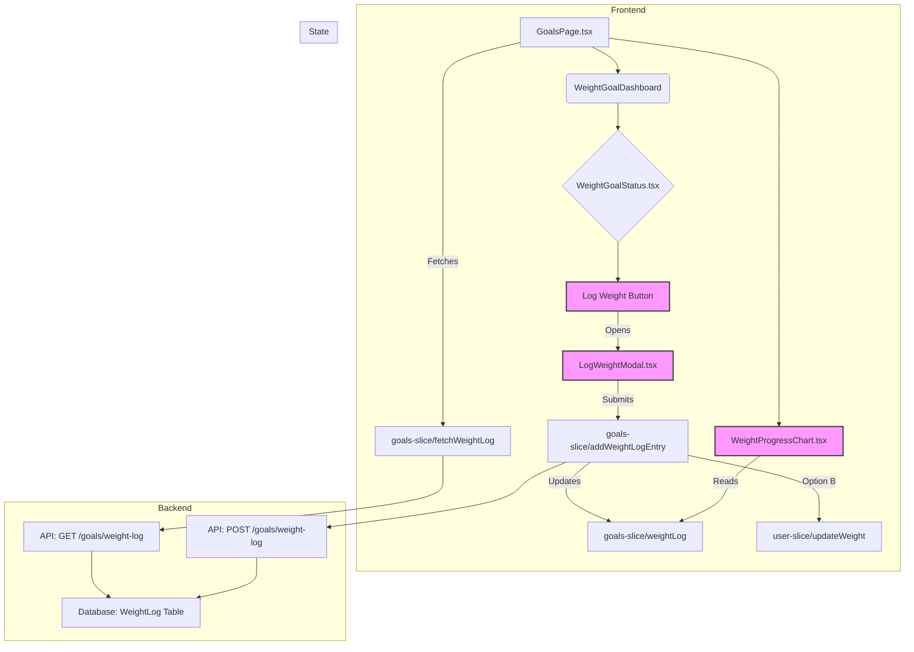

# Plan: Implement Weight Progress Tracking

This document outlines the plan to add functionality for users to track their weight progress over time.

## 1. Data Storage & State Management

- **Backend:**
  - **Decision:** A separate `weight_log` table will be created. This follows normalization principles, improves scalability and query efficiency, and offers flexibility for future additions.
  - Modify the database schema to include this `weight_log` table (columns: `id`, `user_id`, `date`, `weight`).
  - Create new API endpoints in `backend/src/modules/goals/routes.ts` (or a dedicated module):
    - `POST /api/goals/weight-log`: Add a new weight entry.
    - `GET /api/goals/weight-log`: Retrieve historical weight entries.
    - (Optional) `DELETE /api/goals/weight-log/:id`: Delete a specific entry.
- **Frontend (Zustand Store - `goals-slice.ts`):**
  - Add state: `weightLog: { date: string, weight: number }[] = []`.
  - Add actions:
    - `fetchWeightLog()`: Calls GET endpoint, updates `weightLog`.
    - `addWeightLogEntry(weight: number, date: string)`: Calls POST endpoint, updates `weightLog`, and updates `user.weight` (Option B).
    - (Optional) `deleteWeightLogEntry(id: string)`: Calls DELETE endpoint, updates `weightLog`.
  - Modify `fetchWeightGoals` or add a separate fetch in `GoalsPage.tsx` to call `fetchWeightLog`.

## 2. User Interface (UI)

- **Input:**
  - Add a "Log Weight" button (likely in `WeightGoalStatus.tsx`).
  - Create a modal/form (`LogWeightModal.tsx`) for weight input (defaulting date to today).
- **Display:**
  - Create a new component (`WeightProgressChart.tsx` or `WeightHistoryList.tsx`) for visualization (line chart preferred).
  - Integrate this display into `GoalsPage.tsx` (e.g., below dashboard or in "Recent Stats").

## 3. Logic & Integration

- **Decision:** When logging weight, update _both_ the `weightLog` history AND the main `user.weight` in the user profile state (`user-slice.ts`) simultaneously (Option B).

## 4. Schema Updates (`backend/src/modules/goals/schemas.ts`) ✅

- **Define `DateString`:** Add a reusable `DateString` primitive for required dates:
  ```typescript
  const DateString = t.String({ format: "date" });
  ```
- **Add `weightLogEntry` Schema:** Define the structure for a single weight log entry:
  ```typescript
  weightLogEntry: t.Object({
    id: t.String(), // Assuming UUID or similar string ID from DB
    userId: t.String(), // Assuming user ID is a string
    date: DateString, // Date of the log entry
    weight: t.Number({ minimum: 0 }), // Recorded weight
  }),
  ```
- **Add `addWeightLogBody` Schema:** Define the request body for adding a new entry:
  ```typescript
  addWeightLogBody: t.Object({
    date: DateString, // Date for the new entry
    weight: t.Number({ minimum: 0 }), // Weight for the new entry
  }),
  ```
- **Add `addWeightLogResponse` Schema:** Define the response after adding an entry:
  ```typescript
  addWeightLogResponse: t.Object({
    id: t.String(),
    userId: t.String(),
    date: DateString,
    weight: t.Number({ minimum: 0 }),
  }),
  ```
- **Add `getWeightLogResponse` Schema:** Define the response for fetching the history:
  ```typescript
  getWeightLogResponse: t.Array(
    t.Object({
      id: t.String(),
      // userId is usually not needed when fetching for the logged-in user
      date: DateString,
      weight: t.Number({ minimum: 0 }),
    })
  ),
  ```
- **Integrate:** Place these new schemas within the exported `GoalSchemas` object.

## 5. API Service Updates (`frontend/src/utils/api-service.ts`)

- **Add Interfaces:** Define TypeScript interfaces for the weight log payloads and responses (mirroring the backend schemas):

  ```typescript
  interface WeightLogEntry {
    id: string;
    date: string; // YYYY-MM-DD
    weight: number;
  }

  interface AddWeightLogPayload {
    date: string; // YYYY-MM-DD
    weight: number;
  }
  ```

- **Add Endpoints to `apiService.goals`:**
  - `getWeightLog`: Fetches the weight log history (`GET /api/goals/weight-log`). Returns `Promise<WeightLogEntry[]>`.
  - `addWeightLogEntry`: Adds a new weight log entry (`POST /api/goals/weight-log`). Takes `AddWeightLogPayload` as input, returns `Promise<WeightLogEntry>`.
  - `deleteWeightLogEntry` (Optional): Deletes a specific entry (`DELETE /api/goals/weight-log/:id`). Takes `id: string` as input, returns `Promise<{ success: boolean }>`.

## 6. Store Slice Updates (`frontend/src/features/goals/store/goals-slice.ts`)

- **Add State:** Include `weightLog` in the `GoalsSlice` interface:
  ```typescript
  weightLog: WeightLogEntry[]; // Use the interface defined in api-service
  ```
- **Initialize State:** Set the initial value for `weightLog` to `[]`.
- **Add Actions:** Define new actions in the `GoalsSlice` interface and implement them:
  - `fetchWeightLog()`:
    - Sets `isLoading` to true.
    - Calls `apiService.goals.getWeightLog`.
    - Updates the `weightLog` state with the fetched data (sorted by date descending).
    - Handles loading state and errors, potentially using `addNotification`.
  - `addWeightLogEntry(payload: AddWeightLogPayload)`:
    - Sets `isSaving` to true.
    - Calls `apiService.goals.addWeightLogEntry` with the payload.
    - On success:
      - Adds the new entry to the `weightLog` state array (maintaining sort order).
      - **Crucially:** Updates the `weightGoals.currentWeight` state with the new weight from the payload.
      - Updates the `user.weight` in the `userSlice` (requires accessing `userSlice` actions via `get()`).
    - Handles saving state and errors, potentially using `addNotification`.
  - `deleteWeightLogEntry(id: string)` (Optional):
    - Sets `isSaving` to true.
    - Calls `apiService.goals.deleteWeightLogEntry` with the ID.
    - On success, removes the entry with the matching ID from the `weightLog` state array.
    - Handles saving state and errors.
- **Integrate Fetching:** Modify `fetchWeightGoals` or call `fetchWeightLog` separately (e.g., in `GoalsPage.tsx`'s `useEffect`) to load the weight log data when the goals page mounts.
- **Update `createWeightGoal`:** When a weight goal is _created_ or _updated_ with a `currentWeight`, consider adding an initial entry to the `weightLog` automatically by calling `addWeightLogEntry` internally. This ensures the log starts with the goal's initial weight.
- **Update `deleteWeightGoal`:** When a weight goal is deleted, consider if the `weightLog` should also be cleared. Add `set({ weightLog: [] })` to the `deleteWeightGoal` action if this is desired.
- **Update `resetGoals`:** Similarly, decide if resetting goals should clear the weight log and add `set({ weightLog: [] })` if needed.

## 7. Backend Route Updates (`backend/src/modules/goals/routes.ts`) ✅

- **Import Schemas:** Import the newly defined `weightLogEntry`, `addWeightLogBody`, `addWeightLogResponse`, and `getWeightLogResponse` schemas.
- **Import Database Client/Connection:** Ensure the existing database connection/client instance used in other modules is available/imported (e.g., `ctx.db`).
- **Import ID Generator:** Import the function used to generate unique IDs (e.g., `createId` from `ksuid`).
- **Add `POST /api/goals/weight-log` Endpoint:**
  - Define a new route handler for `POST /api/goals/weight-log`.
  - Use the `authMiddleware` to ensure the user is authenticated.
  - Validate the request body using `addWeightLogBody`.
  - Extract `userId` from the authenticated user context (`ctx.user.id`).
  - Generate a new unique ID for the log entry (e.g., `const newId = createId();`).
  - **Insert** the new weight log entry into the `weight_log` table using the **existing database access method** (e.g., `ctx.db.run('INSERT INTO weight_log (id, user_id, date, weight) VALUES (?, ?, ?, ?)', newId, userId, body.date, body.weight);`).
  - Construct and return the newly created entry object, formatted according to `addWeightLogResponse`.
  - Handle potential database errors (e.g., using try/catch and returning appropriate HTTP status codes).
- **Add `GET /api/goals/weight-log` Endpoint:**
  - Define a new route handler for `GET /api/goals/weight-log`.
  - Use `authMiddleware`.
  - Extract `userId`.
  - **Query** the `weight_log` table for entries belonging to the `userId`, ordered by date using the **existing database access method** (e.g., `const logs = ctx.db.all('SELECT id, date, weight FROM weight_log WHERE user_id = ? ORDER BY date DESC', userId);`).
  - Format the response using `getWeightLogResponse`.
  - Handle potential database errors.
- **(Optional) Add `DELETE /api/goals/weight-log/:id` Endpoint:**
  - Define a route handler for `DELETE /api/goals/weight-log/:id`.
  - Use `authMiddleware`.
  - Extract `userId` and the `id` parameter from the request (`ctx.params.id`).
  - **Delete** the entry from `weight_log` table ensuring the `id` belongs to the `userId` using the **existing database access method** (e.g., `const result = ctx.db.run('DELETE FROM weight_log WHERE id = ? AND user_id = ?', ctx.params.id, userId);`). Check `result.changes` to see if a row was affected.
  - Return a success indicator (e.g., `{ success: true }`) or 404 if not found/not authorized.
  - Handle potential database errors.

## 8. Database Schema Updates (`backend/src/db/schema.ts` or Manual SQL)

- **Define `weight_log` Table Structure:**
  - The `weight_log` table needs to be created in the database (`macro_tracker.db`).
  - **Manual SQL:** Prepare the following SQL `CREATE TABLE` statement:
    ```sql
    CREATE TABLE weight_log (
      id TEXT PRIMARY KEY,
      user_id TEXT NOT NULL,
      date TEXT NOT NULL, -- Store as ISO string (YYYY-MM-DD)
      weight REAL NOT NULL, -- Use REAL for floating-point numbers
      -- Optional: created_at INTEGER DEFAULT (strftime('%s', 'now') * 1000),
      FOREIGN KEY (user_id) REFERENCES users(id) ON DELETE CASCADE
    );
    ```
  - Ensure `user_id` references the `users` table correctly with `ON DELETE CASCADE` if you want logs deleted when a user is deleted.

## 9. Database Migrations (Manual or Existing Tool)

- **Apply Schema Change:** Since Drizzle Kit is not being used, the `CREATE TABLE weight_log` statement (from step 8) needs to be applied to the `macro_tracker.db` database.
- **Method:**
  - **Manual:** Use a SQLite browser/CLI tool to execute the `CREATE TABLE` statement directly on the database file.
  - **Existing Migration Tool:** If the project already uses a different migration tool, use that tool's process to add and run a new migration containing the `CREATE TABLE` statement.

## 10. Frontend UI Component Updates ✅

- **Log Weight Trigger (`frontend/src/features/goals/components/WeightGoalStatus.tsx` or similar):** ✅
  - Add a button (e.g., `<Button variant="outline" onClick={openLogModal}>Log Weight</Button>`).
  - Manage the state for opening/closing the logging modal (e.g., using `useState`).
- **Log Weight Modal (`frontend/src/features/goals/components/LogWeightModal.tsx` - New File):** ✅
  - Create a new functional component `LogWeightModal`.
  - Use the `Modal` component from `frontend/src/components/Modal.tsx`.
  - Include form fields (using components from `frontend/src/components/form/` like `DateField` and `NumberField`) for `date` and `weight`. Default date to today.
  - Manage local form state (e.g., using `useState` or a form library like `react-hook-form`).
  - Add client-side validation (weight > 0, date required).
  - On submit, call the `addWeightLogEntry` action from the `goals-slice` with the form data.
  - Handle loading/saving states (disable button, show spinner) and potential errors from the store action.
  - Close the modal on successful submission or cancellation.
- **Weight History Display (`frontend/src/features/goals/components/WeightProgressChart.tsx` - New File):** ✅
  - Create a new functional component `WeightProgressChart` (or `WeightHistoryList`).
  - Access the `weightLog` array and `isLoading` state from the `goals-slice` state using the store hook (`useAppStore`).
  - If using a chart:
    - Install a charting library (e.g., `recharts` - `bun add recharts`). ✅
    - Format the `weightLog` data as required by the library (ensure dates are handled correctly).
    - Render the chart (e.g., a line chart showing weight over time).
    - Handle loading state (show spinner).
    - Handle empty states (no data yet - display a message).
  - If using a list:
    - Map over the `weightLog` array and display each entry (date, weight) in a formatted list or table.
    - Handle loading and empty states.
    - Consider adding delete functionality if implemented.

## 11. Frontend Page Updates (`frontend/src/pages/GoalsPage.tsx`)

- **Import Components:** Import the new `LogWeightModal` and `WeightProgressChart` (or list) components.
- **Integrate Trigger:** Place the trigger mechanism (e.g., the "Log Weight" button, potentially passed down to `WeightGoalStatus`) within the page structure where appropriate. Manage modal open/close state here or in a parent component.
- **Integrate Modal:** Render the `LogWeightModal` component, controlling its visibility based on state.
- **Integrate Display:** Render the `WeightProgressChart` (or list) component, likely below the main goal setting area or in a dedicated section.
- **Data Fetching:**
  - In a `useEffect` hook, call the `fetchWeightLog` action from the `goals-slice` when the component mounts to load the historical data. Ensure this runs alongside or after `fetchWeightGoals`.
  ```typescript
  useEffect(() => {
    // Assuming fetchWeightGoals is also called elsewhere or here
    actions.fetchWeightLog();
  }, [actions]); // Assuming actions are stable references from the store hook
  ```

## 12. User Slice Updates (`frontend/src/features/user/store/user-slice.ts` - Optional but Recommended) ✅

- **Add Action:** Define a new action in the `UserSlice` interface:
  ```typescript
  updateCurrentUserWeight: (newWeight: number) => void;
  ```
- **Implement Action:** Implement the action in `createUserSlice`:
  ```typescript
  updateCurrentUserWeight: (newWeight) => {
    set((state) => ({
      user: state.user ? { ...state.user, weight: newWeight } : null,
    }));
    // No API call needed here, as the primary weight update happens via goals/weight-log
  },
  ```
- **Call from `goals-slice`:** Modify the `addWeightLogEntry` action in `goals-slice.ts` to call this new user slice action after successfully adding a log entry:
  ```typescript
  // Inside addWeightLogEntry success block in goals-slice.ts
  const savedEntry = await apiService.goals.addWeightLogEntry(payload);
  set((state) => ({
    // Add and sort weightLog
    weightLog: [...(state.weightLog || []), savedEntry].sort(
      (a, b) => new Date(b.date).getTime() - new Date(a.date).getTime()
    ),
    // Update current weight in goals slice
    weightGoals: state.weightGoals
      ? { ...state.weightGoals, currentWeight: savedEntry.weight }
      : null,
    isSaving: false,
  }));
  // Call user slice action using fullGet() to access other slices
  const fullGet = get as () => FullGoalsState; // Assuming FullGoalsState includes UserSlice actions
  if (fullGet().updateCurrentUserWeight) {
    fullGet().updateCurrentUserWeight(savedEntry.weight);
  }
  // ... rest of success handling (e.g., notification) ...
  ```

## Diagram


