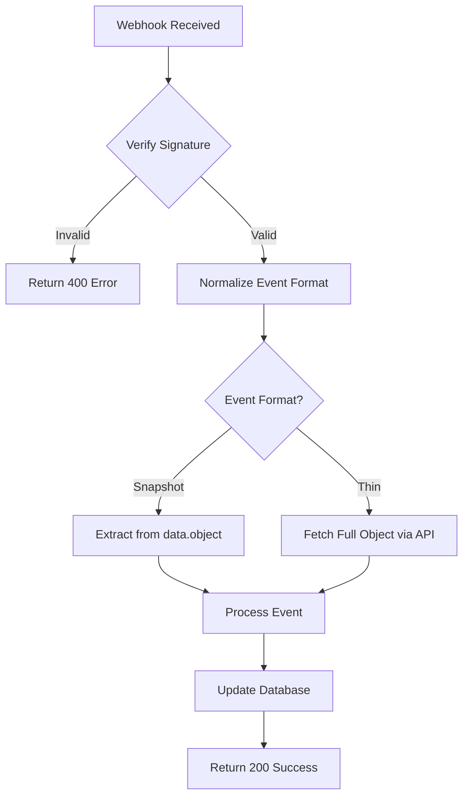

# 🎯 Stripe Webhook Setup Guide - Dual Format Support

Your Macro Tracker backend now supports **both** Stripe webhook formats:

- **Snapshot Events** (v1) - Traditional format with full object data
- **Thin Events** (v2) - New format with minimal payload + object references

## 🛠️ Implementation Features

### ✅ Dual Format Detection

- Automatically detects webhook format (snapshot vs thin)
- Normalizes events for consistent processing
- Fetches full objects for thin events when needed

### ✅ Event Type Mapping

- Maps v2 thin event types to v1 equivalents
- Handles both naming conventions seamlessly
- Maintains backward compatibility

### ✅ Enhanced Error Handling

- Comprehensive logging for both formats
- Graceful fallback for unsupported events
- Detailed error context in logs

## 📋 Supported Events

| V1 (Snapshot) Event             | V2 (Thin) Event                         | Purpose               |
| ------------------------------- | --------------------------------------- | --------------------- |
| `customer.subscription.created` | `v1.billing.subscription.created`       | New subscription      |
| `customer.subscription.updated` | `v1.billing.subscription.updated`       | Subscription changes  |
| `customer.subscription.deleted` | `v1.billing.subscription.deleted`       | Subscription canceled |
| `invoice.payment_succeeded`     | `v1.billing.invoice.payment_succeeded`  | Payment successful    |
| `invoice.payment_failed`        | `v1.billing.invoice.payment_failed`     | Payment failed        |
| `checkout.session.completed`    | `v1.billing.checkout.session.completed` | Checkout completed    |

## 🚀 Setup Steps

### 1. **Environment Configuration**

Your `.env` file is ready with:

```env
JWT_SECRET="iEhXR0W3fX+ssRSc1MZRfGO8AbQq0lGTYoNsnJD022k="
STRIPE_SECRET_KEY=sk_test_51RfcbFR6oWdg4TYr9Z0uEiKwOanvkMl0qHVUXLvFeIYMqLigUN0c8NQGQibqWbr4Vb6xOnvTHKjxfFxMaekJS88Q00zpFTDkFW
STRIPE_WEBHOOK_SECRET=whsec_replace_with_your_webhook_secret
STRIPE_PRICE_ID=price_replace_with_your_stripe_price_id
```

### 2. **Create Webhook Endpoint in Stripe**

#### Option A: Traditional Webhook (Snapshot Events)

1. Go to [Stripe Dashboard > Webhooks](https://dashboard.stripe.com/webhooks)
2. Click "Create webhook endpoint"
3. Set URL: `https://your-domain.com/api/billing/webhook`
4. Select events:
   - ✅ `customer.subscription.created`
   - ✅ `customer.subscription.updated`
   - ✅ `customer.subscription.deleted`
   - ✅ `invoice.payment_succeeded`
   - ✅ `invoice.payment_failed`
   - ✅ `checkout.session.completed`

#### Option B: Event Destinations (Thin Events)

1. Go to [Stripe Dashboard > Event Destinations](https://dashboard.stripe.com/event-destinations)
2. Click "Create event destination"
3. Choose "Webhook endpoint"
4. Set URL: `https://your-domain.com/api/billing/webhook`
5. Select events:
   - ✅ `v1.billing.subscription.created`
   - ✅ `v1.billing.subscription.updated`
   - ✅ `v1.billing.subscription.deleted`
   - ✅ `v1.billing.invoice.payment_succeeded`
   - ✅ `v1.billing.invoice.payment_failed`

### 3. **Update Environment Variables**

After creating your webhook:

1. Copy the webhook signing secret (starts with `whsec_`)
2. Update your `.env` file:
   ```env
   STRIPE_WEBHOOK_SECRET=whsec_your_actual_secret_here
   ```

### 4. **Create Stripe Products & Prices**

1. Create a product for "Pro Subscription"
2. Create a price (e.g., $9.99/month)
3. Copy the price ID and update `.env`:
   ```env
   STRIPE_PRICE_ID=price_your_actual_price_id_here
   ```

## 🧪 Testing Webhooks

### Local Development with Stripe CLI

```bash
# Install Stripe CLI
# Download from: https://github.com/stripe/stripe-cli/releases

# Login to Stripe
stripe login

# Forward webhooks to local server
stripe listen --forward-to localhost:3000/api/billing/webhook

# In another terminal, trigger test events
stripe trigger customer.subscription.created
stripe trigger invoice.payment_succeeded
```

### Test Script

Run the included test script:

```bash
# Start your server
bun run dev

# In another terminal, run tests
node test-webhooks.js
```

## 📊 Webhook Processing Flow



## 🔍 Monitoring & Debugging

### Check Webhook Logs

Your backend logs will show:

```json
{
  "operation": "stripe_webhook",
  "eventType": "customer.subscription.created",
  "eventId": "evt_...",
  "format": "snapshot",
  "message": "Processing Stripe webhook: customer.subscription.created (snapshot)"
}
```

### Webhook Delivery Status

- Monitor webhook delivery in Stripe Dashboard
- Check response codes and retry attempts
- Review webhook attempt details for errors

## 🚨 Security Best Practices

### ✅ Implemented

- ✅ Webhook signature verification
- ✅ HTTPS required for production
- ✅ Event idempotency handling
- ✅ Comprehensive error logging
- ✅ Quick response times (< 10s)

### 📝 Additional Recommendations

- Set up webhook endpoint monitoring
- Implement exponential backoff for failed events
- Use webhook endpoint secrets rotation
- Monitor for suspicious webhook activity

## 🎉 You're Ready!

Your webhook system now handles both current and future Stripe event formats automatically. The backend will:

1. **Detect** the webhook format (snapshot vs thin)
2. **Normalize** events for consistent processing
3. **Fetch** full objects for thin events when needed
4. **Process** subscription changes and update your database
5. **Log** everything for monitoring and debugging

Deploy your backend and start accepting Pro subscriptions! 🚀
