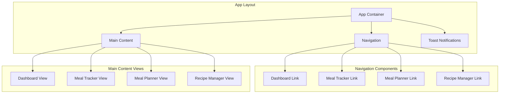
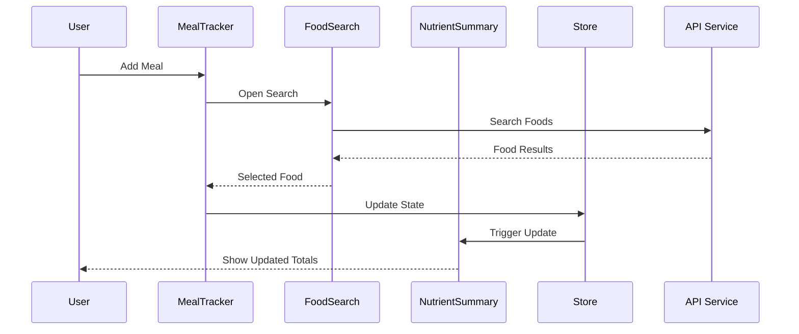
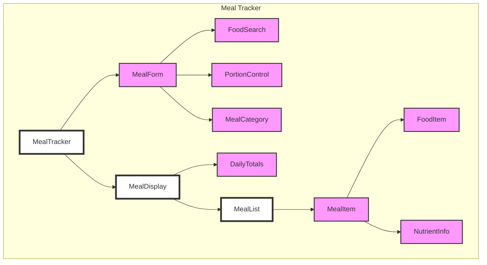
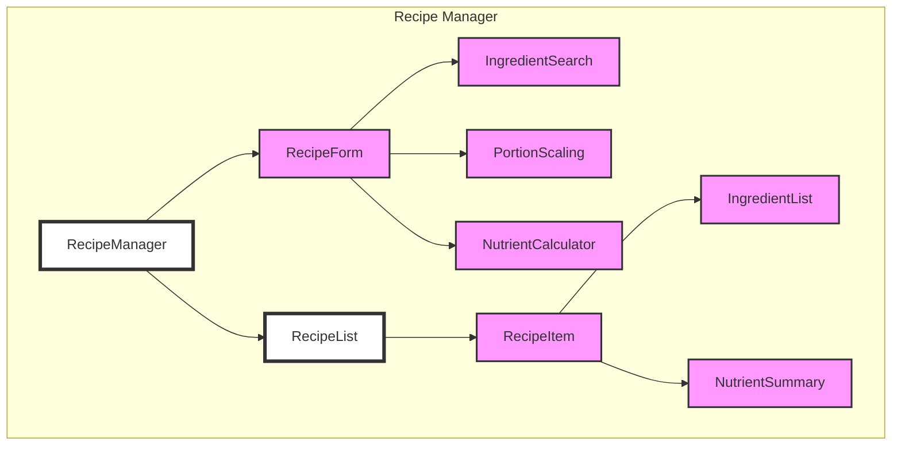
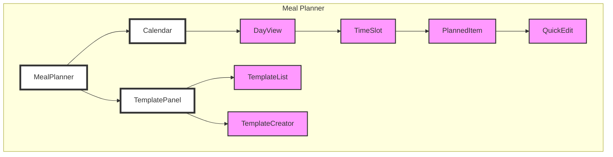

# Component Architecture and Interactions

## Core Component Hierarchy



## Component Interaction Flow



## Detailed Component Breakdown

### 1. Meal Tracking Components



### 2. Recipe Management Components



### 3. Meal Planning Components



## Component Data Flow

### 1. MealTracker Component

```typescript
interface MealTrackerProps {
  date: string;
  onAddMeal: (meal: Meal) => void;
  onUpdateMeal: (id: string, updates: Partial<Meal>) => void;
  onDeleteMeal: (id: string) => void;
}

interface MealTrackerState {
  meals: Meal[];
  isAddingMeal: boolean;
  selectedMeal: string | null;
  dailyTotals: NutrientProfile;
}
```

### 2. FoodSearch Component

```typescript
interface FoodSearchProps {
  onSelect: (food: FoodItem) => void;
  onCancel: () => void;
  excludeItems?: string[]; // Already added items
}

interface FoodSearchState {
  query: string;
  results: FoodItem[];
  isLoading: boolean;
  error: string | null;
}
```

### 3. NutrientDisplay Component

```typescript
interface NutrientDisplayProps {
  nutrients: NutrientProfile;
  goals?: NutrientGoals;
  showDetails: boolean;
  onToggleDetails: () => void;
}
```

## Component Interaction Patterns

### 1. Parent-Child Communication

```typescript
// Parent Component
const ParentComponent = () => {
  const handleMealAdd = (meal: Meal) => {
    // Update store
    useStore.getState().addMeal(meal);
  };

  return <MealTracker onAddMeal={handleMealAdd} date={selectedDate} />;
};
```

### 2. Store Integration

```typescript
// Child Component
const ChildComponent = () => {
  const meals = useStore((state) => state.meals);
  const addMeal = useStore((state) => state.addMeal);

  // Component logic
};
```

### 3. Event Propagation

```typescript
// Event Handler Chain
const MealItem = ({ meal, onUpdate, onDelete }) => {
  const handlePortionChange = (newPortion: number) => {
    const updates = {
      ...meal,
      portion: newPortion,
      nutrients: calculateNutrients(meal.baseNutrients, newPortion),
    };
    onUpdate(meal.id, updates);
  };

  return <PortionControl value={meal.portion} onChange={handlePortionChange} />;
};
```

## Component Performance Optimization

### 1. Memoization Strategy

```typescript
// Memoized Component
const MealList = React.memo(({ meals, onMealUpdate }) => {
  return meals.map((meal) => (
    <MealItem key={meal.id} meal={meal} onUpdate={onMealUpdate} />
  ));
});
```

### 2. Virtual List Implementation

```typescript
// Virtual List for Performance
const VirtualizedMealList = ({ meals }) => {
  return (
    <VirtualList
      height={400}
      itemCount={meals.length}
      itemSize={80}
      width="100%"
      itemData={meals}
    >
      {MealRow}
    </VirtualList>
  );
};
```

## Error Boundary Implementation

```typescript
// Error Boundary for Component Tree
class ComponentErrorBoundary extends React.Component {
  state = { hasError: false, error: null };

  static getDerivedStateFromError(error) {
    return { hasError: true, error };
  }

  render() {
    if (this.state.hasError) {
      return <ErrorFallback error={this.state.error} />;
    }
    return this.props.children;
  }
}
```

## State Update Patterns

### 1. Optimistic Updates

```typescript
const handleMealUpdate = async (id: string, updates: Partial<Meal>) => {
  // Optimistic update
  updateLocalMeal(id, updates);

  try {
    await api.meals.update(id, updates);
  } catch (error) {
    // Revert on failure
    revertLocalMeal(id);
    showError(error);
  }
};
```

### 2. Batch Updates

```typescript
const handleBatchAdd = async (meals: Meal[]) => {
  // Show progress
  startProgress();

  try {
    // Batch process
    await Promise.all(meals.map((meal) => api.meals.create(meal)));

    // Update UI
    refreshMealList();
  } finally {
    endProgress();
  }
};
```

## Component Guidelines

1. **Composition Over Inheritance**

   - Build complex components from smaller, reusable pieces
   - Use composition patterns for shared functionality

2. **State Management**

   - Keep state as local as possible
   - Lift state up only when necessary
   - Use store for global state only

3. **Performance**

   - Implement virtualization for long lists
   - Memoize expensive calculations
   - Use React.memo for pure components

4. **Error Handling**

   - Implement error boundaries
   - Provide fallback UI
   - Log errors appropriately

5. **Accessibility**
   - Include ARIA labels
   - Ensure keyboard navigation
   - Maintain focus management
