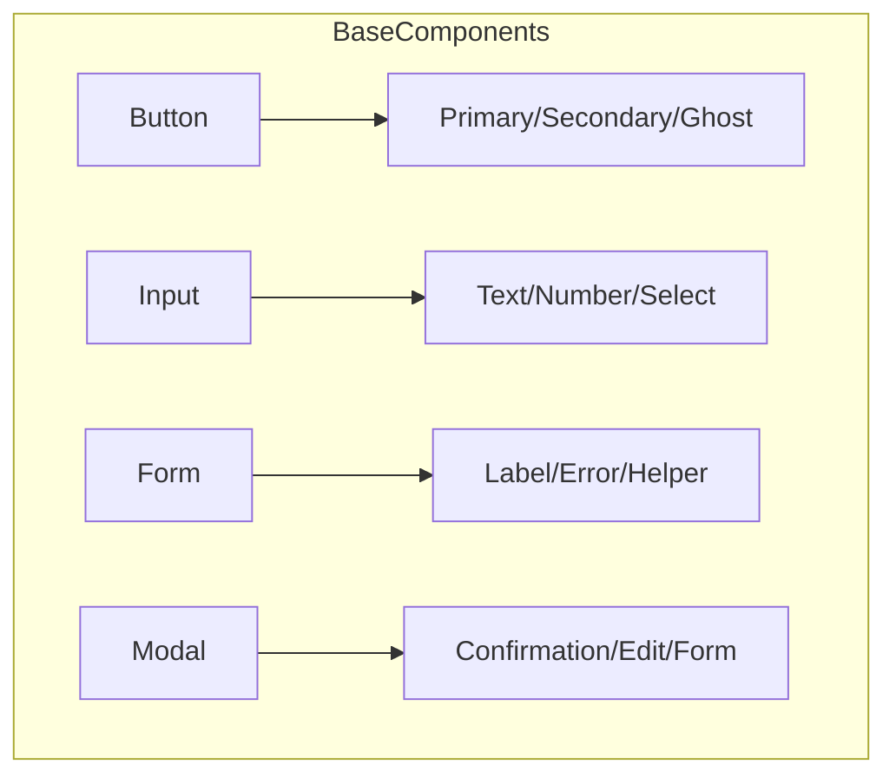
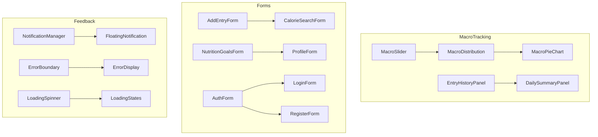

# Component Implementation Plan

## 1. Component Organization

### Base Components Layer



### Feature Components Layer



## 2. Implementation Order

### Phase 1: Core Infrastructure

1. Error Boundary & Error Handling

   - Enhanced error capture
   - Automatic retry logic
   - Error reporting

2. State Management Setup

   - Zustand store configuration
   - React Query integration
   - Type definitions

3. Form Infrastructure
   - Base form components
   - Validation system
   - Error handling

### Phase 2: Feature Components

1. Authentication Components

   - Login/Register forms
   - Auth state management
   - Protected routes

2. Macro Tracking Components

   - Data input forms
   - Visualization components
   - History tracking

3. Settings Components
   - User preferences
   - Profile management
   - Goals configuration

### Phase 3: Enhancement Components

1. Notification System

   - Toast notifications
   - Status updates
   - Network state feedback

2. Loading States

   - Skeleton loaders
   - Progress indicators
   - Transition animations

3. Modal System
   - Confirmation dialogs
   - Edit forms
   - Dynamic content

## 3. Component Patterns

### Error Handling Pattern

```typescript
interface ErrorHandlingProps {
  fallback?: ReactNode;
  onError?: (error: Error) => void;
  retryable?: boolean;
}

const withErrorHandling = <P extends object>(
  Component: ComponentType<P>,
  options: ErrorHandlingProps
) => {
  return function WithErrorHandlingWrapper(props: P) {
    return (
      <ErrorBoundary fallback={options.fallback} onError={options.onError}>
        <Component {...props} />
      </ErrorBoundary>
    );
  };
};
```

### Data Loading Pattern

```typescript
interface LoadingProps<T> {
  data: T | undefined;
  isLoading: boolean;
  error: Error | null;
  skeleton: ReactNode;
}

const withDataLoading = <T, P extends LoadingProps<T>>(
  Component: ComponentType<P>
) => {
  return function WithDataLoadingWrapper(props: P) {
    if (props.isLoading) return props.skeleton;
    if (props.error) return <ErrorDisplay error={props.error} />;
    if (!props.data) return <EmptyState />;
    return <Component {...props} />;
  };
};
```

### Form Validation Pattern

```typescript
interface ValidationSchema {
  [key: string]: {
    validate: (value: any) => boolean;
    message: string;
  };
}

const withFormValidation = <P extends object>(
  Component: ComponentType<P>,
  schema: ValidationSchema
) => {
  return function WithFormValidationWrapper(props: P) {
    const validate = useCallback((values: any) => {
      // Implementation
    }, []);

    return <Component {...props} onValidate={validate} />;
  };
};
```

## 4. Shared Component Props

### Base Props

```typescript
interface BaseProps {
  className?: string;
  testId?: string;
  ariaLabel?: string;
}

interface LoadableProps extends BaseProps {
  isLoading?: boolean;
  loadingText?: string;
}

interface ErrorProps extends BaseProps {
  error?: Error | null;
  onRetry?: () => void;
}
```

### Form Props

```typescript
interface FormFieldProps extends BaseProps {
  label: string;
  error?: string;
  touched?: boolean;
  required?: boolean;
  helperText?: string;
}

interface ValidationProps {
  validate?: (value: any) => string | undefined;
  validateOnBlur?: boolean;
  validateOnChange?: boolean;
}
```

## 5. Testing Strategy

### Unit Tests

- Component rendering
- Props validation
- Event handlers
- State updates
- Error cases

### Integration Tests

- Form submissions
- Data loading
- Error handling
- State management
- User interactions

### E2E Tests

- User flows
- Data persistence
- Navigation
- Error recovery

## Next Steps

1. Set up project infrastructure

   - TypeScript configuration
   - Build system
   - Testing framework

2. Implement core utilities

   - Error handling
   - Validation
   - State management

3. Create base components

   - Form elements
   - Feedback components
   - Layout components

4. Implement feature components

   - Following the phase order
   - With proper error boundaries
   - Including loading states

5. Add comprehensive tests
   - Unit tests for all components
   - Integration tests for features
   - E2E tests for flows
