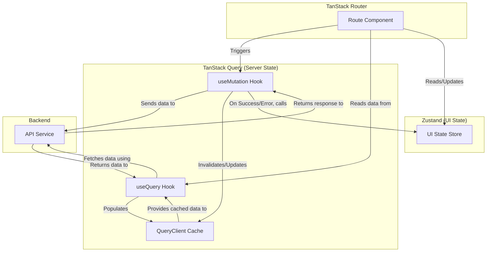

# TanStack Query Migration & Refactoring Plan

This document outlines the strategy for migrating the application's state management from a hybrid Zustand and TanStack Router loader approach to a more robust system leveraging TanStack Query for server state and simplifying Zustand for UI state.

## 1. Core Principles & Architecture

The primary goal is to establish a clear separation between server state and client state.

- **TanStack Query**: Will be the definitive source for all data fetched from the server. It will manage caching, background refetching, mutations (CUD operations), and loading/error states related to server communication.
- **Zustand**: Will be simplified to manage only client-side UI state. This includes form inputs, modal visibility, and other ephemeral states that are not persisted on the server.
- **TanStack Router Loaders**: Will be integrated with TanStack Query to ensure data is available before a route renders. Loaders will fetch data using the `queryClient`.

### Proposed Data Flow

## 2. Migration Phases

The migration will be executed in the following phases:

### Phase 1: Foundational Setup & Auth Refactoring

1.  **Install TanStack Query**: Add `@tanstack/react-query` and `@tanstack/react-query-devtools` to the project.
2.  **Create `QueryClient`**: Instantiate and provide the `QueryClient` at the root of the application.
3.  **Establish Query Keys**: Create a centralized `queryKeys.ts` file to manage all query keys for consistency.
4.  **Refactor Auth**:
    - Create a `useUser` custom hook that uses `useQuery` to fetch user details. This will replace the `authLoader`.
    - Create `useLogin`, `useLogout`, `useRegister`, `useForgotPassword`, and `useResetPassword` mutation hooks.
    - On success, these mutations will invalidate the user query to automatically refetch and update the auth state.
    - Simplify `auth-slice.ts` to only manage the multi-step registration form's UI state.

### Phase 2: Habits Feature Migration

1.  **Create `useHabits` Query**: A custom hook that fetches all habits.
2.  **Integrate with Loader**: The `habitsLoader` will use the `queryClient` to pre-fetch the habits data.
3.  **Create Mutation Hooks**:
    - `useAddHabit`
    - `useUpdateHabit`
    - `useDeleteHabit`
    - `useIncrementHabitProgress`
4.  **Implement Optimistic Updates**: For `useIncrementHabitProgress` and `useDeleteHabit`, implement optimistic updates to provide a snappy user experience.
5.  **Deprecate `habits-slice.ts`**: Remove the slice completely. Any remaining UI state will be handled by local component state or a new, smaller UI-specific store if needed.

### Phase 3: Goals Feature Migration

1.  **Create Query Hooks**:
    - `useWeightGoals`
    - `useWeightLog`
2.  **Integrate with Loaders**: Update `weightGoalsLoader` and other related loaders to use the `queryClient`.
3.  **Create Mutation Hooks**:
    - `useCreateWeightGoal`
    - `useUpdateWeightGoal`
    - `useDeleteWeightGoal`
    - `useAddWeightLogEntry`
    - `useDeleteWeightLogEntry`
4.  **Handle Dependent Mutations**: The `useAddWeightLogEntry` mutation will, on success, invalidate both the `weightLog` and `weightGoals` queries.
5.  **Deprecate `goals-slice.ts`**: Remove the slice.

### Phase 4: Macros Feature Migration

1.  **Create Query Hooks**:
    - `useMacroHistory` (for paginated history)
    - `useMacroDailyTotals`
    - `useMacroTarget`
2.  **Integrate with Loaders**: Update `macroDataLoader` and `macroTargetLoader` to use the `queryClient`.
3.  **Create Mutation Hooks**:
    - `useAddMacroEntry`
    - `useUpdateMacroEntry`
    - `useDeleteMacroEntry`
    - `useUpdateMacroTarget`
4.  **Handle Pagination**: The `useMacroHistory` hook will manage pagination logic.
5.  **Deprecate `macros-slice.ts`**: Remove the slice.

### Phase 5: Settings Feature Migration

1.  **Create `useSettings` Query**: A hook to fetch user settings.
2.  **Integrate with Loader**: The `settingsLoader` will use the `queryClient`.
3.  **Create `useSaveSettings` Mutation**: A mutation to update user settings.
4.  **Simplify `user-slice.ts`**: The slice will now only be responsible for managing the _form state_ of the settings page (tracking changes, validation errors, etc.), not the server data itself.

### Phase 6: Cleanup and Finalization

1.  **Remove Obsolete Code**: Delete all the old, large Zustand slice files.
2.  **Review and Refactor**: Ensure all components are using the new TanStack Query hooks correctly and consistently.
3.  **Verify Notifications**: Confirm that all user notifications are being triggered from the `onSuccess` and `onError` callbacks of the mutations.
4.  **Update Documentation**: Update any relevant documentation to reflect the new state management architecture.

This comprehensive plan will guide us through a successful and transformative refactoring of the application's state management.
