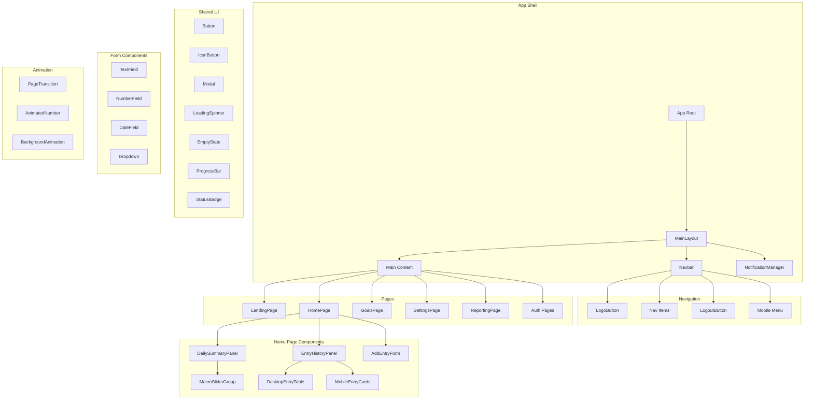
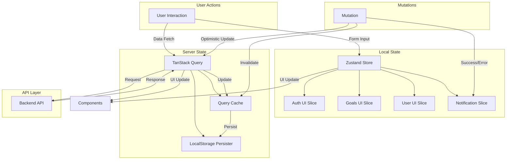

# Frontend Implementation Analysis

> Comprehensive analysis of the Macro Tracker frontend implementation, documenting architecture, design patterns, and implementation details for comparison against Spotify's design system.

---

## Table of Contents

1. [Executive Summary](#executive-summary)
2. [Project Structure and Architecture](#project-structure-and-architecture)
3. [Visual Design Implementation](#visual-design-implementation)
4. [Component Inventory](#component-inventory)
5. [State Management Analysis](#state-management-analysis)
6. [Routing Architecture](#routing-architecture)
7. [Performance Patterns](#performance-patterns)
8. [Accessibility Implementation](#accessibility-implementation)
9. [Component Hierarchy Diagram](#component-hierarchy-diagram)
10. [State Management Flow Diagram](#state-management-flow-diagram)
11. [Design Tokens Reference](#design-tokens-reference)
12. [Strengths and Areas for Improvement](#strengths-and-areas-for-improvement)

---

## Executive Summary

The Macro Tracker frontend is a modern React application built with a **dark-first design philosophy**, using a feature-based architecture with clear separation of concerns. The application leverages:

- **React 19** with TypeScript for type-safe component development
- **TanStack Router** for file-based routing with built-in data loading
- **TanStack Query** for server state management with persistence
- **Zustand** for client-side UI state management
- **Tailwind CSS 4** with CSS custom properties for theming
- **Motion (Framer Motion)** for animations
- **Clerk** for authentication
- **Vite** for build tooling with PWA support

### Key Architectural Decisions

| Decision                | Implementation              | Rationale                               |
| ----------------------- | --------------------------- | --------------------------------------- |
| Dark-only theme         | No light mode support       | Focused UX for health/fitness tracking  |
| Feature-based structure | `src/features/{feature}/`   | Modularity and code organization        |
| Server state separation | TanStack Query              | Caching, deduplication, offline support |
| UI state centralization | Zustand slices              | Predictable state management            |
| CSS custom properties   | Tailwind `@theme` directive | Design token system                     |

---

## Project Structure and Architecture

### Directory Organization

```
frontend/src/
├── components/           # Shared UI components
│   ├── animation/       # Animation components (PageTransition, AnimatedNumber)
│   ├── auth/            # Auth-related components (ClerkTokenSync, RequireCompleteProfile)
│   ├── billing/         # Billing components (PricingTable, ProBadge, UpgradeModal)
│   ├── chart/           # Chart components (LineChartComponent, ChartTooltip)
│   ├── form/            # Form components (TextField, NumberField, Dropdown)
│   ├── layout/          # Layout components (MainLayout, Navbar, PageBackground)
│   ├── macros/          # Macro-specific components (MacroSlider, MacroTarget)
│   ├── metrics/         # Metrics components (UserMetricsPanel)
│   ├── notifications/   # Notification system (FloatingNotification, NotificationManager)
│   ├── ui/              # Base UI components (Button, Modal, LoadingSpinner)
│   └── utils/           # Utility components (Constants, Styles)
├── features/            # Feature modules
│   ├── auth/            # Authentication feature
│   ├── billing/         # Billing/subscription feature
│   ├── goals/           # Goals and habits feature
│   ├── landing/         # Landing page feature
│   ├── macroTracking/   # Macro tracking feature
│   ├── reporting/       # Reporting/analytics feature
│   └── settings/        # User settings feature
├── hooks/               # Shared custom hooks
├── lib/                 # Core libraries (queryClient, queryKeys)
├── store/               # Zustand store configuration
│   └── ui/              # UI state slices
├── types/               # Shared TypeScript types
└── utils/               # Shared utilities (apiServices)
```

### Module Structure Pattern

Each feature follows a consistent internal structure:

```
features/{featureName}/
├── components/          # Feature-specific UI components
├── hooks/               # Feature-specific hooks
├── pages/               # Page components
├── types/               # Feature-specific types
├── utils/               # Feature-specific utilities
├── calculations.ts      # Domain math and aggregation
├── constants.ts         # Feature-local constants
└── index.ts             # Public API barrel export
```

### Build Configuration

| Tool         | Configuration                                       | Purpose                                        |
| ------------ | --------------------------------------------------- | ---------------------------------------------- |
| Vite         | [`vite.config.ts`](frontend/vite.config.ts)         | Build tool with React plugin, PWA, compression |
| TypeScript   | [`tsconfig.json`](frontend/tsconfig.json)           | Type checking with path aliases                |
| Tailwind CSS | [`tailwind.config.js`](frontend/tailwind.config.js) | Utility-first CSS                              |
| ESLint       | [`eslint.config.js`](frontend/eslint.config.js)     | Code quality and import organization           |

---

## Visual Design Implementation

### Color System

The application uses a **dark-first color system** defined via Tailwind CSS 4's `@theme` directive in [`style.css`](frontend/src/style.css).

#### Brand Colors

| Token            | Value     | Usage                             |
| ---------------- | --------- | --------------------------------- |
| `primary`        | `#22c55e` | Primary brand color, CTAs, links  |
| `secondary`      | `#6ee7a0` | Secondary accents, hover states   |
| `vibrant-accent` | `#f59e0b` | High-impact CTAs, attention items |

#### Surface System (Elevation)

| Token        | Value     | Level | Usage                  |
| ------------ | --------- | ----- | ---------------------- |
| `background` | `#09090b` | 0     | Page background        |
| `surface`    | `#121218` | 1     | Cards, modals          |
| `surface-2`  | `#1a1a22` | 2     | Nested elements        |
| `surface-3`  | `#22222c` | 3     | High-emphasis elements |
| `surface-4`  | `#2a2a36` | 4     | Highest emphasis       |

#### Text Colors

| Token        | Value     | Usage                         |
| ------------ | --------- | ----------------------------- |
| `foreground` | `#fafafa` | Primary text (high emphasis)  |
| `muted`      | `#a1a1aa` | Secondary text, labels, hints |

#### Text Opacity Hierarchy

| Token            | Value                       | Usage                     |
| ---------------- | --------------------------- | ------------------------- |
| `text-primary`   | `rgba(255, 255, 255, 1)`    | Headings, important text  |
| `text-secondary` | `rgba(255, 255, 255, 0.85)` | Emphasized body text      |
| `text-body`      | `rgba(255, 255, 255, 0.7)`  | Standard body text        |
| `text-muted`     | `rgba(255, 255, 255, 0.5)`  | Secondary text            |
| `text-hint`      | `rgba(255, 255, 255, 0.35)` | Tertiary text, timestamps |

#### Macro Colors

| Token     | Value     | Usage                      |
| --------- | --------- | -------------------------- |
| `protein` | `#22c55e` | Protein indicators, charts |
| `carbs`   | `#3b82f6` | Carbohydrate indicators    |
| `fats`    | `#ef4444` | Fat indicators, charts     |

#### Semantic Colors

| Token     | Value     | Usage                         |
| --------- | --------- | ----------------------------- |
| `success` | `#22c55e` | Success states, confirmations |
| `warning` | `#f59e0b` | Warnings, cautions            |
| `error`   | `#ef4444` | Errors, destructive actions   |

### Typography

The application uses Tailwind's default font stack with custom letter spacing tokens:

| Token            | Value     | Usage                    |
| ---------------- | --------- | ------------------------ |
| `tracking-label` | `0.025em` | Labels, small text       |
| `tracking-wide`  | `0.05em`  | Standard wide tracking   |
| `tracking-wider` | `0.1em`   | Extra wide for uppercase |

#### Font Weight Guidelines

| Weight   | Class           | Usage                        |
| -------- | --------------- | ---------------------------- |
| Light    | `font-light`    | Hero numbers, large displays |
| Normal   | `font-normal`   | Body text                    |
| Medium   | `font-medium`   | Emphasized body text, labels |
| Semibold | `font-semibold` | Headings, buttons, labels    |

**Note**: The design system recommends avoiding `font-bold` and `font-extrabold` in most cases.

### Spacing System

The application follows Tailwind's default spacing scale with documented patterns:

| Context   | Classes                | Usage                   |
| --------- | ---------------------- | ----------------------- |
| Page edge | `px-4 sm:px-6 lg:px-8` | Horizontal page padding |
| Sections  | `space-y-6`            | Vertical section gaps   |
| Cards     | `p-4` to `p-6`         | Card internal padding   |
| Forms     | `space-y-4`            | Form field spacing      |

### Shadow System

Minimal shadows following Memoria Design System principles:

| Token               | Value                               | Usage                    |
| ------------------- | ----------------------------------- | ------------------------ |
| `shadow-surface`    | `0 1px 2px 0 rgba(0,0,0,0.03)`      | Subtle surface elevation |
| `shadow-card`       | `0 1px 3px rgba(0,0,0,0.1)`         | Card components          |
| `shadow-card-hover` | `0 4px 12px rgba(0,0,0,0.15)`       | Card hover state         |
| `shadow-modal`      | `0 20px 40px -12px rgba(0,0,0,0.2)` | Modal dialogs            |

### Animation Easing

| Token         | Value                                     | Usage                    |
| ------------- | ----------------------------------------- | ------------------------ |
| `ease-modal`  | `cubic-bezier(0.32, 0.72, 0, 1)`          | Modal animations         |
| `ease-drawer` | `cubic-bezier(0.32, 0.72, 0, 1)`          | Drawer/sheet animations  |
| `ease-spring` | `cubic-bezier(0.175, 0.885, 0.32, 1.275)` | Bouncy/spring animations |

---

## Component Inventory

### UI Components (`components/ui/`)

| Component                                                                     | Description             | Key Features                                                 |
| ----------------------------------------------------------------------------- | ----------------------- | ------------------------------------------------------------ |
| [`Button`](frontend/src/components/ui/Button.tsx)                             | Primary action button   | 7 variants, loading states, icon support, auto-loading hooks |
| [`IconButton`](frontend/src/components/ui/IconButton.tsx)                     | Icon-only action button | 10 action variants, size variants                            |
| [`Modal`](frontend/src/components/ui/Modal.tsx)                               | Dialog component        | Confirmation/Form variants, portal rendering, animations     |
| [`LoadingSpinner`](frontend/src/components/ui/LoadingSpinner.tsx)             | Loading indicator       | Size variants, color customization                           |
| [`LoadingStates`](frontend/src/components/ui/LoadingStates.tsx)               | Loading wrappers        | Global, critical, feature-specific loading                   |
| [`EmptyState`](frontend/src/components/ui/EmptyState.tsx)                     | Empty data display      | Icon, title, message, actions                                |
| [`ProgressBar`](frontend/src/components/ui/ProgressBar.tsx)                   | Progress indicator      | Color variants, height variants                              |
| [`StatusBadge`](frontend/src/components/ui/StatusBadge.tsx)                   | Status indicator        | Color variants, sizes                                        |
| [`StatusIndicator`](frontend/src/components/ui/StatusIndicator.tsx)           | Status dot              | Pulse animation, colors                                      |
| [`TabBar`](frontend/src/components/ui/TabBar.tsx)                             | Tab navigation          | Animated underline                                           |
| [`TabButton`](frontend/src/components/ui/TabButton.tsx)                       | Tab button              | Active state, motion support                                 |
| [`RangeSlider`](frontend/src/components/ui/RangeSlider.tsx)                   | Range input             | Min/max, step, formatting                                    |
| [`ProgressiveBlur`](frontend/src/components/ui/ProgressiveBlur.tsx)           | Blur gradient           | Direction, intensity                                         |
| [`ErrorBoundary`](frontend/src/components/ui/ErrorBoundary.tsx)               | Error handler           | Fallback UI, recovery                                        |
| [`QueryErrorBoundary`](frontend/src/components/ui/QueryErrorBoundary.tsx)     | Query error handler     | Retry functionality                                          |
| [`TopLoadingBar`](frontend/src/components/ui/TopLoadingBar.tsx)               | Page loading bar        | Route transition indicator                                   |
| [`GlobalLoadingOverlay`](frontend/src/components/ui/GlobalLoadingOverlay.tsx) | Full-screen loading     | Mutation blocking                                            |
| [`MetricCard`](frontend/src/components/ui/MetricCard.tsx)                     | Metric display          | Icon, value, trend                                           |
| [`Icons`](frontend/src/components/ui/Icons.tsx)                               | Icon library            | Lucide-based, consistent sizing                              |

### Form Components (`components/form/`)

| Component                                                                 | Description       | Key Features                               |
| ------------------------------------------------------------------------- | ----------------- | ------------------------------------------ |
| [`TextField`](frontend/src/components/form/TextField.tsx)                 | Text input        | Label, error, helper text, password toggle |
| [`NumberField`](frontend/src/components/form/NumberField.tsx)             | Number input      | Min/max, step, formatting                  |
| [`DateField`](frontend/src/components/form/DateField.tsx)                 | Date picker       | Date formatting                            |
| [`TimeField`](frontend/src/components/form/TimeField.tsx)                 | Time picker       | Time formatting                            |
| [`Dropdown`](frontend/src/components/form/Dropdown.tsx)                   | Select input      | Options, placeholder                       |
| [`QuantityUnitField`](frontend/src/components/form/QuantityUnitField.tsx) | Quantity + unit   | Unit conversion                            |
| [`CardContainer`](frontend/src/components/form/CardContainer.tsx)         | Form card wrapper | Variant styles                             |
| [`InfoCard`](frontend/src/components/form/InfoCard.tsx)                   | Info display card | Icon, color variants                       |

### Layout Components (`components/layout/`)

| Component                                                                             | Description          | Key Features                       |
| ------------------------------------------------------------------------------------- | -------------------- | ---------------------------------- |
| [`MainLayout`](frontend/src/components/layout/MainLayout.tsx)                         | App shell            | Navbar, skip link, notifications   |
| [`Navbar`](frontend/src/components/layout/Navbar.tsx)                                 | Navigation bar       | Desktop/mobile views, active state |
| [`PageBackground`](frontend/src/components/layout/PageBackground.tsx)                 | Background wrapper   | Gradient, noise texture            |
| [`LogoButton`](frontend/src/components/layout/LogoButton.tsx)                         | Logo link            | Navigation home                    |
| [`DashboardPageContainer`](frontend/src/components/layout/DashboardPageContainer.tsx) | Dashboard wrapper    | Consistent padding                 |
| [`FeaturePage`](frontend/src/components/layout/FeaturePage.tsx)                       | Feature page wrapper | Title, actions                     |
| [`PageHeader`](frontend/src/components/layout/PageHeader.tsx)                         | Page header          | Title, description, actions        |

### Animation Components (`components/animation/`)

| Component                                                                          | Description       | Key Features                          |
| ---------------------------------------------------------------------------------- | ----------------- | ------------------------------------- |
| [`PageTransition`](frontend/src/components/animation/PageTransition.tsx)           | Page transition   | Blur-to-clear, reduced motion support |
| [`AnimatedNumber`](frontend/src/components/animation/AnimatedNumber.tsx)           | Number animation  | Count-up, prefix/suffix               |
| [`BackgroundAnimation`](frontend/src/components/animation/BackgroundAnimation.tsx) | Background effect | Gradient animation                    |
| [`ScrollTriggeredDiv`](frontend/src/components/animation/ScrollTriggeredDiv.tsx)   | Scroll animation  | Fade, slide on scroll                 |
| [`TextGenerateEffect`](frontend/src/components/animation/TextGenerateEffect.tsx)   | Text animation    | Character-by-character reveal         |

### Feature-Specific Components

#### Auth Feature (`features/auth/`)

- `AuthForm`, `ClerkSignInForm`, `ClerkSignUpForm`
- `ProfileCreationForm`, `RegisterForm`, `RegisterFormSteps`
- `ForgotPasswordForm`, `ResetPasswordForm`
- `StepIndicator`, `ButtonModeToggle`

#### Goals Feature (`features/goals/`)

- `WeightGoalDashboard`, `WeightGoalDetails`, `WeightGoalForm`
- `WeightGoalModal`, `WeightGoalProgressChart`, `WeightGoalStatus`
- `MacroTargetForm`, `MacroNutrient`
- `HabitCard`, `HabitForm`, `HabitModal`, `HabitTracker`
- `LogWeightModal`, `WeightLogList`

#### Macro Tracking Feature (`features/macroTracking/`)

- `AddEntryForm`, `CalorieSearchForm`
- `DailySummaryPanel`, `EntryHistoryPanel`
- `DesktopEntryTable`, `MobileEntryCards`
- `EditModal`, `MacroSliderGroup`, `MacroBadgeGroup`

#### Reporting Feature (`features/reporting/`)

- `MacroDensityBreakdown`, `MealTimeBreakdown`
- `MacroSummaryStat`, `NutritionInsights`
- `RecommendationsSection`, `UnifiedInsights`

---

## State Management Analysis

### Architecture Overview

The application uses a **hybrid state management** approach:

1. **Server State**: TanStack Query with persistence
2. **Client UI State**: Zustand with slice pattern

### Zustand Store Structure

```typescript
// Store composition in store.ts
export type StoreState = UserUISlice &
  AuthUISlice &
  GoalsUISlice &
  MacroUISlice &
  NotificationSlice;
```

#### Store Slices

| Slice               | File                                                                     | Purpose                                  |
| ------------------- | ------------------------------------------------------------------------ | ---------------------------------------- |
| `UserUISlice`       | [`user-ui-slice.ts`](frontend/src/store/ui/user-ui-slice.ts)             | Settings form state, subscription status |
| `AuthUISlice`       | [`auth-ui-slice.ts`](frontend/src/store/ui/auth-ui-slice.ts)             | Login/registration form state            |
| `GoalsUISlice`      | [`goals-ui-slice.ts`](frontend/src/store/ui/goals-ui-slice.ts)           | Goals page modals, tab state             |
| `MacroUISlice`      | [`macro-ui-slice.ts`](frontend/src/store/ui/macro-ui-slice.ts)           | Editing entry state                      |
| `NotificationSlice` | [`notifications-slice.ts`](frontend/src/store/ui/notifications-slice.ts) | Toast notifications                      |

### TanStack Query Configuration

```typescript
// queryClient.ts configuration
const queryClient = new QueryClient({
  defaultOptions: {
    queries: {
      staleTime: 5 * 60 * 1000, // 5 minutes
      gcTime: 10 * 60 * 1000, // 10 minutes
      refetchOnWindowFocus: false,
      refetchOnReconnect: true,
      retry: (failureCount, error) => {
        // Smart retry based on error type
      },
    },
  },
});
```

#### Query Configurations by Data Type

| Config      | Stale Time | GC Time | Refetch Interval | Use Case                 |
| ----------- | ---------- | ------- | ---------------- | ------------------------ |
| `auth`      | 1 min      | 5 min   | 5 min            | Authentication data      |
| `macros`    | 2 min      | 10 min  | 3 min            | Frequently changing data |
| `longLived` | 5 min      | 10 min  | 10 min           | Habits, goals, settings  |
| `realTime`  | 30 sec     | 2 min   | 1 min            | Real-time data           |

### Query Keys Structure

```typescript
// Centralized query keys factory
export const queryKeys = {
  auth: { all, user },
  habits: { all, list, byId },
  goals: { all, weight, weightLog },
  macros: { all, history, dailyTotals, targets },
  settings: { all, user, billing },
};
```

### Caching Strategies

1. **Persistence**: LocalStorage persister for offline support
2. **Deduplication**: Query keys prevent duplicate requests
3. **Invalidation**: Manual invalidation after mutations
4. **Optimistic Updates**: Supported via mutation patterns

---

## Routing Architecture

### Router Configuration

The application uses **TanStack Router** with file-based route generation:

```typescript
// Route tree structure
const routeTree = rootRoute.addChildren([
  landingRoute, // /
  homeRoute, // /home
  settingsRoute, // /settings
  goalsRoute, // /goals
  signInRoute, // /login
  signUpRoute, // /register
  profileSetupRoute, // /profile-setup
  authReadyRoute, // /auth-ready
  ssoCallbackRoute, // /sso-callback
  reportingRoute, // /reporting
  pricingRoute, // /pricing
  resetPasswordRoute, // /reset-password
  termsRoute, // /terms
  privacyRoute, // /privacy
]);
```

### Route Guards

| Guard                    | Purpose                        | Implementation                 |
| ------------------------ | ------------------------------ | ------------------------------ |
| `RequireAuth`            | Protect authenticated routes   | Checks `isSignedIn` from Clerk |
| `RequireUnauth`          | Protect unauthenticated routes | Redirects signed-in users      |
| `RequireCompleteProfile` | Ensure profile completion      | Checks user profile status     |

### Data Loading Pattern

Routes use TanStack Router's `loader` pattern for data prefetching:

```typescript
// Example: homeRoute loader
loader: async (context) => {
  const [macroTarget, macroHistory, weightGoals, weightLog] =
    await Promise.all([
      context.queryClient.fetchQuery(...),
      // ... parallel queries
    ]);
  return { macroTarget, history, weightGoals, weightLog };
}
```

### Code Splitting

All page components are lazy-loaded:

```typescript
const HomePage = React.lazy(
  () => import("./features/macroTracking/pages/HomePage"),
);
const SettingsPage = React.lazy(
  () => import("@/features/settings/pages/SettingsPage"),
);
// ... etc
```

---

## Performance Patterns

### Code Splitting Implementation

| Strategy              | Implementation               | Location                                      |
| --------------------- | ---------------------------- | --------------------------------------------- |
| Route-based splitting | `React.lazy()` for all pages | [`AppRouter.tsx`](frontend/src/AppRouter.tsx) |
| Vendor chunking       | Manual chunks in Vite config | [`vite.config.ts`](frontend/vite.config.ts)   |
| Auto code-splitting   | TanStack Router plugin       | Build configuration                           |

### Lazy Loading Patterns

```typescript
// vite.config.ts
manualChunks: {
  vendor: ["react", "react-dom"],
}
```

### Image Optimization

- PWA manifest icons defined with multiple sizes
- Static assets cached via service worker
- Build-time compression via `vite-plugin-compression`

### Animation Performance

- Uses Motion (Framer Motion) for animations
- Respects `prefers-reduced-motion` media query
- Hardware-accelerated transforms (scale, opacity, blur)

```typescript
// PageTransition respects reduced motion
const prefersReducedMotion = usePrefersReducedMotion();
const variants = prefersReducedMotion ? reducedMotionVariants : pageVariants;
```

### Service Worker Strategy

| Strategy               | Content Type                   |
| ---------------------- | ------------------------------ |
| Cache First            | Static assets (JS, CSS, fonts) |
| Network First          | API calls with cache fallback  |
| Stale While Revalidate | Images, user data              |

---

## Accessibility Implementation

### ARIA Attributes Usage

| Component   | ARIA Implementation                                     |
| ----------- | ------------------------------------------------------- |
| `Modal`     | `role="dialog"`, `aria-modal="true"`, `aria-labelledby` |
| `Button`    | `aria-busy`, `aria-label`                               |
| `TextField` | `aria-describedby` for errors/helper text               |
| `Navbar`    | `role="navigation"`, `aria-label="Main navigation"`     |
| `TabButton` | `aria-current="page"` for active state                  |

### Keyboard Navigation

- **Modal**: Escape key closes modal
- **Form fields**: Standard tab navigation
- **Buttons**: Enter/Space activation
- **Skip link**: "Skip to content" link for screen readers

### Focus Management

```typescript
// Modal focus trap implementation
useEffect(() => {
  function handleKeyDown(event: KeyboardEvent) {
    if (event.key === "Escape" && isOpen) {
      onClose();
    }
  }
  // ... event listener setup
}, [isOpen, onClose]);
```

### Screen Reader Support

- Semantic HTML structure (`<main>`, `<nav>`, `<header>`)
- Hidden skip link visible on focus
- Live regions for notifications (via NotificationManager)
- Label associations for form fields

### Motion Preferences

```typescript
// usePrefersReducedMotion hook
export function usePrefersReducedMotion(): boolean {
  const [prefersReducedMotion, setPrefersReducedMotion] = useState(false);

  useEffect(() => {
    const mediaQuery = window.matchMedia("(prefers-reduced-motion: reduce)");
    setPrefersReducedMotion(mediaQuery.matches);
    // ... listener setup
  }, []);

  return prefersReducedMotion;
}
```

---

## Component Hierarchy Diagram



---

## State Management Flow Diagram



---

## Design Tokens Reference

### Complete Token System

```css
:root {
  /* Brand Colors */
  --color-primary: #22c55e;
  --color-secondary: #6ee7a0;
  --color-vibrant-accent: #f59e0b;

  /* Surfaces */
  --color-background: #09090b;
  --color-surface: #121218;
  --color-surface-2: #1a1a22;
  --color-surface-3: #22222c;
  --color-surface-4: #2a2a36;

  /* Borders */
  --color-border: #27272a;
  --color-border-2: #3f3f46;

  /* Text */
  --color-foreground: #fafafa;
  --color-muted: #a1a1aa;

  /* Text Opacity */
  --text-primary: rgba(255, 255, 255, 1);
  --text-secondary: rgba(255, 255, 255, 0.85);
  --text-body: rgba(255, 255, 255, 0.7);
  --text-muted: rgba(255, 255, 255, 0.5);
  --text-hint: rgba(255, 255, 255, 0.35);

  /* Macro Colors */
  --color-protein: #22c55e;
  --color-carbs: #3b82f6;
  --color-fats: #ef4444;

  /* Semantic */
  --color-success: #22c55e;
  --color-warning: #f59e0b;
  --color-error: #ef4444;

  /* Shadows */
  --shadow-surface: 0 1px 2px 0 rgba(0, 0, 0, 0.03);
  --shadow-primary:
    0 1px 3px 0 rgba(0, 0, 0, 0.06), 0 1px 2px -1px rgba(0, 0, 0, 0.06);
  --shadow-modal: 0 20px 40px -12px rgba(0, 0, 0, 0.2);
  --shadow-card: 0 1px 3px rgba(0, 0, 0, 0.1);
  --shadow-card-hover: 0 4px 12px rgba(0, 0, 0, 0.15);

  /* Easing */
  --ease-modal: cubic-bezier(0.32, 0.72, 0, 1);
  --ease-drawer: cubic-bezier(0.32, 0.72, 0, 1);
  --ease-spring: cubic-bezier(0.175, 0.885, 0.32, 1.275);

  /* Letter Spacing */
  --tracking-label: 0.025em;
  --tracking-wide: 0.05em;
  --tracking-wider: 0.1em;
}
```

---

## Strengths and Areas for Improvement

### Strengths

| Area                     | Strength                              | Evidence                                   |
| ------------------------ | ------------------------------------- | ------------------------------------------ |
| **Architecture**         | Feature-based modular structure       | Clear separation in `src/features/`        |
| **State Management**     | Hybrid approach with clear boundaries | TanStack Query + Zustand                   |
| **Type Safety**          | Comprehensive TypeScript usage        | Strong typing throughout                   |
| **Performance**          | Code splitting, lazy loading, caching | Vite config, React.lazy, query persistence |
| **Accessibility**        | ARIA support, reduced motion          | Modal, form components, animation hooks    |
| **Design System**        | Token-based theming                   | CSS custom properties, documented colors   |
| **Developer Experience** | Path aliases, barrel exports          | `@/` imports, index.ts files               |
| **Offline Support**      | PWA with service worker               | LocalStorage persistence, SW strategies    |

### Areas for Improvement

| Area                       | Gap                             | Recommendation                                 |
| -------------------------- | ------------------------------- | ---------------------------------------------- |
| **Light Mode**             | No light theme support          | Consider adding theme toggle for accessibility |
| **Component Library**      | No Storybook/component docs     | Add Storybook for component documentation      |
| **Testing**                | Limited test visibility         | Add unit/integration tests for components      |
| **Animation Consistency**  | Mixed animation patterns        | Standardize animation variants/timing          |
| **Icon System**            | Lucide-based but not documented | Create icon documentation/guidelines           |
| **Responsive Breakpoints** | Not explicitly documented       | Define breakpoint system in design tokens      |
| **Form Validation**        | Scattered validation logic      | Centralize validation schemas (e.g., Zod)      |
| **Error Boundaries**       | Limited error boundary usage    | Add more granular error boundaries             |

### Comparison with Spotify Design System

| Aspect                 | Macro Tracker                      | Spotify                      | Gap Analysis                     |
| ---------------------- | ---------------------------------- | ---------------------------- | -------------------------------- |
| **Theme**              | Dark-only                          | Dark-first with light option | Missing light mode               |
| **Color System**       | 5 surface levels                   | 5 background levels          | Similar approach                 |
| **Typography**         | Tailwind defaults                  | Custom Circular font         | Missing custom font              |
| **Animation**          | Motion with reduced motion support | Musical timing principles    | Could enhance animation patterns |
| **Accessibility**      | Basic ARIA, reduced motion         | Full WCAG 2.1 AA             | Could enhance focus management   |
| **Component Variants** | 7 button variants                  | 3 button types               | More variant flexibility         |
| **Spacing**            | Tailwind scale                     | 8-point grid                 | Similar approach                 |

---

## References

- [`frontend/src/style.css`](frontend/src/style.css) - Main styles and design tokens
- [`frontend/tailwind.config.js`](frontend/tailwind.config.js) - Tailwind configuration
- [`frontend/docs/COLOR_SYSTEM.md`](frontend/docs/COLOR_SYSTEM.md) - Color documentation
- [`frontend/docs/FRONTEND_STRUCTURE_GUIDELINES.md`](frontend/docs/FRONTEND_STRUCTURE_GUIDELINES.md) - Structure guidelines
- [`frontend/src/store/`](frontend/src/store/) - State management
- [`frontend/src/AppRouter.tsx`](frontend/src/AppRouter.tsx) - Routing configuration
- [`frontend/package.json`](frontend/package.json) - Dependencies

---

_Document created: February 2026_
_Purpose: Frontend implementation analysis for gap analysis against Spotify design system_
