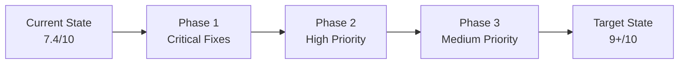

# Comprehensive Recommendations Report

> Final actionable recommendations for achieving parity with Spotify's performance standards and visual identity. This document synthesizes findings from all analysis documents and provides a complete implementation guide.

---

## Table of Contents

1. [Executive Summary](#executive-summary)
2. [Critical Priority Recommendations (P1)](#critical-priority-recommendations-p1)
3. [High Priority Recommendations (P2)](#high-priority-recommendations-p2)
4. [Medium Priority Recommendations (P3)](#medium-priority-recommendations-p3)
5. [Low Priority Recommendations (P4)](#low-priority-recommendations-p4)
6. [Implementation Roadmap](#implementation-roadmap)
7. [Design Token Specifications](#design-token-specifications)
8. [Component Specifications](#component-specifications)

---

## Executive Summary

### Overall Assessment

The Macro Tracker frontend demonstrates **strong architectural foundations** with excellent state management separation and good component organization. The overall alignment score with Spotify's design system is **7.4/10**.

#### Score Breakdown by Category

| Category               | Score  | Weight | Weighted Score | Status     |
| ---------------------- | ------ | ------ | -------------- | ---------- |
| Visual Design          | 7/10   | 20%    | 1.4            | Good       |
| UI Patterns            | 6.5/10 | 25%    | 1.625          | Needs Work |
| Component Architecture | 7.5/10 | 20%    | 1.5            | Good       |
| State Management       | 9/10   | 15%    | 1.35           | Excellent  |
| Accessibility          | 7/10   | 10%    | 0.7            | Good       |
| Performance            | 8/10   | 10%    | 0.8            | Good       |
| **Total**              |        | 100%   | **7.375**      | **Good**   |

### What This Score Means

- **9-10**: Excellent alignment, minor polish needed
- **7-8**: Good foundation, specific improvements needed
- **5-6**: Moderate alignment, significant work required
- **Below 5**: Major redesign needed

**Current Status (7.4)**: The application has solid foundations but requires targeted improvements in visual identity and accessibility to achieve Spotify-level design standards.

### Strategic Recommendation Overview



### Top 5 Action Items

| Priority | Action                  | Impact          | Effort |
| -------- | ----------------------- | --------------- | ------ |
| 1        | Button pill shape       | Brand identity  | Low    |
| 2        | ProgressBar ARIA        | Accessibility   | Low    |
| 3        | Skeleton loaders        | UX/Perception   | Medium |
| 4        | IconButton circular     | Visual identity | Low    |
| 5        | Input styling alignment | Visual identity | Low    |

---

## Critical Priority Recommendations (P1)

Items that must be addressed immediately due to accessibility compliance or core brand identity gaps.

---

### 1.1 Button Pill Shape and Styling

**Severity**: Critical  
**Impact**: Core brand identity element  
**Effort**: Low

#### Current State

The Button component uses `rounded-lg` (8px border-radius) with normal case text:

```typescript
// frontend/src/components/ui/Button.tsx
const buttonVariants = {
  primary:
    "bg-primary text-background hover:bg-primary/85 active:bg-primary/70 rounded-lg cursor-pointer disabled:opacity-50 ...",
};
```

#### Target State (Spotify Standard)

Spotify uses fully rounded pill-shaped buttons with uppercase text and hover scale:

```css
/* Spotify standard */
.btn-primary {
  background-color: #1db954;
  color: #000000;
  border-radius: 9999px;
  padding: 12px 32px;
  font-size: 14px;
  font-weight: 700;
  text-transform: uppercase;
  letter-spacing: 0.1em;
  transition: all 100ms ease-out;
}

.btn-primary:hover {
  background-color: #1ed760;
  transform: scale(1.02);
}

.btn-primary:active {
  background-color: #169c46;
  transform: scale(0.98);
}
```

#### Implementation Steps

- [ ] Update primary button variant to use `rounded-full`
- [ ] Add uppercase text transformation for primary variant
- [ ] Add letter-spacing for wider tracking
- [ ] Add hover scale effect (1.02)
- [ ] Ensure active scale (0.98) is maintained
- [ ] Update font-weight to bold (700)

#### Code Changes

**File**: [`frontend/src/components/ui/Button.tsx`](frontend/src/components/ui/Button.tsx)

```typescript
// BEFORE
const buttonVariants: Record<string, string> = {
  primary:
    "bg-primary text-background hover:bg-primary/85 active:bg-primary/70 rounded-lg cursor-pointer disabled:opacity-50 transition-all duration-150 ease-out font-semibold",
  // ... other variants
};

// AFTER
const buttonVariants: Record<string, string> = {
  primary:
    "bg-primary text-background hover:bg-primary-hover active:bg-primary-active rounded-full cursor-pointer disabled:opacity-50 transition-all duration-100 ease-out font-bold uppercase tracking-wider hover:scale-[1.02] active:scale-[0.98]",
  // ... other variants (secondary, outline may keep rounded-lg)
};
```

**File**: [`frontend/src/style.css`](frontend/src/style.css) - Add new color tokens

```css
@theme {
  /* Add to existing color tokens */
  --color-primary-hover: #1ed760;
  --color-primary-active: #169c46;
}
```

#### Files to Modify

| File                                                  | Changes                        |
| ----------------------------------------------------- | ------------------------------ |
| [`Button.tsx`](frontend/src/components/ui/Button.tsx) | Variant styling, scale effects |
| [`style.css`](frontend/src/style.css)                 | New hover/active color tokens  |

---

### 1.2 ProgressBar ARIA Attributes

**Severity**: Critical  
**Impact**: WCAG 2.1 AA compliance  
**Effort**: Low

#### Current State

The ProgressBar component lacks essential ARIA attributes for screen reader accessibility:

```typescript
// frontend/src/components/ui/ProgressBar.tsx
<div className={containerClasses}>
  <div className={fillClasses} style={{ width: `${safeProgress}%` }} />
</div>
```

#### Target State (WCAG 2.1 AA)

Progress bars must include proper ARIA attributes:

```html
<div
  role="progressbar"
  aria-valuenow="75"
  aria-valuemin="0"
  aria-valuemax="100"
  aria-label="Daily calorie progress"
>
  <div style="width: 75%"></div>
</div>
```

#### Implementation Steps

- [ ] Add `role="progressbar"` to container
- [ ] Add `aria-valuenow` with current progress value
- [ ] Add `aria-valuemin={0}`
- [ ] Add `aria-valuemax={100}`
- [ ] Add `aria-label` prop for accessible name
- [ ] Update props interface to include optional `ariaLabel`

#### Code Changes

**File**: [`frontend/src/components/ui/ProgressBar.tsx`](frontend/src/components/ui/ProgressBar.tsx)

```typescript
// BEFORE
interface ProgressBarProps {
  progress: number;
  color?: "blue" | "green" | "red" | "accent" | "purple" | "protein" | "carbs" | "fats";
  height?: "sm" | "md" | "lg";
  showPercentage?: boolean;
  className?: string;
  fillClass?: string;
}

// AFTER
interface ProgressBarProps {
  progress: number;
  color?: "blue" | "green" | "red" | "accent" | "purple" | "protein" | "carbs" | "fats";
  height?: "sm" | "md" | "lg";
  showPercentage?: boolean;
  className?: string;
  fillClass?: string;
  ariaLabel?: string; // NEW: Accessible name for screen readers
}

// Component implementation
export function ProgressBar({
  progress,
  color = "green",
  height = "md",
  showPercentage = false,
  className,
  fillClass,
  ariaLabel = "Progress", // NEW: Default label
}: ProgressBarProps) {
  const safeProgress = Math.min(100, Math.max(0, progress));

  // ... existing code ...

  return (
    <div
      role="progressbar"           // NEW
      aria-valuenow={safeProgress} // NEW
      aria-valuemin={0}            // NEW
      aria-valuemax={100}          // NEW
      aria-label={ariaLabel}       // NEW
      className={containerClasses}
    >
      <div className={fillClasses} style={{ width: `${safeProgress}%` }} />
      {showPercentage && (
        <span className="text-xs text-muted ml-2">{safeProgress}%</span>
      )}
    </div>
  );
}
```

#### Files to Modify

| File                                                            | Changes                          |
| --------------------------------------------------------------- | -------------------------------- |
| [`ProgressBar.tsx`](frontend/src/components/ui/ProgressBar.tsx) | ARIA attributes, props interface |

#### Usage Examples After Fix

```typescript
// Macro progress
<ProgressBar
  progress={75}
  ariaLabel="Daily protein progress"
  color="protein"
/>

// Calorie progress
<ProgressBar
  progress={caloriePercentage}
  ariaLabel="Daily calorie intake"
/>
```

---

### 1.3 Skeleton Loader Component

**Severity**: Critical  
**Impact**: UX improvement, reduced perceived latency  
**Effort**: Medium

#### Current State

The application uses spinner-based loading indicators without skeleton placeholders:

```typescript
// frontend/src/components/ui/LoadingStates.tsx
// Uses LoadingSpinner for all loading states
{isLoading && <LoadingSpinner size="md" />}
```

#### Target State (Spotify Standard)

Spotify uses gradient shimmer skeleton loaders:

```css
.skeleton {
  background: linear-gradient(90deg, #3e3e3e 0%, #4a4a4a 50%, #3e3e3e 100%);
  background-size: 200% 100%;
  animation: skeleton-loading 1.5s ease-in-out infinite;
  border-radius: 4px;
}

@keyframes skeleton-loading {
  0% {
    background-position: 200% 0;
  }
  100% {
    background-position: -200% 0;
  }
}
```

#### Implementation Steps

- [ ] Create new `Skeleton.tsx` component
- [ ] Add skeleton variants (text, circular, rectangular)
- [ ] Implement shimmer animation
- [ ] Create `SkeletonGroup.tsx` for common patterns
- [ ] Update `LoadingStates.tsx` to support skeleton mode
- [ ] Add skeleton patterns to key pages (Home, Goals)

#### Code Changes

**New File**: `frontend/src/components/ui/Skeleton.tsx`

```typescript
import { cn } from "@/utils/cn";

interface SkeletonProps {
  className?: string;
  variant?: "text" | "circular" | "rectangular" | "card";
  width?: number | string;
  height?: number | string;
  animation?: "shimmer" | "pulse" | "none";
}

export function Skeleton({
  className,
  variant = "text",
  width,
  height,
  animation = "shimmer",
}: SkeletonProps) {
  const baseClasses = "bg-surface-3";

  const variantClasses = {
    text: "rounded h-4",
    circular: "rounded-full",
    rectangular: "rounded-lg",
    card: "rounded-xl",
  };

  const animationClasses = {
    shimmer: "animate-shimmer bg-gradient-shimmer bg-[length:200%_100%]",
    pulse: "animate-pulse",
    none: "",
  };

  return (
    <div
      className={cn(
        baseClasses,
        variantClasses[variant],
        animationClasses[animation],
        className
      )}
      style={{ width, height }}
      aria-hidden="true"
    />
  );
}

// Pre-built skeleton patterns
export function SkeletonText({ lines = 3 }: { lines?: number }) {
  return (
    <div className="space-y-2">
      {Array.from({ length: lines }).map((_, i) => (
        <Skeleton
          key={i}
          variant="text"
          className={i === lines - 1 ? "w-3/4" : "w-full"}
        />
      ))}
    </div>
  );
}

export function SkeletonCard() {
  return (
    <div className="p-4 rounded-xl bg-surface space-y-3">
      <Skeleton variant="rectangular" className="h-32 w-full" />
      <Skeleton variant="text" className="w-2/3" />
      <Skeleton variant="text" className="w-1/2" />
    </div>
  );
}

export function SkeletonMetricCard() {
  return (
    <div className="p-4 rounded-xl bg-surface space-y-2">
      <div className="flex items-center gap-2">
        <Skeleton variant="circular" className="w-8 h-8" />
        <Skeleton variant="text" className="w-20" />
      </div>
      <Skeleton variant="text" className="h-8 w-24" />
      <Skeleton variant="text" className="w-16" />
    </div>
  );
}
```

**File**: [`frontend/src/style.css`](frontend/src/style.css) - Add shimmer animation

```css
@theme {
  /* Add shimmer gradient */
  --gradient-shimmer: linear-gradient(
    90deg,
    var(--color-surface-3) 0%,
    var(--color-surface-4) 50%,
    var(--color-surface-3) 100%
  );
}

/* Add custom animation */
@keyframes shimmer {
  0% {
    background-position: 200% 0;
  }
  100% {
    background-position: -200% 0;
  }
}

.animate-shimmer {
  animation: shimmer 1.5s ease-in-out infinite;
}

.bg-gradient-shimmer {
  background: var(--gradient-shimmer);
}
```

**File**: [`frontend/src/components/ui/index.ts`](frontend/src/components/ui/index.ts) - Export new component

```typescript
export {
  Skeleton,
  SkeletonText,
  SkeletonCard,
  SkeletonMetricCard,
} from "./Skeleton";
```

#### Files to Create/Modify

| File                                                                | Action | Changes               |
| ------------------------------------------------------------------- | ------ | --------------------- |
| `Skeleton.tsx`                                                      | Create | New component         |
| [`style.css`](frontend/src/style.css)                               | Modify | Shimmer animation     |
| [`index.ts`](frontend/src/components/ui/index.ts)                   | Modify | Export new component  |
| [`LoadingStates.tsx`](frontend/src/components/ui/LoadingStates.tsx) | Modify | Support skeleton mode |

---

## High Priority Recommendations (P2)

Items for near-term implementation that significantly improve visual identity and UX.

---

### 2.1 IconButton Circular Shape and Hover Effects

**Severity**: High  
**Impact**: Visual consistency  
**Effort**: Low

#### Current State

IconButton uses the Button component without explicit circular styling:

```typescript
// frontend/src/components/ui/IconButton.tsx
// Uses Button component which has rounded-lg
```

#### Target State (Spotify Standard)

```css
.btn-icon {
  width: 32px;
  height: 32px;
  border-radius: 50%;
  display: flex;
  align-items: center;
  justify-content: center;
  background: transparent;
  color: #b3b3b3;
  transition: all 100ms ease-out;
}

.btn-icon:hover {
  color: #ffffff;
  transform: scale(1.1);
}
```

#### Implementation Steps

- [ ] Add explicit circular shape (`rounded-full`)
- [ ] Add hover scale effect (1.1)
- [ ] Ensure consistent sizing (32px default)
- [ ] Update color transitions

#### Code Changes

**File**: [`frontend/src/components/ui/IconButton.tsx`](frontend/src/components/ui/IconButton.tsx)

```typescript
// Update the component styling
const baseClasses = cn(
  "inline-flex items-center justify-center",
  "rounded-full", // Changed from using Button's rounded-lg
  "transition-all duration-100 ease-out",
  "hover:scale-110", // NEW: Hover scale
  "active:scale-95",
  "focus-visible:ring-2 focus-visible:ring-primary focus-visible:ring-offset-2",
  sizeClasses[buttonSize],
  className,
);
```

---

### 2.2 Input Styling Alignment

**Severity**: High  
**Impact**: Visual consistency  
**Effort**: Low

#### Current State

```typescript
// frontend/src/components/form/Styles.ts
input: {
  base: "w-full px-3.5 py-2.5 bg-surface-2 border rounded-lg text-foreground ...",
  normal: "border-border",
}
```

#### Target State (Spotify Standard)

```css
.input-text {
  background-color: #3e3e3e;
  border: none;
  border-radius: 4px;
  padding: 14px 12px;
  font-size: 14px;
  color: #ffffff;
}

.input-text:focus {
  outline: none;
  box-shadow: 0 0 0 2px #ffffff;
}
```

#### Implementation Steps

- [ ] Lighten input background (closer to `#3e3e3e`)
- [ ] Consider removing border or making more subtle
- [ ] Update focus ring to white or primary
- [ ] Adjust border-radius to 4px for closer alignment

#### Code Changes

**File**: [`frontend/src/components/form/Styles.ts`](frontend/src/components/form/Styles.ts)

```typescript
// BEFORE
export const formStyles = {
  input: {
    base: "w-full px-3.5 py-2.5 bg-surface-2 border rounded-lg text-foreground transition-colors duration-150 placeholder:text-muted focus:outline-none focus:ring-2 focus:ring-primary",
    normal: "border-border",
    error: "border-error/60",
    // ...
  },
};

// AFTER - Option A: Subtle border approach
export const formStyles = {
  input: {
    base: "w-full px-3 py-3.5 bg-surface-4 border-none rounded text-foreground transition-all duration-100 placeholder:text-muted focus:outline-none focus:ring-2 focus:ring-white/80",
    normal: "",
    error: "ring-2 ring-error/60",
    // ...
  },
};

// AFTER - Option B: Minimal border approach (closer to Spotify)
export const formStyles = {
  input: {
    base: "w-full px-3 py-3.5 bg-surface-4 rounded text-foreground transition-all duration-100 placeholder:text-muted focus:outline-none focus:ring-2 focus:ring-white focus:bg-surface-3",
    normal: "border border-transparent",
    error: "border border-error/60",
    // ...
  },
};
```

---

### 2.3 Button Hover Scale Effect

**Severity**: High  
**Impact**: Interaction polish  
**Effort**: Low

#### Implementation

Add hover scale to all button variants:

```typescript
// Add to all button variants
"hover:scale-[1.02] active:scale-[0.98] transition-transform duration-100";
```

---

### 2.4 Tab Indicator Style

**Severity**: High  
**Impact**: Visual consistency  
**Effort**: Low

#### Current State

TabBar uses background color change for active state:

```typescript
// Active tab has background color
active ? "bg-primary text-background" : "text-muted hover:text-foreground";
```

#### Target State (Spotify Standard)

Spotify uses underline indicator:

```css
.tab-active {
  font-weight: 700;
  border-bottom: 2px solid #1db954;
  color: #ffffff;
}

.tab-inactive {
  color: #b3b3b3;
}
```

#### Implementation Steps

- [ ] Add underline indicator option to TabBar
- [ ] Update active state styling
- [ ] Consider making underline style the default

#### Code Changes

**File**: [`frontend/src/components/ui/TabBar.tsx`](frontend/src/components/ui/TabBar.tsx)

```typescript
// Add indicatorStyle prop
interface TabBarProps {
  items: TabItem[];
  activeKey: string;
  onChange: (key: string) => void;
  indicatorStyle?: "background" | "underline";
  // ... other props
}

// In TabButton, add underline variant
const indicatorClasses =
  indicatorStyle === "underline" ?
    cn(active && "border-b-2 border-primary font-bold", "pb-2")
  : cn(active && "bg-primary text-background rounded-md", "px-4 py-2");
```

---

### 2.5 Modal Animation Simplification

**Severity**: High  
**Impact**: Visual consistency  
**Effort**: Low

#### Current State

Modal uses 3D rotation animation:

```typescript
const modalVariants = {
  hidden: { opacity: 0, scale: 0.95, y: 20, rotateX: -10 },
  visible: { opacity: 1, scale: 1, y: 0, rotateX: 0 },
  exit: { opacity: 0, scale: 0.95, y: 20, rotateX: 10 },
};
```

#### Target State (Spotify Standard)

Spotify uses simpler fade + scale:

```typescript
const modalVariants = {
  hidden: { opacity: 0, scale: 0.95 },
  visible: {
    opacity: 1,
    scale: 1,
    transition: { duration: 200, ease: "easeOut" },
  },
  exit: { opacity: 0, scale: 0.95 },
};
```

#### Implementation Steps

- [ ] Remove rotateX from animation variants
- [ ] Simplify to fade + scale only
- [ ] Keep reduced motion support

---

## Medium Priority Recommendations (P3)

Items for medium-term roadmap that enhance UX and performance.

---

### 3.1 Sidebar Navigation Pattern

**Severity**: Medium  
**Impact**: Major UX change  
**Effort**: High

#### Current State

Application uses top navbar only for all screen sizes.

#### Target State (Spotify Standard)

Desktop sidebar navigation with collapsible behavior:

```
┌──────────────┬──────────────────────────────────────────┐
│              │                                          │
│  🏠 Home     │         Main Content Area               │
│  📊 Goals    │                                          │
│  ⚙️ Settings │                                          │
│              │                                          │
│              │                                          │
│              │                                          │
└──────────────┴──────────────────────────────────────────┘
```

#### Implementation Steps

- [ ] Create `Sidebar.tsx` component
- [ ] Create `SidebarItem.tsx` component
- [ ] Create `SidebarSection.tsx` component
- [ ] Add responsive behavior (sidebar on desktop, bottom nav on mobile)
- [ ] Implement collapsible sidebar for tablet
- [ ] Update `MainLayout.tsx` to conditionally show sidebar

#### New Components

**File**: `frontend/src/components/layout/Sidebar.tsx`

```typescript
interface SidebarProps {
  collapsed?: boolean;
  onToggle?: () => void;
}

export function Sidebar({ collapsed = false, onToggle }: SidebarProps) {
  return (
    <aside
      className={cn(
        "fixed left-0 top-0 bottom-0 z-40",
        "bg-background border-r border-border",
        "transition-all duration-200",
        collapsed ? "w-[72px]" : "w-[280px]"
      )}
    >
      {/* Logo */}
      <div className="h-16 flex items-center px-4 border-b border-border">
        <LogoButton collapsed={collapsed} />
      </div>

      {/* Navigation */}
      <nav className="p-2 space-y-1">
        <SidebarItem icon={HomeIcon} label="Home" href="/home" collapsed={collapsed} />
        <SidebarItem icon={TargetIcon} label="Goals" href="/goals" collapsed={collapsed} />
        <SidebarItem icon={BarChartIcon} label="Reports" href="/reporting" collapsed={collapsed} />
        <SidebarItem icon={SettingsIcon} label="Settings" href="/settings" collapsed={collapsed} />
      </nav>

      {/* Collapse toggle */}
      <button
        onClick={onToggle}
        className="absolute bottom-4 right-2 p-2 rounded-full hover:bg-surface-2"
      >
        <ChevronIcon className={cn("transition-transform", collapsed && "rotate-180")} />
      </button>
    </aside>
  );
}
```

---

### 3.2 Virtualization for Large Lists

**Severity**: Medium  
**Impact**: Performance for power users  
**Effort**: Medium

#### Current State

Entry history lists render all items without virtualization.

#### Target State

Implement virtualization for lists with 100+ items:

```typescript
import { useVirtualizer } from "@tanstack/react-virtual";

const rowVirtualizer = useVirtualizer({
  count: entries.length,
  getScrollElement: () => parentRef.current,
  estimateSize: () => 64, // Row height
  overscan: 5,
});
```

#### Implementation Steps

- [ ] Install `@tanstack/react-virtual`
- [ ] Create virtualized list wrapper component
- [ ] Update `DesktopEntryTable` to use virtualization
- [ ] Update `MobileEntryCards` to use virtualization
- [ ] Add threshold check (only virtualize 100+ items)

---

### 3.3 Focus Management Enhancement

**Severity**: Medium  
**Impact**: Accessibility  
**Effort**: Medium

#### Current State

Basic focus management exists but could be enhanced.

#### Target State

Full keyboard navigation support:

```css
/* Focus visible for keyboard users only */
:focus-visible {
  outline: 2px solid #1db954;
  outline-offset: 2px;
}

/* Remove default outline for mouse users */
:focus:not(:focus-visible) {
  outline: none;
}
```

#### Implementation Steps

- [ ] Add focus-visible styles globally
- [ ] Implement focus trap in modals
- [ ] Add focus restoration after modal close
- [ ] Implement skip links for main content
- [ ] Add keyboard navigation for dropdowns

---

### 3.4 Offline Action Queue

**Severity**: Medium  
**Impact**: Offline experience  
**Effort**: Medium

#### Current State

Basic offline support via service worker and LocalStorage persistence.

#### Target State

Queue offline actions for sync:

```typescript
interface OfflineAction {
  id: string;
  type: "ADD_ENTRY" | "UPDATE_ENTRY" | "DELETE_ENTRY";
  payload: unknown;
  timestamp: number;
  retries: number;
}

// Process queue when online
window.addEventListener("online", processOfflineQueue);
```

---

## Low Priority Recommendations (P4)

Items for long-term consideration and future-proofing.

---

### 4.1 Custom Dropdown Component

**Severity**: Low  
**Impact**: Visual consistency  
**Effort**: Medium

Create custom dropdown with animations instead of native select:

```typescript
interface SelectProps {
  options: SelectOption[];
  value: string;
  onChange: (value: string) => void;
  placeholder?: string;
  animated?: boolean;
}
```

---

### 4.2 Page Transition Simplification

**Severity**: Low  
**Impact**: Visual preference  
**Effort**: Low

Consider simpler fade+slide instead of blur effect:

```typescript
const pageVariants = {
  initial: { opacity: 0, x: 20 },
  animate: { opacity: 1, x: 0 },
  exit: { opacity: 0, x: -20 },
};
```

---

### 4.3 Icon Active State Filled Variants

**Severity**: Low  
**Impact**: Visual polish  
**Effort**: Low

Add filled icon variants for active states:

```typescript
// When active, use filled icon variant
<Icon name="home" variant={isActive ? "filled" : "outlined"} />
```

---

### 4.4 Dynamic Theme Extraction

**Severity**: Low  
**Impact**: Visual enhancement  
**Effort**: High

Extract dominant colors from user images for contextual theming (similar to Spotify's album art extraction).

---

### 4.5 Animation Timing Standardization

**Severity**: Low  
**Impact**: Consistency  
**Effort**: Low

Standardize all animations to Spotify's timing:

| Token               | Duration | Usage                |
| ------------------- | -------- | -------------------- |
| `--duration-fast`   | 100ms    | Hover states         |
| `--duration-normal` | 200ms    | Standard transitions |
| `--duration-slow`   | 300ms    | Modal opens          |

---

## Implementation Roadmap

### Phase 1: Critical Fixes (Week 1-2)

| Task                      | Priority | Effort | Files                                            | Status |
| ------------------------- | -------- | ------ | ------------------------------------------------ | ------ |
| Button pill shape         | P1       | Low    | `Button.tsx`, `style.css`                        | [ ]    |
| ProgressBar ARIA          | P1       | Low    | `ProgressBar.tsx`                                | [ ]    |
| Skeleton loader component | P1       | Medium | `Skeleton.tsx`, `style.css`, `LoadingStates.tsx` | [ ]    |

### Phase 2: High Priority Items (Week 3-4)

| Task                     | Priority | Effort | Files                         | Status |
| ------------------------ | -------- | ------ | ----------------------------- | ------ |
| IconButton circular      | P2       | Low    | `IconButton.tsx`              | [ ]    |
| Input styling alignment  | P2       | Low    | `Styles.ts`                   | [ ]    |
| Button hover scale       | P2       | Low    | `Button.tsx`                  | [ ]    |
| Tab indicator style      | P2       | Low    | `TabBar.tsx`, `TabButton.tsx` | [ ]    |
| Modal animation simplify | P2       | Low    | `Modal.tsx`                   | [ ]    |

### Phase 3: Medium Priority Items (Month 2)

| Task                 | Priority | Effort | Files                                           | Status |
| -------------------- | -------- | ------ | ----------------------------------------------- | ------ |
| Sidebar navigation   | P3       | High   | `Sidebar.tsx`, `MainLayout.tsx`                 | [ ]    |
| Virtualization       | P3       | Medium | `DesktopEntryTable.tsx`, `MobileEntryCards.tsx` | [ ]    |
| Focus management     | P3       | Medium | Multiple                                        | [ ]    |
| Offline action queue | P3       | Medium | New service file                                | [ ]    |

### Phase 4: Low Priority Items (Month 3+)

| Task                     | Priority | Effort | Files                | Status |
| ------------------------ | -------- | ------ | -------------------- | ------ |
| Custom dropdown          | P4       | Medium | `Select.tsx`         | [ ]    |
| Page transition simplify | P4       | Low    | `PageTransition.tsx` | [ ]    |
| Icon filled variants     | P4       | Low    | `Icons.tsx`          | [ ]    |
| Dynamic theme extraction | P4       | High   | New utility          | [ ]    |

---

## Design Token Specifications

### Color Tokens

#### Brand Colors

| Token                    | Hex       | Usage                           |
| ------------------------ | --------- | ------------------------------- |
| `--color-primary`        | `#22c55e` | Primary brand color, CTAs       |
| `--color-primary-hover`  | `#1ed760` | Primary button hover (Spotify)  |
| `--color-primary-active` | `#169c46` | Primary button active (Spotify) |
| `--color-secondary`      | `#6ee7a0` | Secondary accents               |
| `--color-vibrant-accent` | `#f59e0b` | High-impact CTAs                |

#### Surface Colors (Elevation)

| Token                | Hex       | Level | Usage                  |
| -------------------- | --------- | ----- | ---------------------- |
| `--color-background` | `#09090b` | 0     | Page background        |
| `--color-surface`    | `#121218` | 1     | Cards, modals          |
| `--color-surface-2`  | `#1a1a22` | 2     | Nested elements        |
| `--color-surface-3`  | `#22222c` | 3     | High-emphasis elements |
| `--color-surface-4`  | `#2a2a36` | 4     | Highest emphasis       |

**Recommended Adjustment**: Consider adding `--color-surface-5: #3e3e3e` for input backgrounds and hover states to match Spotify's lighter elevated surfaces.

#### Text Colors

| Token                | Value                       | Usage                     |
| -------------------- | --------------------------- | ------------------------- |
| `--color-foreground` | `#fafafa`                   | Primary text              |
| `--color-muted`      | `#a1a1aa`                   | Secondary text, labels    |
| `--text-primary`     | `rgba(255, 255, 255, 1)`    | Headings                  |
| `--text-secondary`   | `rgba(255, 255, 255, 0.85)` | Emphasized body           |
| `--text-body`        | `rgba(255, 255, 255, 0.7)`  | Standard body             |
| `--text-muted`       | `rgba(255, 255, 255, 0.5)`  | Secondary text            |
| `--text-hint`        | `rgba(255, 255, 255, 0.35)` | Tertiary text, timestamps |

#### Semantic Colors

| Token             | Hex       | Usage          |
| ----------------- | --------- | -------------- |
| `--color-success` | `#22c55e` | Success states |
| `--color-warning` | `#f59e0b` | Warnings       |
| `--color-error`   | `#ef4444` | Errors         |

#### Macro Colors

| Token             | Hex       | Usage                      |
| ----------------- | --------- | -------------------------- |
| `--color-protein` | `#22c55e` | Protein indicators, charts |
| `--color-carbs`   | `#3b82f6` | Carbohydrate indicators    |
| `--color-fats`    | `#ef4444` | Fat indicators, charts     |

### Typography Tokens

| Token         | Size | Weight | Line Height | Usage               |
| ------------- | ---- | ------ | ----------- | ------------------- |
| `--text-xs`   | 12px | 400    | 1.4         | Timestamps, badges  |
| `--text-sm`   | 14px | 400    | 1.5         | Metadata, secondary |
| `--text-base` | 16px | 400    | 1.5         | Body text           |
| `--text-lg`   | 18px | 400    | 1.5         | Emphasized text     |
| `--text-xl`   | 20px | 400    | 1.4         | Large text          |
| `--text-2xl`  | 24px | 600    | 1.3         | Card titles         |
| `--text-3xl`  | 30px | 600    | 1.3         | Section headers     |
| `--text-4xl`  | 36px | 600    | 1.2         | Page titles         |

### Spacing Tokens

| Token          | Value | Usage                      |
| -------------- | ----- | -------------------------- |
| `--spacing-1`  | 4px   | Tight spacing, icon gaps   |
| `--spacing-2`  | 8px   | Component internal padding |
| `--spacing-3`  | 12px  | Small gaps                 |
| `--spacing-4`  | 16px  | Standard component padding |
| `--spacing-5`  | 20px  | Medium gaps                |
| `--spacing-6`  | 24px  | Section spacing            |
| `--spacing-8`  | 32px  | Major section dividers     |
| `--spacing-10` | 40px  | Large gaps                 |
| `--spacing-12` | 48px  | Page section gaps          |
| `--spacing-16` | 64px  | Hero section spacing       |

### Border Radius Tokens

| Token           | Value  | Usage                           |
| --------------- | ------ | ------------------------------- |
| `--radius-sm`   | 4px    | Small buttons, badges, inputs   |
| `--radius-md`   | 8px    | Cards, buttons (secondary)      |
| `--radius-lg`   | 12px   | Large cards, modals             |
| `--radius-xl`   | 16px   | Featured content cards          |
| `--radius-full` | 9999px | Pills, avatars, primary buttons |

### Animation Tokens

| Token               | Duration | Easing                                    | Usage                |
| ------------------- | -------- | ----------------------------------------- | -------------------- |
| `--duration-fast`   | 100ms    | `ease-out`                                | Hover states         |
| `--duration-normal` | 200ms    | `ease-out`                                | Standard transitions |
| `--duration-slow`   | 300ms    | `ease-in-out`                             | Modal opens          |
| `--ease-out`        | -        | `cubic-bezier(0, 0, 0.2, 1)`              | Standard easing      |
| `--ease-in-out`     | -        | `cubic-bezier(0.4, 0, 0.2, 1)`            | Bidirectional        |
| `--ease-spring`     | -        | `cubic-bezier(0.175, 0.885, 0.32, 1.275)` | Bouncy animations    |
| `--ease-modal`      | -        | `cubic-bezier(0.32, 0.72, 0, 1)`          | Modal animations     |

### Shadow Tokens

| Token                 | Value                               | Usage            |
| --------------------- | ----------------------------------- | ---------------- |
| `--shadow-surface`    | `0 1px 2px 0 rgba(0,0,0,0.03)`      | Subtle elevation |
| `--shadow-card`       | `0 1px 3px rgba(0,0,0,0.1)`         | Cards            |
| `--shadow-card-hover` | `0 4px 12px rgba(0,0,0,0.15)`       | Card hover       |
| `--shadow-modal`      | `0 20px 40px -12px rgba(0,0,0,0.2)` | Modals           |

---

## Component Specifications

### Button Component

**File**: [`frontend/src/components/ui/Button.tsx`](frontend/src/components/ui/Button.tsx)

#### Props Interface Changes

```typescript
interface ButtonProps {
  children?: React.ReactNode;
  text?: string;
  type?: "button" | "submit" | "reset";
  variant?:
    | "primary"
    | "secondary"
    | "neutral"
    | "danger"
    | "success"
    | "ghost"
    | "outline";
  buttonSize?: "xs" | "sm" | "md" | "lg";
  icon?: React.ReactNode;
  iconPosition?: "left" | "right";
  isLoading?: boolean;
  loadingText?: string;
  disabled?: boolean;
  className?: string;
  fullWidth?: boolean;
  ariaLabel?: string;
  // NEW PROPS
  pill?: boolean; // Force pill shape for non-primary variants
  uppercase?: boolean; // Force uppercase text
}
```

#### Styling Changes

| Variant   | Current      | Recommended                             |
| --------- | ------------ | --------------------------------------- |
| primary   | `rounded-lg` | `rounded-full uppercase tracking-wider` |
| secondary | `rounded-lg` | `rounded-lg` (keep)                     |
| outline   | `rounded-lg` | `rounded-full` (optional)               |
| ghost     | `rounded-lg` | `rounded-lg` (keep)                     |

#### Behavior Changes

- Add hover scale (1.02) to primary variant
- Maintain active scale (0.98)
- Add 100ms transition duration

---

### ProgressBar Component

**File**: [`frontend/src/components/ui/ProgressBar.tsx`](frontend/src/components/ui/ProgressBar.tsx)

#### Props Interface Changes

```typescript
interface ProgressBarProps {
  progress: number;
  color?:
    | "blue"
    | "green"
    | "red"
    | "accent"
    | "purple"
    | "protein"
    | "carbs"
    | "fats";
  height?: "sm" | "md" | "lg";
  showPercentage?: boolean;
  className?: string;
  fillClass?: string;
  // NEW PROPS
  ariaLabel?: string; // Required for accessibility
  animated?: boolean; // Enable/disable animation
}
```

#### Accessibility Attributes

```typescript
<div
  role="progressbar"
  aria-valuenow={safeProgress}
  aria-valuemin={0}
  aria-valuemax={100}
  aria-label={ariaLabel || "Progress"}
>
```

---

### IconButton Component

**File**: [`frontend/src/components/ui/IconButton.tsx`](frontend/src/components/ui/IconButton.tsx)

#### Styling Changes

| Property      | Current   | Recommended       |
| ------------- | --------- | ----------------- |
| Border radius | Inherited | `rounded-full`    |
| Hover scale   | None      | `hover:scale-110` |
| Active scale  | None      | `active:scale-95` |
| Transition    | 200ms     | 100ms             |

---

### Modal Component

**File**: [`frontend/src/components/ui/Modal.tsx`](frontend/src/components/ui/Modal.tsx)

#### Animation Changes

```typescript
// BEFORE
const modalVariants = {
  hidden: { opacity: 0, scale: 0.95, y: 20, rotateX: -10 },
  visible: { opacity: 1, scale: 1, y: 0, rotateX: 0 },
  exit: { opacity: 0, scale: 0.95, y: 20, rotateX: 10 },
};

// AFTER (simplified)
const modalVariants = {
  hidden: { opacity: 0, scale: 0.95 },
  visible: {
    opacity: 1,
    scale: 1,
    transition: { duration: 0.2, ease: [0.32, 0.72, 0, 1] },
  },
  exit: { opacity: 0, scale: 0.95 },
};
```

---

### TextField Component

**File**: [`frontend/src/components/form/TextField.tsx`](frontend/src/components/form/TextField.tsx)

#### Styling Changes (via Styles.ts)

| Property      | Current         | Recommended          |
| ------------- | --------------- | -------------------- |
| Background    | `bg-surface-2`  | `bg-surface-4`       |
| Border radius | `rounded-lg`    | `rounded`            |
| Border        | `border-border` | `border-transparent` |
| Focus ring    | `ring-primary`  | `ring-white/80`      |

---

### TabBar Component

**File**: [`frontend/src/components/ui/TabBar.tsx`](frontend/src/components/ui/TabBar.tsx)

#### Props Interface Changes

```typescript
interface TabBarProps {
  items: TabItem[];
  activeKey: string;
  onChange: (key: string) => void;
  // NEW PROPS
  indicatorStyle?: "background" | "underline";
  layoutId?: string;
  isMotion?: boolean;
}
```

#### Styling Changes

Add underline indicator option:

```typescript
// Underline style
const underlineClasses = cn(
  "px-4 py-2 font-medium transition-colors",
  active ?
    "text-foreground border-b-2 border-primary font-bold"
  : "text-muted hover:text-foreground",
);
```

---

## Summary Checklist

### Phase 1 Completion Criteria

- [ ] All primary buttons have pill shape
- [ ] All buttons have hover scale effect
- [ ] ProgressBar has complete ARIA attributes
- [ ] Skeleton loader component created and integrated
- [ ] All changes tested with screen readers

### Phase 2 Completion Criteria

- [ ] IconButton is circular with hover scale
- [ ] Input fields have updated styling
- [ ] TabBar has underline indicator option
- [ ] Modal animations simplified
- [ ] All changes tested across browsers

### Phase 3 Completion Criteria

- [ ] Sidebar navigation implemented for desktop
- [ ] Virtualization added for large lists
- [ ] Focus management enhanced
- [ ] Offline action queue implemented

### Phase 4 Completion Criteria

- [ ] Custom dropdown component created
- [ ] Page transitions simplified
- [ ] Icon filled variants added
- [ ] Dynamic theme extraction explored

---

## References

- [Spotify Design Analysis](./spotify-design-analysis.md) - Source design system reference
- [Frontend Implementation Analysis](./frontend-implementation-analysis.md) - Current implementation overview
- [Component Architecture Analysis](./component-architecture-analysis.md) - Detailed component scores
- [Gap Analysis](./gap-analysis.md) - Priority matrix and gap identification
- [Spotify Design Blog](https://design.spotify.com/) - Official design resources
- [WCAG 2.1 Guidelines](https://www.w3.org/WAI/WCAG21/quickref/) - Accessibility standards

---

_Document created: February 2026_  
_Purpose: Comprehensive implementation guide for Spotify design system alignment_
