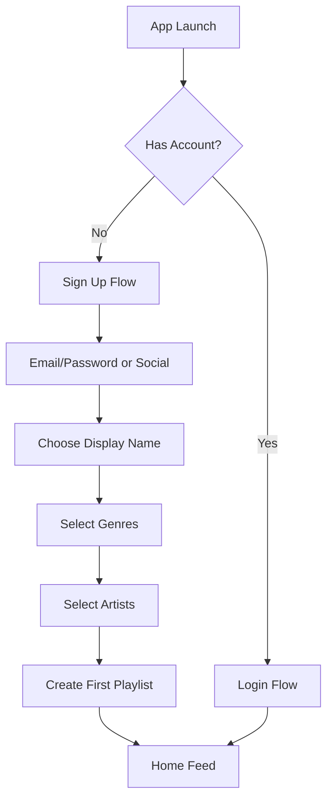
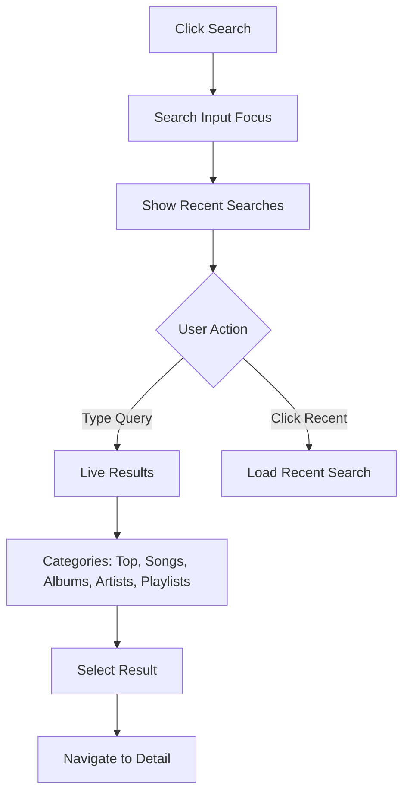
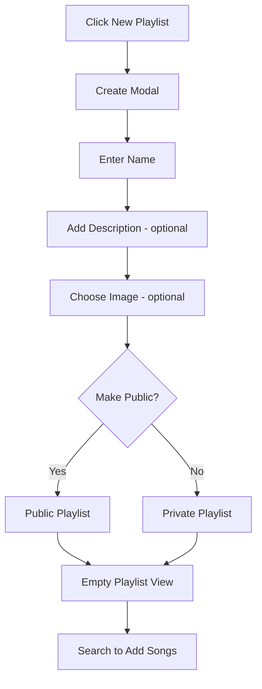

# Spotify Design System Analysis

> Comprehensive research document covering Spotify's design philosophy, visual language, and technical implementation patterns. This analysis serves as a baseline reference for cross-examination against frontend implementations.

---

## Table of Contents

1. [Executive Summary](#executive-summary)
2. [Visual Design Language](#visual-design-language)
3. [UI/UX Patterns](#uiux-patterns)
4. [Component Architecture Principles](#component-architecture-principles)
5. [Interaction Flows](#interaction-flows)
6. [Scalability Requirements](#scalability-requirements)
7. [Design Tokens Reference](#design-tokens-reference)
8. [Key Differentiators](#key-differentiators)

---

## Executive Summary

Spotify's design philosophy centers on **"Music for Everyone"** - a principle that extends beyond content accessibility to encompass visual accessibility, cultural inclusivity, and seamless cross-platform experiences. The design system emphasizes:

### Core Philosophy Pillars

| Pillar                         | Description                                                                             |
| ------------------------------ | --------------------------------------------------------------------------------------- |
| **Dark-First Design**          | Native dark mode with carefully crafted contrast ratios for extended listening sessions |
| **Content-Forward UI**         | Album art, playlists, and user content take visual precedence over UI chrome            |
| **Fluid Transitions**          | Motion design that mirrors the continuous nature of music playback                      |
| **Personalization at Scale**   | UI adapts to user behavior, time of day, and content preferences                        |
| **Cross-Platform Consistency** | Unified experience across desktop, mobile, web, and embedded devices                    |

### Design Principles

1. **Reduce Friction** - Minimize steps between user intent and music playing
2. **Contextual Awareness** - UI adapts to listening context (workout, focus, party)
3. **Social Integration** - Seamless sharing and collaborative features
4. **Progressive Disclosure** - Advanced features revealed contextually
5. **Emotional Connection** - Design evokes the emotional nature of music

---

## Visual Design Language

### Color Palette

Spotify employs a sophisticated dark-first color system optimized for OLED displays and extended viewing sessions.

#### Primary Colors

| Token                   | Hex       | RGB              | Usage                                        |
| ----------------------- | --------- | ---------------- | -------------------------------------------- |
| `--spotify-green`       | `#1DB954` | rgb(29, 185, 84) | Primary actions, active states, brand accent |
| `--spotify-green-light` | `#1ED760` | rgb(30, 215, 96) | Hover states on primary green                |
| `--spotify-green-dark`  | `#169C46` | rgb(22, 156, 70) | Pressed states on primary green              |

#### Background Colors (Dark Theme)

| Token            | Hex       | RGB             | Usage                       |
| ---------------- | --------- | --------------- | --------------------------- |
| `--bg-base`      | `#121212` | rgb(18, 18, 18) | Main application background |
| `--bg-highlight` | `#1A1A1A` | rgb(26, 26, 26) | Elevated surfaces, cards    |
| `--bg-elevated`  | `#242424` | rgb(36, 36, 36) | Modals, dropdowns, tooltips |
| `--bg-tinted`    | `#2A2A2A` | rgb(42, 42, 42) | Hover states on surfaces    |
| `--bg-press`     | `#3E3E3E` | rgb(62, 62, 62) | Active/pressed states       |

#### Text Colors

| Token                  | Hex       | Opacity | Usage                     |
| ---------------------- | --------- | ------- | ------------------------- |
| `--text-base`          | `#FFFFFF` | 100%    | Primary text, headings    |
| `--text-subdued`       | `#B3B3B3` | ~70%    | Secondary text, metadata  |
| `--text-muted`         | `#6A6A6A` | ~40%    | Tertiary text, timestamps |
| `--text-bright-accent` | `#1DB954` | 100%    | Accent text, links        |

#### Semantic Colors

| Token                | Hex       | Usage                              |
| -------------------- | --------- | ---------------------------------- |
| `--semantic-red`     | `#E91429` | Errors, explicit content indicator |
| `--semantic-yellow`  | `#FFC864` | Warnings, premium prompts          |
| `--semantic-blue`    | `#2E77D0` | Information, links                 |
| `--now-playing-blue` | `#509BF5` | Now playing bar accent             |

#### Gradient System

Spotify uses dynamic gradients extracted from album art for contextual theming:

```css
/* Dynamic album art gradient overlay */
--gradient-album-overlay: linear-gradient(
  180deg,
  rgba(var(--album-dominant-color), 0.6) 0%,
  rgba(18, 18, 18, 1) 100%
);

/* Standard card hover gradient */
--gradient-card-hover: linear-gradient(
  180deg,
  transparent 0%,
  rgba(0, 0, 0, 0.7) 100%
);
```

### Typography System

Spotify uses **Circular** as its primary typeface, designed by Lineto. The system prioritizes readability at small sizes and maintains clarity in the dark UI context.

#### Font Stack

```css
--font-family-base:
  "Circular", -apple-system, BlinkMacSystemFont, "Segoe UI", sans-serif;
--font-family-fallback: system-ui, -apple-system, sans-serif;
--font-family-mono: "SF Mono", "Fira Code", monospace;
```

#### Type Scale

| Token             | Size | Weight | Line Height | Letter Spacing | Usage                    |
| ----------------- | ---- | ------ | ----------- | -------------- | ------------------------ |
| `--font-size-xs`  | 10px | 400    | 1.4         | 0.1em          | Timestamps, badges       |
| `--font-size-sm`  | 12px | 400    | 1.5         | 0.015em        | Metadata, secondary info |
| `--font-size-md`  | 14px | 400    | 1.5         | 0              | Body text, list items    |
| `--font-size-lg`  | 16px | 400    | 1.5         | 0              | Primary body text        |
| `--font-size-xl`  | 18px | 400    | 1.4         | 0              | Emphasized text          |
| `--font-size-2xl` | 24px | 700    | 1.3         | -0.005em       | Card titles              |
| `--font-size-3xl` | 28px | 700    | 1.3         | -0.01em        | Section headers          |
| `--font-size-4xl` | 32px | 700    | 1.2         | -0.015em       | Page titles              |
| `--font-size-5xl` | 48px | 900    | 1.1         | -0.02em        | Hero headlines           |
| `--font-size-6xl` | 96px | 900    | 1.0         | -0.03em        | Large hero numbers       |

#### Font Weights

| Token                  | Weight | Usage                    |
| ---------------------- | ------ | ------------------------ |
| `--font-weight-book`   | 400    | Body text, descriptions  |
| `--font-weight-medium` | 500    | Emphasized body, labels  |
| `--font-weight-bold`   | 700    | Headings, buttons        |
| `--font-weight-black`  | 900    | Hero text, large numbers |

### Spacing and Layout Grid

Spotify uses an 8-point grid system with consistent spacing increments.

#### Spacing Scale

| Token           | Value | Usage                      |
| --------------- | ----- | -------------------------- |
| `--spacing-xs`  | 4px   | Tight spacing, icon gaps   |
| `--spacing-sm`  | 8px   | Component internal padding |
| `--spacing-md`  | 16px  | Standard component padding |
| `--spacing-lg`  | 24px  | Section spacing            |
| `--spacing-xl`  | 32px  | Major section dividers     |
| `--spacing-2xl` | 48px  | Page section gaps          |
| `--spacing-3xl` | 64px  | Hero section spacing       |

#### Layout Grid Specifications

```
Desktop (>= 1280px):
- Sidebar: 280px fixed
- Main content: Fluid (min 720px)
- Right sidebar: 280px (contextual)
- Gutter: 16px

Tablet (768px - 1279px):
- Sidebar: Collapsible, 72px collapsed
- Main content: Fluid
- Gutter: 12px

Mobile (< 768px):
- Full-width content
- Bottom navigation: 56px
- Safe area insets applied
```

#### Border Radius

| Token           | Value  | Usage                             |
| --------------- | ------ | --------------------------------- |
| `--radius-sm`   | 4px    | Small buttons, badges             |
| `--radius-md`   | 8px    | Cards, inputs, buttons            |
| `--radius-lg`   | 12px   | Large cards, modals               |
| `--radius-xl`   | 16px   | Featured content cards            |
| `--radius-full` | 9999px | Pills, avatars, circular elements |

### Iconography

Spotify uses a custom icon set designed at 24x24px base size with a 2px stroke width.

#### Icon Specifications

| Property       | Value                                      |
| -------------- | ------------------------------------------ |
| Base Size      | 24x24px                                    |
| Stroke Width   | 2px                                        |
| Corner Radius  | 1px                                        |
| Optical Weight | Consistent 2px                             |
| Style          | Outlined (default), Filled (active states) |

#### Icon Categories

1. **Navigation** - Back, forward, home, search, library
2. **Playback** - Play, pause, skip, shuffle, repeat
3. **Actions** - Add, remove, edit, share, download
4. **Status** - Check, warning, error, loading
5. **Social** - Profile, followers, collaborative

#### Icon Sizing Scale

| Token       | Size | Usage                    |
| ----------- | ---- | ------------------------ |
| `--icon-xs` | 12px | Inline icons, badges     |
| `--icon-sm` | 16px | Button icons, list items |
| `--icon-md` | 24px | Standard icons           |
| `--icon-lg` | 32px | Feature icons            |
| `--icon-xl` | 48px | Hero icons               |

### Motion and Animation Principles

Spotify's motion design philosophy centers on **"Rhythm and Flow"** - animations that feel musical and maintain user orientation.

#### Motion Principles

1. **Musical Timing** - Animations sync to musical concepts (beats, measures)
2. **Continuous Flow** - No jarring stops; elements transition smoothly
3. **Purposeful Motion** - Every animation communicates state change
4. **Performance First** - 60fps minimum on all animations

#### Animation Durations

| Token                | Duration | Easing                       | Usage                         |
| -------------------- | -------- | ---------------------------- | ----------------------------- |
| `--duration-instant` | 0ms      | -                            | Immediate state changes       |
| `--duration-fast`    | 100ms    | ease-out                     | Hover states, toggles         |
| `--duration-normal`  | 200ms    | ease-out                     | Standard transitions          |
| `--duration-slow`    | 300ms    | ease-in-out                  | Modal opens, page transitions |
| `--duration-slower`  | 400ms    | ease-in-out                  | Complex animations            |
| `--duration-slowest` | 500ms    | cubic-bezier(0.4, 0, 0.2, 1) | Hero animations               |

#### Easing Functions

```css
--ease-out: cubic-bezier(0, 0, 0.2, 1);
--ease-in: cubic-bezier(0.4, 0, 1, 1);
--ease-in-out: cubic-bezier(0.4, 0, 0.2, 1);
--ease-bounce: cubic-bezier(0.68, -0.55, 0.265, 1.55);
--ease-spring: cubic-bezier(0.175, 0.885, 0.32, 1.275);
```

#### Key Animation Patterns

1. **Play Button Expansion** - Play icon morphs to pause with scale pulse
2. **Now Playing Bar Slide** - Bottom bar slides up with content fade
3. **Card Hover Lift** - Subtle scale (1.02) with shadow increase
4. **Page Transitions** - Fade with horizontal slide (300ms)
5. **Equalizer Animation** - Three-bar pulse synced to playback

---

## UI/UX Patterns

### Navigation Patterns

#### Sidebar Navigation (Desktop)

```
┌─────────────────────────────────────────────────────────┐
│  [Logo]                                    [Profile]     │
├──────────────┬──────────────────────────────────────────┤
│              │                                          │
│  Home        │         Main Content Area               │
│  Search      │                                          │
│  Library     │                                          │
│              │                                          │
│  Playlists   │                                          │
│  ──────────  │                                          │
│  + New       │                                          │
│  Folder      │                                          │
│              │                                          │
└──────────────┴──────────────────────────────────────────┘
```

**Specifications:**

- Fixed position, full-height
- Width: 280px (expandable to 320px)
- Scrollable playlist section with sticky header
- Drag-and-drop playlist reordering
- Context menu on right-click

#### Bottom Navigation (Mobile)

| Tab     | Icon             | Active Indicator    |
| ------- | ---------------- | ------------------- |
| Home    | House            | Filled icon + label |
| Search  | Magnifying glass | Filled icon + label |
| Library | Stacked squares  | Filled icon + label |

**Specifications:**

- Height: 56px (plus safe area inset)
- Fixed bottom position
- Haptic feedback on tap
- Now playing bar appears above navigation

#### Tab Navigation (Sub-navigation)

- Horizontal scrollable tabs for content categories
- Active tab: Bold text + green underline
- Inactive: Subdued text color
- Swipe gestures between tab content

### Card and List Item Designs

#### Content Card (Album/Playlist/Artist)

```
┌─────────────────────────┐
│                         │
│      [Album Art]        │  180x180px (desktop)
│      160x160px          │  160x160px (tablet)
│      (mobile)           │  148x148px (mobile)
│                         │
├─────────────────────────┤
│ Title                   │  14px bold, white
│ Subtitle                │  12px regular, subdued
└─────────────────────────┘
```

**Hover State:**

- Scale: 1.02
- Play button appears (48px, green, bottom-right)
- Shadow: 0 8px 24px rgba(0, 0, 0, 0.5)

**Active/Playing State:**

- Green equalizer icon replaces play button
- Subtle pulse animation on card border

#### Track List Item

```
┌────────────────────────────────────────────────────────┐
│ #  [Album Art]  Title                    Duration     │
│                 Artist • Album           ⋮            │
└────────────────────────────────────────────────────────┘
```

**Specifications:**

- Height: 64px (desktop), 56px (mobile)
- Album art: 40x40px, border-radius 4px
- Hover: Row background changes to `--bg-tinted`
- Playing: Green equalizer replaces track number
- Explicit badge: "E" in 12px, grey pill

#### List Item States

| State    | Background               | Text Color   | Actions Visible |
| -------- | ------------------------ | ------------ | --------------- |
| Default  | Transparent              | Base/Subdued | Hidden          |
| Hover    | `--bg-tinted`            | Base         | Play, More      |
| Active   | `--bg-tinted`            | Green accent | Play, More      |
| Selected | `--bg-elevated`          | Base         | All visible     |
| Dragging | `--bg-elevated` + shadow | Base         | All visible     |

### Button Styles and States

#### Primary Button (Green)

```css
.btn-primary {
  background-color: #1db954;
  color: #000000;
  border-radius: 9999px;
  padding: 12px 32px;
  font-size: 14px;
  font-weight: 700;
  text-transform: uppercase;
  letter-spacing: 0.1em;
  transition: all 100ms ease-out;
}

.btn-primary:hover {
  background-color: #1ed760;
  transform: scale(1.02);
}

.btn-primary:active {
  background-color: #169c46;
  transform: scale(0.98);
}
```

#### Secondary Button (Outline)

```css
.btn-secondary {
  background-color: transparent;
  color: #ffffff;
  border: 1px solid #6a6a6a;
  border-radius: 9999px;
  padding: 12px 32px;
  font-size: 14px;
  font-weight: 700;
  transition: all 100ms ease-out;
}

.btn-secondary:hover {
  border-color: #ffffff;
  transform: scale(1.02);
}
```

#### Icon Button

```css
.btn-icon {
  width: 32px;
  height: 32px;
  border-radius: 50%;
  display: flex;
  align-items: center;
  justify-content: center;
  background: transparent;
  color: #b3b3b3;
  transition: all 100ms ease-out;
}

.btn-icon:hover {
  color: #ffffff;
  transform: scale(1.1);
}
```

#### Button Sizes

| Size   | Height | Padding   | Font Size |
| ------ | ------ | --------- | --------- |
| Small  | 32px   | 8px 16px  | 12px      |
| Medium | 40px   | 12px 24px | 14px      |
| Large  | 48px   | 16px 32px | 16px      |

### Form Elements and Input Fields

#### Text Input

```css
.input-text {
  background-color: #3e3e3e;
  border: none;
  border-radius: 4px;
  padding: 14px 12px;
  font-size: 14px;
  color: #ffffff;
  width: 100%;
}

.input-text::placeholder {
  color: #6a6a6a;
}

.input-text:focus {
  outline: none;
  box-shadow: 0 0 0 2px #ffffff;
}
```

#### Search Input

- Full-width with magnifying glass icon prefix
- Clear button appears when text entered
- Dropdown with recent searches and suggestions
- Keyboard navigation (arrow keys, enter)

#### Toggle Switch

```css
.toggle {
  width: 44px;
  height: 24px;
  border-radius: 12px;
  background-color: #3e3e3e;
  position: relative;
  cursor: pointer;
}

.toggle::after {
  content: "";
  position: absolute;
  width: 18px;
  height: 18px;
  border-radius: 50%;
  background-color: #ffffff;
  top: 3px;
  left: 3px;
  transition: transform 100ms ease-out;
}

.toggle.active {
  background-color: #1db954;
}

.toggle.active::after {
  transform: translateX(20px);
}
```

### Modal and Overlay Patterns

#### Modal Structure

```
┌─────────────────────────────────────────┐
│  Title                          [Close] │
├─────────────────────────────────────────┤
│                                         │
│           Modal Content                 │
│                                         │
├─────────────────────────────────────────┤
│              [Cancel]  [Confirm]        │
└─────────────────────────────────────────┘
```

**Specifications:**

- Background: `--bg-elevated` (#242424)
- Border radius: 16px
- Max width: 540px
- Backdrop: rgba(0, 0, 0, 0.7)
- Animation: Fade in + scale from 0.95

#### Dropdown Menu

- Background: `--bg-elevated`
- Border radius: 8px
- Item height: 40px
- Hover: `--bg-tinted`
- Divider: 1px solid `--bg-tinted`
- Animation: Fade + slide up (100ms)

### Loading States and Skeleton Screens

#### Skeleton Loader

```css
.skeleton {
  background: linear-gradient(90deg, #3e3e3e 0%, #4a4a4a 50%, #3e3e3e 100%);
  background-size: 200% 100%;
  animation: skeleton-loading 1.5s ease-in-out infinite;
  border-radius: 4px;
}

@keyframes skeleton-loading {
  0% {
    background-position: 200% 0;
  }
  100% {
    background-position: -200% 0;
  }
}
```

#### Loading Patterns

| Context           | Pattern                         |
| ----------------- | ------------------------------- |
| Initial page load | Full skeleton layout            |
| Infinite scroll   | Small spinner at bottom         |
| Button action     | Spinner replaces icon           |
| Image loading     | Placeholder with dominant color |
| Search results    | Skeleton cards                  |

### Empty States

#### Structure

```
┌─────────────────────────────────────────┐
│                                         │
│              [Illustration]             │
│                                         │
│           Empty State Title             │
│     Description of what's missing       │
│                                         │
│           [Primary Action]              │
│                                         │
└─────────────────────────────────────────┘
```

**Design Specifications:**

- Illustration: 96x96px, muted colors
- Title: 18px bold, white
- Description: 14px regular, subdued
- Action: Primary button style

### Error Handling UI

#### Inline Error

```css
.error-inline {
  color: #e91429;
  font-size: 12px;
  margin-top: 4px;
  display: flex;
  align-items: center;
  gap: 4px;
}
```

#### Full Page Error

- Centered layout
- Error illustration (96x96px)
- Error message in plain language
- Retry button (secondary style)
- Help link if persistent

---

## Component Architecture Principles

### Component Hierarchy and Organization

#### Atomic Design Structure

```
components/
├── atoms/           # Basic building blocks
│   ├── Button/
│   ├── Icon/
│   ├── Typography/
│   └── Input/
├── molecules/       # Simple combinations
│   ├── SearchBar/
│   ├── TrackItem/
│   ├── CardHeader/
│   └── PlaybackControl/
├── organisms/       # Complex components
│   ├── Sidebar/
│   ├── NowPlayingBar/
│   ├── TrackList/
│   └── ContentGrid/
└── templates/       # Page layouts
    ├── BrowseLayout/
    ├── PlaylistLayout/
    └── SearchLayout/
```

#### Component Composition Patterns

1. **Compound Components** - Components that work together (e.g., Tabs + TabPanel)
2. **Render Props** - Flexible content rendering
3. **Slots** - Named insertion points for content
4. **Higher-Order Components** - Cross-cutting concerns

### State Management Approaches

#### State Categories

| Category        | Storage           | Examples                     |
| --------------- | ----------------- | ---------------------------- |
| Server State    | React Query / SWC | Playlists, tracks, user data |
| Global UI State | Zustand / Redux   | Theme, sidebar state, modals |
| Local State     | useState          | Form inputs, toggles         |
| URL State       | React Router      | Search params, active tab    |
| Session State   | sessionStorage    | Temporary preferences        |

#### Data Fetching Pattern

```typescript
// React Query configuration for Spotify-like data fetching
const queryClient = new QueryClient({
  defaultOptions: {
    queries: {
      staleTime: 5 * 60 * 1000, // 5 minutes
      cacheTime: 30 * 60 * 1000, // 30 minutes
      refetchOnWindowFocus: false,
      retry: 2,
    },
  },
});
```

### Performance Optimization Techniques

#### Virtualization

- Track lists use virtualization for 1000+ items
- Only visible items rendered in DOM
- 5-item overscan for smooth scrolling

#### Image Optimization

```typescript
// Spotify image URL pattern with size parameter
const getImageUrl = (url: string, size: number) =>
  url.replace(/\/image\/$/, `/image/${size}x${size}`);

// Sizes: 48, 64, 80, 160, 300, 640
```

#### Code Splitting

- Route-based splitting for main sections
- Component-level splitting for heavy components
- Prefetching on hover for likely navigation

#### Performance Metrics

| Metric                   | Target  |
| ------------------------ | ------- |
| First Contentful Paint   | < 1.5s  |
| Largest Contentful Paint | < 2.5s  |
| Time to Interactive      | < 3.5s  |
| Cumulative Layout Shift  | < 0.1   |
| First Input Delay        | < 100ms |

### Accessibility Standards (WCAG Compliance)

#### Target: WCAG 2.1 AA

| Requirement           | Implementation                                 |
| --------------------- | ---------------------------------------------- |
| Color Contrast        | 4.5:1 for text, 3:1 for UI components          |
| Focus Indicators      | Visible focus ring on all interactive elements |
| Keyboard Navigation   | Full app navigation without mouse              |
| Screen Reader Support | ARIA labels, live regions, roles               |
| Motion Preferences    | Respects `prefers-reduced-motion`              |
| Touch Targets         | Minimum 44x44px                                |

#### Focus Management

```css
/* Focus visible for keyboard users only */
:focus-visible {
  outline: 2px solid #1db954;
  outline-offset: 2px;
}

/* Remove default outline for mouse users */
:focus:not(:focus-visible) {
  outline: none;
}
```

#### ARIA Patterns

- Landmark regions: `navigation`, `main`, `contentinfo`
- Live regions for playback status updates
- Grid pattern for track lists
- Dialog pattern for modals

### Responsive Design Breakpoints

| Breakpoint | Width       | Layout Changes             |
| ---------- | ----------- | -------------------------- |
| Mobile S   | 0-319px     | Compact layout             |
| Mobile M   | 320-479px   | Standard mobile            |
| Mobile L   | 480-599px   | Large mobile               |
| Tablet     | 600-959px   | Two-column possible        |
| Desktop S  | 960-1279px  | Sidebar visible            |
| Desktop M  | 1280-1919px | Full sidebar + right panel |
| Desktop L  | 1920px+     | Maximum content width      |

---

## Interaction Flows

### User Onboarding Flows

#### New User Flow



#### Onboarding Screens

1. **Welcome** - Brand introduction, value proposition
2. **Authentication** - Login/Signup options
3. **Profile Setup** - Display name, avatar
4. **Genre Selection** - Multi-select grid of genres
5. **Artist Selection** - Multi-select grid of artists
6. **Ready to Go** - Success confirmation, CTA to browse

### Search and Discovery Patterns

#### Search Flow



#### Search Results Layout

- **Top Result** - Large card with best match
- **Songs** - Horizontal list with play all option
- **Albums** - Grid of album cards
- **Artists** - Grid with circular avatars
- **Playlists** - Grid of playlist cards
- **Podcasts** - Separate section if applicable

### Playback Controls and Interactions

#### Now Playing Bar (Desktop)

```
┌──────────────────────────────────────────────────────────────────┐
│ [Album]  Title - Artist    [Controls]    [Progress]    [Volume]  │
│  56x56   Subdued text      Prev Play/Pause Next         Volume    │
└──────────────────────────────────────────────────────────────────┘
```

#### Playback Controls

| Control    | Action                   | Keyboard Shortcut |
| ---------- | ------------------------ | ----------------- |
| Play/Pause | Toggle playback          | Space             |
| Previous   | Previous track / Restart | Shift+Left        |
| Next       | Next track               | Shift+Right       |
| Shuffle    | Toggle shuffle mode      | S                 |
| Repeat     | Cycle: off → all → one   | R                 |
| Seek       | Click/drag progress bar  | Left/Right arrows |
| Volume     | Click/drag slider        | Up/Down arrows    |

#### Playback State Indicators

- **Playing**: Green equalizer animation
- **Paused**: Static pause icon
- **Buffering**: Spinner overlay
- **Error**: Red warning icon

### Playlist and Content Management

#### Playlist Creation Flow



#### Playlist Actions

- **Edit Details** - Name, description, image
- **Add to Queue** - Play next or add to end
- **Share** - Copy link, social share
- **Download** - Offline availability (Premium)
- **Delete** - Remove with confirmation

#### Drag and Drop

- Reorder tracks within playlist
- Drag tracks between playlists
- Drag to add to queue
- Visual feedback during drag

### Social Features and Sharing

#### Sharing Options

| Method        | Implementation                        |
| ------------- | ------------------------------------- |
| Copy Link     | Clipboard API with toast notification |
| Social Share  | Web Share API with fallback           |
| Embed         | iframe code for websites              |
| Collaborative | Toggle to allow others to edit        |

#### Friend Activity (Desktop)

- Sidebar panel showing what friends are playing
- Real-time updates via WebSocket
- Click to view friend's profile
- Click track to play

#### Collaborative Playlists

- Indicator icon on collaborative playlists
- Real-time updates when others modify
- Activity feed showing who added what
- User avatars on tracks they added

---

## Scalability Requirements

### Handling Large Datasets

#### Playlist Optimization

| Playlist Size   | Strategy                          |
| --------------- | --------------------------------- |
| < 100 tracks    | Load all, render all              |
| 100-1000 tracks | Load all, virtualize rendering    |
| 1000+ tracks    | Paginated loading, virtualization |

#### Virtualization Implementation

```typescript
// Track list virtualization parameters
const VIRTUAL_LIST_CONFIG = {
  itemHeight: 64, // pixels
  overscan: 5, // items above/below viewport
  threshold: 100, // items before virtualization kicks in
};
```

#### IndexedDB for Local Storage

- Store recently played tracks
- Cache album art blobs
- Offline playlist data
- Search history

### Real-Time Updates and WebSocket Usage

#### WebSocket Events

| Event              | Payload                  | UI Update             |
| ------------------ | ------------------------ | --------------------- |
| `track_changed`    | Track info, timestamp    | Now playing bar       |
| `playback_state`   | Playing/paused, position | Controls update       |
| `playlist_updated` | Playlist ID, changes     | Refresh playlist      |
| `friend_activity`  | User ID, track           | Friend activity panel |
| `queue_updated`    | Queue items              | Queue panel refresh   |

#### Connection Management

```typescript
// WebSocket reconnection strategy
const WS_CONFIG = {
  reconnectInterval: 1000, // Start at 1s
  maxReconnectInterval: 30000, // Max 30s
  reconnectDecay: 1.5, // Exponential backoff
  timeoutInterval: 5000, // Connection timeout
  maxReconnectAttempts: 10,
};
```

### Offline-First Architecture

#### Service Worker Strategy

1. **Cache First** - Static assets (JS, CSS, fonts)
2. **Network First** - API calls with cache fallback
3. **Stale While Revalidate** - Album art, user data

#### Offline Capabilities

| Feature                   | Offline Support       |
| ------------------------- | --------------------- |
| Play downloaded tracks    | Full                  |
| Browse downloaded content | Full                  |
| Search                    | Limited to downloaded |
| Add to playlist           | Queued for sync       |
| View profile              | Cached version        |

#### Sync Strategy

```typescript
// Offline action queue
interface OfflineAction {
  id: string;
  type: "ADD_TO_PLAYLIST" | "REMOVE_FROM_PLAYLIST" | "CREATE_PLAYLIST";
  payload: unknown;
  timestamp: number;
  retries: number;
}

// Process queue when online
window.addEventListener("online", processOfflineQueue);
```

### Progressive Loading Strategies

#### Image Loading

1. **Placeholder** - Dominant color or blur hash
2. **Thumbnail** - 64px version for list views
3. **Full Size** - 300px for cards, 640px for detail views

#### Content Loading Priority

| Priority | Content Type                          |
| -------- | ------------------------------------- |
| Critical | Above-fold content, playback controls |
| High     | First 20 list items, visible cards    |
| Medium   | Below-fold content, images            |
| Low      | Preload next pages, prefetch on hover |

#### Infinite Scroll Implementation

```typescript
const INFINITE_SCROLL_CONFIG = {
  rootMargin: "200px", // Start loading before reaching bottom
  threshold: 0.1,
  pageSize: 20, // Items per fetch
  maxPages: 50, // Maximum pages to load
};
```

---

## Design Tokens Reference

### Complete Token System

```css
:root {
  /* Colors - Brand */
  --color-brand-primary: #1db954;
  --color-brand-primary-hover: #1ed760;
  --color-brand-primary-active: #169c46;

  /* Colors - Background */
  --color-bg-base: #121212;
  --color-bg-highlight: #1a1a1a;
  --color-bg-elevated: #242424;
  --color-bg-tinted: #2a2a2a;
  --color-bg-press: #3e3e3e;

  /* Colors - Text */
  --color-text-base: #ffffff;
  --color-text-subdued: #b3b3b3;
  --color-text-muted: #6a6a6a;

  /* Colors - Semantic */
  --color-semantic-red: #e91429;
  --color-semantic-yellow: #ffc864;
  --color-semantic-blue: #2e77d0;

  /* Typography */
  --font-family-base: "Circular", sans-serif;
  --font-size-xs: 10px;
  --font-size-sm: 12px;
  --font-size-md: 14px;
  --font-size-lg: 16px;
  --font-size-xl: 18px;
  --font-size-2xl: 24px;
  --font-size-3xl: 28px;
  --font-size-4xl: 32px;
  --font-size-5xl: 48px;
  --font-size-6xl: 96px;

  /* Spacing */
  --spacing-xs: 4px;
  --spacing-sm: 8px;
  --spacing-md: 16px;
  --spacing-lg: 24px;
  --spacing-xl: 32px;
  --spacing-2xl: 48px;
  --spacing-3xl: 64px;

  /* Border Radius */
  --radius-sm: 4px;
  --radius-md: 8px;
  --radius-lg: 12px;
  --radius-xl: 16px;
  --radius-full: 9999px;

  /* Animation */
  --duration-fast: 100ms;
  --duration-normal: 200ms;
  --duration-slow: 300ms;
  --ease-out: cubic-bezier(0, 0, 0.2, 1);
  --ease-in-out: cubic-bezier(0.4, 0, 0.2, 1);

  /* Shadows */
  --shadow-sm: 0 2px 8px rgba(0, 0, 0, 0.3);
  --shadow-md: 0 4px 16px rgba(0, 0, 0, 0.4);
  --shadow-lg: 0 8px 24px rgba(0, 0, 0, 0.5);

  /* Z-Index Scale */
  --z-base: 0;
  --z-elevated: 100;
  --z-sticky: 200;
  --z-overlay: 300;
  --z-modal: 400;
  --z-popover: 500;
  --z-toast: 600;
  --z-tooltip: 700;
}
```

---

## Key Differentiators

### What Makes Spotify's Design Unique

1. **Dark-First Philosophy**
   - Unlike most apps that add dark mode as an afterthought, Spotify is designed dark-first
   - Optimized for OLED displays with true black (#000000) in mobile app
   - Reduces eye strain during extended listening sessions

2. **Content-Forward Approach**
   - Album art takes visual precedence
   - UI chrome recedes to let content shine
   - Dynamic color extraction from album art

3. **Musical Motion Design**
   - Animations feel rhythmic and musical
   - Equalizer animation as universal "now playing" indicator
   - Smooth transitions that mirror continuous playback

4. **Contextual Intelligence**
   - UI adapts to time of day (morning mixes, evening wind-down)
   - Recommendations based on listening context
   - Different UI modes for different activities

5. **Seamless Cross-Device Experience**
   - "Connect" feature for handoff between devices
   - Consistent experience across vastly different screen sizes
   - Real-time sync of playback state

6. **Social Integration Without Friction**
   - Collaborative playlists feel native, not bolted on
   - Friend activity integrated into main interface
   - Sharing requires minimal clicks

7. **Performance at Scale**
   - Handles libraries with 50,000+ tracks
   - Instant search across millions of songs
   - Smooth scrolling in massive playlists

---

## References

- Spotify Design Blog: https://design.spotify.com/
- Spotify Engineering Blog: https://engineering.atspotify.com/
- Spotify Brand Guidelines: https://developer.spotify.com/documentation/general/design-and-branding/
- Spotify for Developers: https://developer.spotify.com/documentation/

---

_Document created: February 2026_
_Purpose: Baseline reference for frontend implementation cross-examination_
