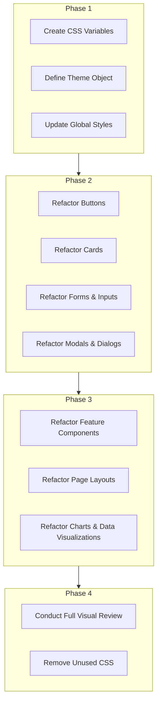

# New Color Palette Refactoring Plan

This document outlines the plan to implement the new color palette defined in `COLOR_PALETTE.md` throughout the application. The goal is to replace all hardcoded color values with a centralized, themeable system.

## 1. Phased Implementation

The refactoring will be executed in four phases to ensure a smooth and organized transition.

## 2. Detailed Task List

### Phase 1: Foundation

- [ ] **Create CSS Variables:** Define the new color palette as CSS custom properties in `frontend/src/styles/variables.css`.
- [ ] **Define Theme Object:** Create a theme object in `frontend/src/theme/theme.ts` that maps semantic roles to the new CSS variables.
- [ ] **Update Global Styles:** Modify `frontend/src/styles/global.css` to use the new variables for default background and text colors.

### Phase 2: Core Component Refactoring

- [ ] **Refactor Buttons:** Update all button components to use semantic color tokens for different states (default, hover, disabled).
- [ ] **Refactor Cards:** Update card components to use the new neutral palette for backgrounds and borders.
- [ ] **Refactor Forms & Inputs:** Update all form elements to use the new color system for text, borders, and focus states.
- [ ] **Refactor Modals & Dialogs:** Update modal components to use the new background and text colors.

### Phase 3: Application-Wide Rollout

- [ ] **Feature Components:** Systematically replace hardcoded colors in all feature-specific components.
- [ ] **Page Layouts:** Update all page layouts and containers to align with the new design system.
- [ ] **Charts & Data Visualizations:** Update all charts to use the new primary, accent, and system colors.

### Phase 4: Verification & Cleanup

- [ ] **Visual Review:** Conduct a thorough review of the entire application to ensure all colors are consistent and correct.
- [ ] **Cleanup:** Remove any old, unused color classes from the codebase.
