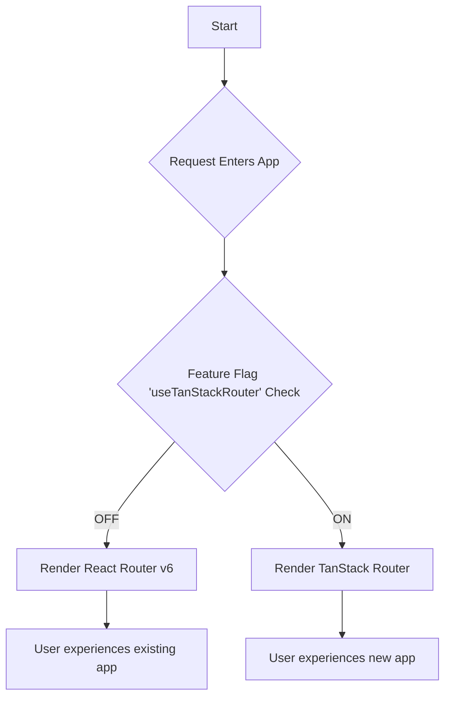

# Technical Specification: Migrating to TanStack Router

**Author:** Roo, Senior Frontend Architect
**Date:** 2025-07-14
**Status:** DRAFT

## 1. Executive Summary & Goals

### Objective

This document outlines the technical strategy and step-by-step plan for migrating the frontend application's routing from **React Router v6** to **TanStack Router**. The goal is to modernize our routing architecture, improve developer experience, and enhance application performance and type-safety.

### Key Motivations

The primary drivers for this migration are:

- **First-Class TypeScript Support:** Achieve end-to-end type-safety for routes, search parameters, and route loaders, significantly reducing a common class of runtime errors.
- **Integrated Data Loading & Caching:** Leverage TanStack Router's built-in data loaders and caching mechanisms to co-locate data fetching with routes, simplifying component logic and improving performance.
- **Performance Gains:** Utilize superior search parameter management and route-level code splitting to improve initial load times and navigation speed.
- **Enhanced Developer Experience:** Adopt a more modern, hook-based API that simplifies complex routing scenarios like protected routes, redirects, and pending UI states.

### Success Metrics

The success of this migration will be measured by:

- **Performance:** A 15% improvement in the Lighthouse Performance score for key pages.
- **Stability:** A 50% reduction in routing-related bugs reported in the 6 weeks post-migration.
- **Developer Velocity:** A positive trend in developer satisfaction surveys regarding the routing and data-fetching experience.
- **Code Quality:** Complete removal of the `react-router-dom` dependency and a measurable reduction in routing-related code complexity.

---

## 2. Pre-Migration Analysis & Scoping

### Current Setup

- **Frontend Framework:** React with Vite
- **Current Routing Library:** `react-router-dom` v7.6.3
- **Application Entrypoint:** [`frontend/src/main.tsx`](frontend/src/main.tsx)
- **Main Router Configuration:** [`frontend/src/app.tsx`](frontend/src/app.tsx)

### Feature Audit Checklist

The following existing routing features have been identified and must be supported post-migration:

- [ ] Root route (`/`)
- [ ] Protected routes (e.g., `/home`, `/settings`)
- [ ] Public routes (e.g., `/login`, `/pricing`)
- [ ] Lazy-loaded route components (`React.lazy`)
- [ ] Programmatic navigation (`useNavigate`)
- [ ] Location/path access (`useLocation`)
- [ ] Search parameter handling (`useSearchParams`)
- [ ] Not Found / 404 route (`*`)
- [ ] Redirects (`<Navigate>`)

### Impacted Files

The following files have been identified as containing routing logic, links, or route-dependent hooks and will require modification.

<details>
<summary>Click to view the 43 impacted files</summary>

- `frontend/src/app.tsx`
- `frontend/src/components/auth/ProRoute.tsx`
- `frontend/src/components/layout/Navbar.tsx`
- `frontend/src/components/ui/Icons.tsx`
- `frontend/src/features/auth/components/ForgotPasswordForm.tsx`
- `frontend/src/features/auth/components/LoginForm.tsx`
- `frontend/src/features/auth/components/RegisterFormSteps.tsx`
- `frontend/src/features/auth/components/ResetPasswordForm.tsx`
- `frontend/src/features/landing/components/CustomPricingCards.tsx`
- `frontend/src/features/landing/components/FinalCtaSection.tsx`
- `frontend/src/features/landing/components/Footer.tsx`
- `frontend/src/features/landing/components/Header.tsx`
- `frontend/src/features/landing/components/HeroSection.tsx`
- `frontend/src/features/landing/pages/PrivacyPolicyPage.tsx`
- `frontend/src/features/landing/pages/TermsAndConditionsPage.tsx`
- `frontend/src/features/notifications/hooks/useNotificationManager.ts`
- `frontend/src/features/settings/components/ProBillingView.tsx`
- `frontend/src/pages/NotFoundPage.tsx`
- `frontend/src/features/settings/components/BillingForm.tsx`
- `frontend/src/features/reporting/components/ReportMenu.tsx`
- `frontend/src/features/reporting/components/ShareReportModal.tsx`
- `frontend/src/features/pricing/components/PricingCard.tsx`
- `frontend/src/features/pricing/components/FeatureComparison.tsx`
- `frontend/src/features/notifications/components/NotificationItem.tsx`
- `frontend/src/features/macroTracking/components/SearchBar.tsx`
- `frontend/src/features/macroTracking/components/FoodItemCard.tsx`
- `frontend/src/features/macroTracking/components/DailySummary.tsx`
- `frontend/src/features/goals/components/WeightGoalModal.tsx`
- `frontend/src/features/goals/components/WeightGoalForm.tsx`
- `frontend/src/features/goals/components/WeightGoalDetails.tsx`
- `frontend/src/features/goals/components/ProgressInsightsCard.tsx`
- `frontend/src/features/goals/components/MonthlyTrendCard.tsx`
- `frontend/src/features/goals/components/MacroTargetForm.tsx`
- `frontend/src/features/goals/components/LogWeightModal.tsx`
- `frontend/src/features/dashboard/components/RecentActivity.tsx`
- `frontend/src/features/dashboard/components/QuickAccess.tsx`
- `frontend/src/features/dashboard/components/DashboardHeader.tsx`
- `frontend/src/features/auth/components/AuthForm.tsx`
- `frontend/src/components/ui/Modal.tsx`
- `frontend/src/components/ui/EmptyState.tsx`
- `frontend/src/components/layout/Sidebar.tsx`
- `frontend/src/components/billing/SubscriptionDetails.tsx`
- `frontend/src/components/billing/PaymentHistory.tsx`
</details>

---

## 3. Phased Rollout Strategy

We will adopt a low-risk, incremental migration strategy using a feature flag. This allows us to run both routers simultaneously in a development environment and roll out the new router to production incrementally.



**Phase 1: Foundational Setup**

- Install TanStack Router and its devtools.
- Create the new router instance and a new root route file.
- Implement the feature flag logic in [`frontend/src/main.tsx`](frontend/src/main.tsx) to switch between the old and new router providers.

**Phase 2: Route-by-Route Migration**

- Begin migrating one top-level route at a time (e.g., start with `/settings`).
- Convert the route definition, replace all `<Link>` components and navigation hooks within that feature's components.
- Move data fetching logic into `loader` functions.
- Thoroughly test the migrated route behind the feature flag.

**Phase 3: Full Rollout & Cleanup**

- Once all routes are migrated and validated, enable the feature flag globally.
- After a monitoring period (e.g., 1 week), remove the feature flag and all legacy React Router code.

---

## 4. Detailed Implementation Plan

### Step 1: Setup & Installation

**File Path:** `frontend/package.json`

**Rationale:** Add TanStack Router as a project dependency.

**Code Diff:**

```diff
--- a/frontend/package.json
+++ b/frontend/package.json
@@ -12,6 +12,7 @@
   "dependencies": {
     "@babel/helper-compilation-targets": "^7.27.2",
     "@tailwindcss/typography": "^0.5.16",
+    "@tanstack/react-router": "^1.45.0",
     "@tailwindcss/vite": "^4.1.11",
     "@tanstack/react-table": "^8.21.3",
     "caniuse-lite": "^1.0.30001726",
@@ -36,6 +37,7 @@
   "devDependencies": {
     "@eslint/js": "^9.30.1",
     "@stylistic/eslint-plugin": "^5.1.0",
+    "@tanstack/router-vite-plugin": "^1.45.0",
     "@tailwindcss/aspect-ratio": "^0.4.2",
     "@tailwindcss/forms": "^0.5.10",
     "@types/react": "^18.3.23",

```

Run `npm install` after updating the file.

### Step 2: Configure Vite Plugin

**File Path:** `frontend/vite.config.ts` (Assuming this file exists or needs to be created)

**Rationale:** The TanStack Router Vite plugin handles file-based route generation.

**Code Diff:**

```diff
--- a/frontend/vite.config.ts
+++ b/frontend/vite.config.ts
@@ -2,12 +2,14 @@
 import react from '@vitejs/plugin-react'
 import tsconfigPaths from 'vite-tsconfig-paths'
+import { TanStackRouterVite } from '@tanstack/router-vite-plugin'

 // https://vitejs.dev/config/
 export default defineConfig({
   plugins: [
     react(),
     tsconfigPaths(),
+    TanStackRouterVite(),
   ],
 })

```

### Step 3: Create the Router Instance

**File Path:** `frontend/src/router.ts` (New File)

**Rationale:** This file will define the router instance, the root route, and the route tree type declaration.

**Code:**

```typescript
import { createRouter } from "@tanstack/react-router";
import { routeTree } from "./routeTree.gen";

// Create a new router instance
export const router = createRouter({ routeTree });

// Register the router instance for type safety
declare module "@tanstack/react-router" {
  interface Register {
    router: typeof router;
  }
}
```

### Step 4: Update Application Entrypoint

**File Path:** `frontend/src/main.tsx`

**Rationale:** Replace the `BrowserRouter` with the new `RouterProvider` from TanStack Router.

**Code Diff:**

```diff
--- a/frontend/src/main.tsx
+++ b/frontend/src/main.tsx
@@ -1,10 +1,13 @@
 import React from "react";
 import ReactDOM from "react-dom/client";
-
-import App from "./app";
+import { RouterProvider } from "@tanstack/react-router";
+import { router } from "./router";

 ReactDOM.createRoot(document.querySelector("#root")!).render(
   <React.StrictMode>
-    <App />
+    <RouterProvider router={router} />
   </React.StrictMode>,
 );

```

### Step 5: Define the Route Tree

**File Path:** `frontend/src/routes/__root.tsx` (New File)

**Rationale:** This file defines the root layout of the application. All other routes will be nested inside this. It replaces the logic currently in `AppContent` from `app.tsx`.

**Code:**

```tsx
import { createRootRoute, Outlet } from "@tanstack/react-router";
import { TanStackRouterDevtools } from "@tanstack/router-devtools";
import React, { Suspense } from "react";
import LoadingSpinner from "@/components/ui/LoadingSpinner";
import Navbar from "@/components/layout/Navbar"; // Assuming Navbar is refactored

export const Route = createRootRoute({
  component: () => (
    <>
      <Navbar />
      <Suspense fallback={<LoadingSpinner />}>
        <Outlet />
      </Suspense>
      <TanStackRouterDevtools />
    </>
  ),
});
```

**File Path:** `frontend/src/routes/index.tsx` (New File, for the `/` path)

**Rationale:** Defines the component for the index route.

**Code:**

```tsx
import { createFileRoute } from "@tanstack/react-router";
import LandingPage from "@/features/landing/pages/LandingPage";

export const Route = createFileRoute("/")({
  component: LandingPage,
});
```

### Step 6: Component Migration Example (Link)

**File Path:** `frontend/src/features/landing/components/Header.tsx`

**Rationale:** Replace `react-router-dom`'s `<Link>` with TanStack's type-safe `<Link>`.

**Code Diff:**

```diff
--- a/frontend/src/features/landing/components/Header.tsx
+++ b/frontend/src/features/landing/components/Header.tsx
@@ -1,5 +1,5 @@
 import { motion } from "framer-motion";
 import React from "react";
-import { Link } from "react-router-dom";
+import { Link } from "@tanstack/react-router";

 const navItemVariants = {
   hidden: { opacity: 0, y: -20 },
@@ -18,13 +18,13 @@
       <nav className="flex items-center justify-between">
         {/* Left side */}
         <div className="flex items-center space-x-4">
-          <Link to="/login" className="inline-block">
+          <Link to="/login" className="inline-block">
             <motion.div
               variants={navItemVariants}
               className="px-4 py-2 text-lg font-semibold text-white transition-colors duration-300 bg-gray-800 rounded-lg hover:bg-gray-700"
             >
               Login
             </motion.div>
           </Link>
-          <Link to="/register" className="inline-block">
+          <Link to="/register" className="inline-block">
             <motion.div
               variants={navItemVariants}
               className="px-4 py-2 text-lg font-semibold text-white transition-colors duration-300 bg-indigo-600 rounded-lg hover:bg-indigo-700"

```

### Step 7: Component Migration Example (Hooks & Auth)

**File Path:** `frontend/src/routes/home.tsx` (New File)

**Rationale:** Demonstrates migrating a protected route, replacing `useNavigate` and `useEffect` auth checks with the `beforeLoad` hook.

**Code:**

```tsx
import { createFileRoute, redirect } from "@tanstack/react-router";
import HomePage from "@/features/macroTracking/pages/HomePage";
import { useStore } from "@/store/store"; // Assuming Zustand store

export const Route = createFileRoute("/home")({
  beforeLoad: ({ location }) => {
    // This now handles authentication checks before the route even loads
    const isAuthenticated = useStore.getState().auth.isAuthenticated;
    if (!isAuthenticated) {
      throw redirect({
        to: "/login",
        search: {
          redirect: location.href,
        },
      });
    }
  },
  component: HomePage,
});
```

---

## 5. Testing & Validation Strategy

- **Unit & Component Tests:**
  - Update all tests that mock `react-router-dom`'s context.
  - Create a test helper to provide a mock TanStack Router instance to components under test.
- **End-to-End (E2E) Tests:**
  - Review and update all E2E tests (e.g., Cypress/Playwright).
  - Assertions on URL paths should remain valid.
  - Update assertions that check for data loading states to align with TanStack's `pendingComponent` and loader lifecycle.
- **Manual QA Checklist:**
  - Verify all navigation links work as expected.
  - Test programmatic navigation (e.g., after form submission).
  - Confirm protected routes redirect unauthenticated users.
  - Validate that dynamic routes load correct data.
  - Check browser history (back/forward buttons).
  - Ensure the 404 page is displayed for invalid routes.

---

## 6. Post-Migration Cleanup

Once the migration is complete and has been monitored in production, the following cleanup steps must be performed:

- [ ] Uninstall `react-router-dom`: `npm uninstall react-router-dom`
- [ ] Delete the old router configuration file: `frontend/src/app.tsx`
- [ ] Remove the feature flag logic from `frontend/src/main.tsx`.
- [ ] Search the codebase for any remaining imports from `react-router-dom` and remove them.
- [ ] Delete any obsolete test mocks related to React Router.
