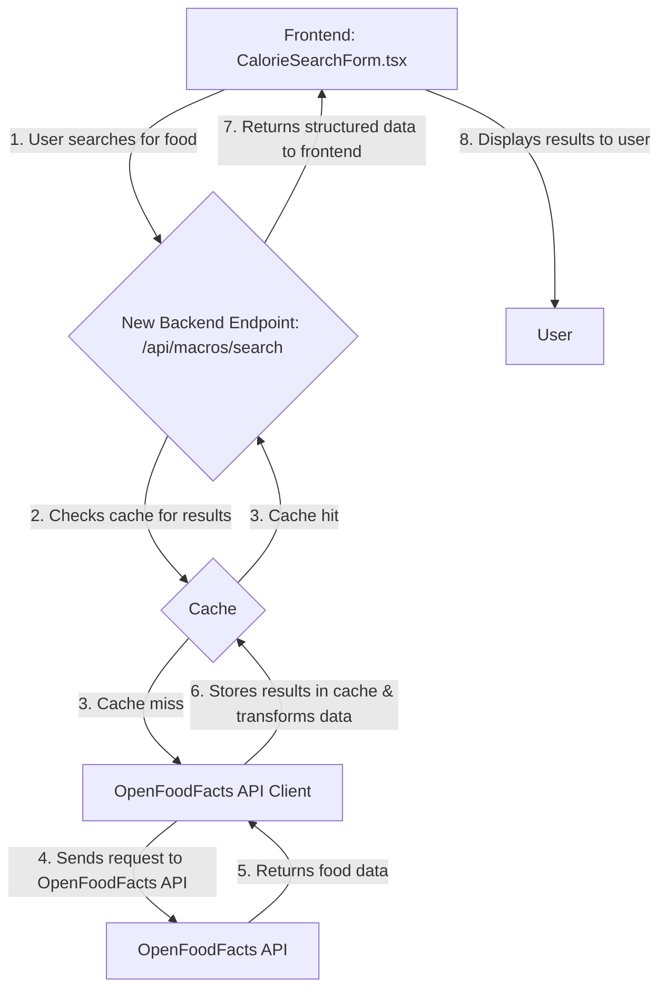

# Technical Implementation Plan: Refactor Calorie Search with OpenFoodFacts API

## 1. Objective

This document outlines the technical plan to refactor the existing calorie search functionality in the application. The current implementation, which uses the Edamam API directly from the frontend, will be replaced with a new backend-driven approach that utilizes the OpenFoodFacts API.

## 2. Technical Approach

The new implementation will introduce a backend endpoint that acts as a proxy to the OpenFoodFacts API. This approach offers several advantages:

- **Security:** API keys and other sensitive information will no longer be exposed on the client-side.
- **Performance:** A caching layer will be implemented on the backend to reduce latency and minimize redundant API calls to the OpenFoodFacts service.
- **Scalability:** Centralizing the API interaction on the backend allows for better control over rate limiting, error handling, and logging.

The frontend will be updated to call this new backend endpoint instead of the Edamam API.



## 3. Affected Components & File-by-File Change Log

### Backend

#### `backend/src/modules/macros/routes.ts`

- **Reason for Change:** To add a new endpoint for food searching.
- **Required Modifications:**
  - Create a new `GET /api/macros/search` endpoint.
  - The endpoint will accept a `query` parameter.
  - It will first check the cache for a response. If a cached response exists, it will be returned.
  - If no cached response is found, it will call the OpenFoodFacts API via the `OpenFoodFactsApiClient`.
  - The response from the API will be cached and then returned to the client.

#### `backend/src/modules/macros/schemas.ts`

- **Reason for Change:** To add a new schema for the food search endpoint.
- **Required Modifications:**
  - Create a new schema for the `GET /api/macros/search` endpoint's query parameters and response.

### Frontend

#### `frontend/src/utils/apiServices.ts`

- **Reason for Change:** To add a new service method for calling the new backend endpoint.
- **Required Modifications:**
  - Add a new method `apiService.macros.search(query: string)` that makes a `GET` request to the `/api/macros/search` endpoint.

#### `frontend/src/features/macroTracking/components/CalorieSearchForm.tsx`

- **Reason for Change:** To replace the direct Edamam API call with a call to the new backend endpoint.
- **Required Modifications:**
  - Remove the existing `fetch` call to the Edamam API.
  - Replace it with a call to the new `apiService.macros.search()` method.
  - Update the component's state and props to handle the new response format from the backend.

## 4. New Files to be Created

### Backend

#### `backend/src/lib/openfoodfacts-api-client.ts`

- **Purpose:** To encapsulate all logic for interacting with the OpenFoodFacts API.
- **Proposed Location:** `backend/src/lib/`
- **Implementation Details:**
  - This module will export a class or object with methods for searching for food products.
  - It will handle the construction of API requests, and the parsing of API responses.

#### `backend/src/lib/cache-service.ts`

- **Purpose:** To provide a simple caching mechanism.
- **Proposed Location:** `backend/src/lib/`
- **Implementation Details:**
  - This module will export a class or object with `get` and `set` methods.
  - For the initial implementation, an in-memory cache can be used. This can be replaced with a more robust solution like Redis in the future.

## 5. Database Schema Changes

No database schema changes are required for this feature.

## 6. API Endpoint Modifications

### New Endpoints

- **Endpoint:** `GET /api/macros/search`
- **Description:** Searches for food products using the OpenFoodFacts API.
- **Request Parameters:**
  - `query` (string, required): The search term for the food product.
- **Example Request:**
  ```
  GET /api/macros/search?query=100g%20chicken%20breast
  ```
- **Example Response:**
  ```json
  [
    {
      "name": "100g chicken breast",
      "protein": 31,
      "carbs": 0,
      "fats": 3.6
    }
  ]
  ```

## 7. Testing Strategy

### Unit Tests

- **`OpenFoodFactsApiClient`:**
  - Test that the API client correctly constructs the request URL.
  - Test that the API client correctly parses the response from the OpenFoodFacts API.
- **`CacheService`:**
  - Test that the `get` and `set` methods work as expected.
- **`CalorieSearchForm.tsx`:**
  - Test that the component correctly calls the `apiService.macros.search` method.
  - Test that the component correctly displays the results from the API.

### Integration Tests

- Test the entire flow from the frontend to the backend, ensuring that the `CalorieSearchForm` component can successfully fetch and display data from the OpenFoodFacts API via the new backend endpoint.

### Manual Verification

- Manually test the calorie search functionality in the browser to ensure that it works as expected.
- Test with a variety of search queries, including edge cases and invalid inputs.

## 8. Potential Risks and Mitigation

- **Risk:** The OpenFoodFacts API may be unreliable or slow.
  - **Mitigation:** The caching layer will help to mitigate this risk by reducing the number of direct calls to the API. We will also implement a timeout for API requests.
- **Risk:** The data from the OpenFoodFacts API may be inaccurate or incomplete.
  - **Mitigation:** We will need to carefully validate and sanitize the data from the API. We will also provide a way for users to report incorrect data.
- **Risk:** The refactoring may introduce breaking changes.
  - **Mitigation:** We will use a feature flag to control the rollout of the new functionality. This will allow us to test the new implementation in production without affecting all users.
