# Frontend Architecture Analysis & Improvement Plan

## Current Architecture Overview

### Tech Stack

- React 19.0.0 with TypeScript
- Vite 6.0.5 for build tooling
- TailwindCSS for styling
- React Router v7 for routing
- Recharts for data visualization

### Application Structure

```mermaid
flowchart LR
    %% Styles
    classDef core fill:#e1f5fe,stroke:#01579b,stroke-width:2px
    classDef pages fill:#fff3e0,stroke:#e65100,stroke-width:2px
    classDef components fill:#f3e5f5,stroke:#4a148c,stroke-width:2px
    classDef state fill:#e8f5e9,stroke:#1b5e20,stroke-width:2px
    classDef utils fill:#fbe9e7,stroke:#bf360c,stroke-width:2px
    classDef storage fill:#f5f5f5,stroke:#424242,stroke-width:2px
    classDef monitoring fill:#e8eaf6,stroke:#283593,stroke-width:2px

    %% Core Application
    subgraph Core["Core Application"]
        direction TB
        A[App.tsx]:::core --> B[AuthHandler]:::core
        B --> C[Routes]:::core

        %% Lazy Loading
        subgraph CodeSplitting["Code Splitting"]
            direction TB
            L1[/"Lazy HomePage"/]:::core
            L2[/"Lazy ReportingPage"/]:::core
            L3[/"Lazy SettingsPage"/]:::core
        end
    end

    %% Pages with Loading States
    subgraph Pages["Page Components"]
        direction TB
        D[HomePage]:::pages
        E[AuthPage]:::pages
        F[SettingsPage]:::pages
        G[ReportingPage]:::pages

        %% Loading & Performance
        D --> DL[LoadingState]:::components
        G --> GL[LoadingState]:::components
        D -.-> PM[Performance Metrics]:::monitoring
    end

    %% Shared Components
    subgraph UI["UI Components"]
        direction TB
        subgraph Forms["Forms & Input"]
            direction TB
            I1[AddEntryForm]:::components
            I2[AuthForm]:::components
            I3[NutritionGoalsForm]:::components
            I4[FormValidation]:::components
        end
        subgraph Elements["UI Elements"]
            direction TB
            J1[ErrorBoundary]:::components
            J2[FloatingNotification]:::components
            J3[LoadingSpinner]:::components
            J4[NetworkStatus]:::components
            J5[Offline Banner]:::components
        end
        subgraph Charts["Data Visualization"]
            direction TB
            K1[MacroDistribution]:::components
            K2[MacroPieChart]:::components
            K3[LoadingSkeleton]:::components
        end
        subgraph Feedback["User Feedback"]
            direction TB
            F1[ToastNotifications]:::components
            F2[ErrorDisplay]:::components
            F3[ProgressIndicator]:::components
        end
    end

    %% State Management & Storage
    subgraph StateLayer["State & Storage Layer"]
        direction TB
        subgraph State["Application State"]
            direction TB
            S[Zustand Store]:::state
            subgraph Slices["Store Slices"]
                direction TB
                S1[UI Slice]:::state
                S2[Auth Slice]:::state
                S3[Macros Slice]:::state
            end
            Q[React Query Cache]:::state
            PubSub[Event Bus]:::state
        end

        subgraph Storage["Browser Storage"]
            direction TB
            LS[Local Storage]:::storage
            SS[Session Storage]:::storage
            IDB[IndexedDB]:::storage
        end
    end

    %% Utils & Services
    subgraph Utils["Utilities & Services"]
        direction TB
        subgraph API["API Layer"]
            direction TB
            M[API Service]:::utils
            RQ[Request Queue]:::utils
            RT[Retry Logic]:::utils
        end
        subgraph ErrorHandling["Error Management"]
            direction TB
            N[Error Handler]:::utils
            NM[Network Monitor]:::utils
        end
        subgraph Validation["Data Validation"]
            direction TB
            V[Schema Validation]:::utils
            SM[State Machines]:::utils
        end
        subgraph Monitoring["Performance Monitoring"]
            direction TB
            PMC[Performance Collector]:::monitoring
            AM[Analytics Manager]:::monitoring
        end
    end

    %% Data Flow & Connections
    C --> |lazy loads| CodeSplitting
    CodeSplitting --> |renders| Pages
    Pages --> |uses| UI
    UI --> |dispatches| S
    S --> |persists| Storage
    M <--> |caches| Q
    M --> |updates| S
    RQ --> |retries| M
    RT --> |handles| RQ
    N --> |reports| PMC
    NM --> |updates| J4
    PubSub --> |notifies| J2

    %% Auth & Session Flow
    B --> |validates| LS
    S2 --> |syncs| LS

    %% Error Handling
    J1 --> |reports| N
    N --> |logs| AM
    NM --> |monitors| M

    %% Performance Tracking
    UI -.-> PMC
    M -.-> PMC
    PMC --> AM

    %% Storage Operations
    Q --> |persists| SS
    S3 --> |caches| IDB

    %% Event Communication
    UI --> |publishes| PubSub
    Pages --> |subscribes| PubSub
```



## Analysis & Recommendations

### 1. Architecture & Performance

#### 1.1 Bundle Splitting & Code Splitting

**Current State:**

- Basic Vite configuration without optimization
- No explicit code splitting strategy
- All routes loaded eagerly

**Recommendations:**

```typescript
// vite.config.ts
export default defineConfig({
  plugins: [react(), tailwindcss()],
  build: {
    rollupOptions: {
      output: {
        manualChunks: {
          "react-vendor": ["react", "react-dom", "react-router-dom"],
          "chart-vendor": ["recharts"],
        },
      },
    },
  },
});

// Route-based code splitting
const HomePage = lazy(() => import("./pages/HomePage"));
const ReportingPage = lazy(() => import("./pages/ReportingPage"));
```

**Priority:** High
**Effort:** Medium
**Impact:** High
**Risks:** Initial loading performance during chunk loading

#### 1.2 State Management

**Current State:**

- Zustand implemented for client-side state management
- State organized in feature-based slices (UI, Auth, Macros)
- Basic notification system in UI slice
- Direct API calls without caching or optimistic updates
- TypeScript errors in UI slice implementation

**Recommendations:**

1. Improve TypeScript typing in state slices:

```typescript
// types/store.ts
interface RootState {
  ui: UISlice;
  auth: AuthSlice;
  macros: MacrosSlice;
}

// store/slices/ui-slice.ts
interface NotificationOptions {
  duration?: number;
  autoClose?: boolean;
}

export const createUISlice: StateCreator<RootState, [], [], UISlice> = (
  set,
  get
) => ({
  notifications: [],
  showNotification: (
    message: string,
    type: NotificationType = DEFAULT_NOTIFICATION_TYPE,
    options: NotificationOptions = {}
  ) => {
    const id = generateUniqueId("notif");
    const notification: Notification = {
      id,
      message,
      type,
      duration: options.duration ?? DEFAULT_NOTIFICATION_DURATION,
      autoClose: options.autoClose ?? DEFAULT_NOTIFICATION_AUTO_CLOSE,
    };

    set((state: RootState) => ({
      notifications: [...state.notifications, notification],
    }));

    return id;
  },
  hideNotification: (id: string) => {
    set((state: RootState) => ({
      notifications: state.notifications.filter((n) => n.id !== id),
    }));
  },
});
```

2. Add React Query for API state management:

```typescript
// hooks/queries/useMacros.ts
export function useMacros() {
  return useQuery({
    queryKey: ["macros"],
    queryFn: () => apiService.macros.getDailyTotals(),
    staleTime: 5 * 60 * 1000,
  });
}

// hooks/mutations/useMacroEntry.ts
export function useMacroEntry() {
  const queryClient = useQueryClient();

  return useMutation({
    mutationFn: (entry: MacroEntry) => apiService.macros.addEntry(entry),
    onMutate: async (newEntry) => {
      await queryClient.cancelQueries({ queryKey: ["macros"] });
      const previousData = queryClient.getQueryData(["macros"]);

      // Optimistic update
      queryClient.setQueryData(["macros"], (old: MacrosData) => ({
        ...old,
        entries: [...old.entries, { ...newEntry, id: "temp-" + Date.now() }],
      }));

      return { previousData };
    },
    onError: (err, vars, context) => {
      queryClient.setQueryData(["macros"], context?.previousData);
    },
    onSettled: () => {
      queryClient.invalidateQueries({ queryKey: ["macros"] });
    },
  });
}
```

**Priority:** High
**Effort:** High
**Impact:** High
**Risks:** Learning curve for team, migration effort

### 2. Error Handling & Recovery

#### 2.1 Error Boundaries

**Current State:**

- Basic error boundary implementation
- Limited error recovery options
- Console logging only

**Recommendations:**

1. Enhanced Error Boundary with Retry Logic:

```typescript
interface ErrorBoundaryState {
  hasError: boolean;
  error?: Error;
  errorInfo?: ErrorInfo;
  retryCount: number;
}

class EnhancedErrorBoundary extends Component<
  ErrorBoundaryProps,
  ErrorBoundaryState
> {
  retryTimeoutId?: number;

  state = {
    hasError: false,
    retryCount: 0,
  };

  componentDidCatch(error: Error, errorInfo: ErrorInfo) {
    // Log to error monitoring service
    errorMonitoring.logError(error, errorInfo);

    // Attempt automatic recovery for network errors
    if (error instanceof NetworkError && this.state.retryCount < 3) {
      this.scheduleRetry();
    }
  }

  scheduleRetry = () => {
    this.retryTimeoutId = window.setTimeout(() => {
      this.setState((state) => ({
        hasError: false,
        retryCount: state.retryCount + 1,
      }));
    }, Math.pow(2, this.state.retryCount) * 1000);
  };
}
```

2. Route-level Error Boundaries:

```typescript
function AppRoutes() {
  return (
    <Routes>
      <Route
        path="/home"
        element={
          <RouteErrorBoundary>
            <HomePage />
          </RouteErrorBoundary>
        }
      />
      {/* ... other routes */}
    </Routes>
  );
}
```

**Priority:** High
**Effort:** Medium
**Impact:** High
**Risks:** Need to test extensively to ensure proper error recovery

### 3. Performance Optimization

#### 3.1 Build Pipeline

**Current State:**

- Basic Vite configuration
- No specific optimization strategies

**Recommendations:**

```typescript
// vite.config.ts
export default defineConfig({
  plugins: [react(), tailwindcss()],
  build: {
    target: "esnext",
    minify: "terser",
    terserOptions: {
      compress: {
        drop_console: true,
        dead_code: true,
      },
    },
    rollupOptions: {
      output: {
        manualChunks: {
          vendor: ["react", "react-dom"],
          router: ["react-router-dom"],
          charts: ["recharts"],
        },
      },
    },
  },
  css: {
    modules: {
      localsConvention: "camelCase",
    },
    postcss: {
      plugins: [autoprefixer(), cssnano({ preset: "advanced" })],
    },
  },
});
```

**Priority:** Medium
**Effort:** Medium
**Impact:** High
**Risks:** Build time increase

#### 3.2 Caching Strategy

**Current State:**

- Basic browser caching
- No specific caching implementation

**Recommendations:**

1. Implement Service Worker:

```typescript
// service-worker.ts
registerRoute(
  ({ request }) => request.destination === "image",
  new CacheFirst({
    cacheName: "images",
    plugins: [
      new ExpirationPlugin({
        maxEntries: 60,
        maxAgeSeconds: 30 * 24 * 60 * 60, // 30 Days
      }),
    ],
  })
);

registerRoute(
  ({ request }) =>
    request.destination === "script" || request.destination === "style",
  new StaleWhileRevalidate({
    cacheName: "static-resources",
  })
);
```

2. API Response Caching:

```typescript
// utils/api-service.ts
async function cachedFetch<T>(
  key: string,
  fetchFn: () => Promise<T>
): Promise<T> {
  const cached = await cacheStore.get(key);
  if (cached) return cached;

  const data = await fetchFn();
  await cacheStore.set(key, data);
  return data;
}
```

**Priority:** Medium
**Effort:** High
**Impact:** High
**Risks:** Cache invalidation complexity

### 4. Testing Strategy

#### 4.1 Testing Coverage

**Current State:**

- No visible testing setup

**Recommendations:**

1. Unit Testing Setup:

```typescript
// jest.config.ts
export default {
  preset: "ts-jest",
  testEnvironment: "jsdom",
  setupFilesAfterEnv: ["@testing-library/jest-dom"],
  moduleNameMapper: {
    "\\.(css|less|scss|sass)$": "identity-obj-proxy",
  },
};

// components/__tests__/MacroDistribution.test.tsx
import { render, screen } from "@testing-library/react";
import userEvent from "@testing-library/user-event";
import MacroDistribution from "../MacroDistribution";

describe("MacroDistribution", () => {
  it("renders correct distribution values", () => {
    render(<MacroDistribution protein={30} carbs={50} fats={20} />);
    expect(screen.getByText("30%")).toBeInTheDocument();
  });
});
```

2. Integration Testing:

```typescript
// cypress/e2e/macro-tracking.cy.ts
describe("Macro Tracking", () => {
  beforeEach(() => {
    cy.login();
    cy.visit("/home");
  });

  it("adds new macro entry", () => {
    cy.get('[data-testid="add-entry-btn"]').click();
    cy.get('[data-testid="protein-input"]').type("30");
    cy.get('[data-testid="submit-entry"]').click();
    cy.get('[data-testid="daily-protein"]').should("contain", "30");
  });
});
```

**Priority:** High
**Effort:** High
**Impact:** High
**Risks:** Initial setup time, maintenance overhead

## Implementation Priority Order

1. High Priority (Immediate)

   - Fix TypeScript type safety issues and strict type checking
   - Implement code splitting
   - Add React Query for data management
   - Enhance error boundaries
   - Set up basic testing infrastructure

2. Medium Priority (Next 1-2 Sprints)

   - Implement build optimizations
   - Add service worker and caching
   - Enhance component testing coverage
   - Implement monitoring and analytics

3. Low Priority (Future)
   - Advanced performance optimizations
   - Enhanced analytics
   - A/B testing infrastructure
   - Automated performance testing

## Next Steps

1. Present recommendations to team
2. Create detailed implementation tickets
3. Set up monitoring baselines
4. Begin high-priority implementations
5. Schedule regular performance reviews

Note: All improvements should be implemented incrementally to minimize risk and allow for proper testing and validation at each step.
