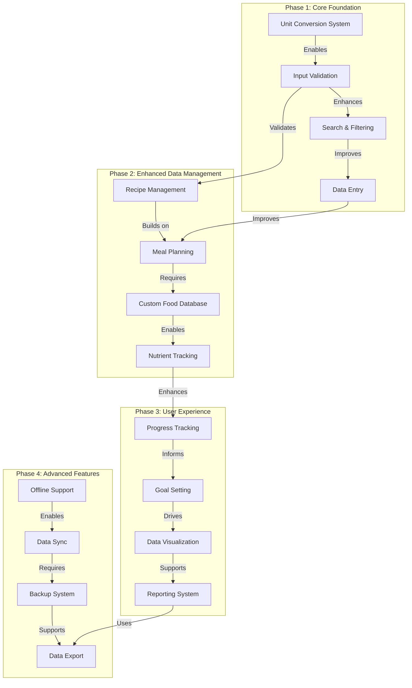

# Macro Tracker Implementation Phases

## Phase Diagram

## Implementation Priority

### Phase 1: Core Foundation (Weeks 1-4)

- Unit conversion system implementation
- Enhanced input validation with unit support
- Advanced search and filtering functionality
- Data entry workflow improvements

### Phase 2: Enhanced Data Management (Weeks 5-8)

- Recipe management system
- Meal planning functionality
- Custom food database
- Extended nutrient tracking

### Phase 3: User Experience (Weeks 9-12)

- Progress tracking implementation
- Goal setting and monitoring
- Enhanced data visualization
- Reporting system development

### Phase 4: Advanced Features (Weeks 13-16)

- Offline support implementation
- Data synchronization
- Backup system
- Data export functionality

## Dependencies Summary

### Technical Dependencies

- Frontend build tools
- Backend services
- Database migrations
- API integrations

### Resource Dependencies

- UI/UX design resources
- Database architecture
- API documentation
- Testing infrastructure

## Risk Mitigation

### Technical Risks

- Data migration complexity
- Performance impacts
- API reliability
- Offline sync conflicts

### Mitigation Strategies

- Comprehensive testing plan
- Performance monitoring
- Fallback mechanisms
- User feedback loops

## Success Metrics

### User-Focused Metrics

- Feature adoption rate
- User satisfaction scores
- Error rate reduction
- Data accuracy improvement

### Technical Metrics

- System performance
- Sync reliability
- Data consistency
- API response times
