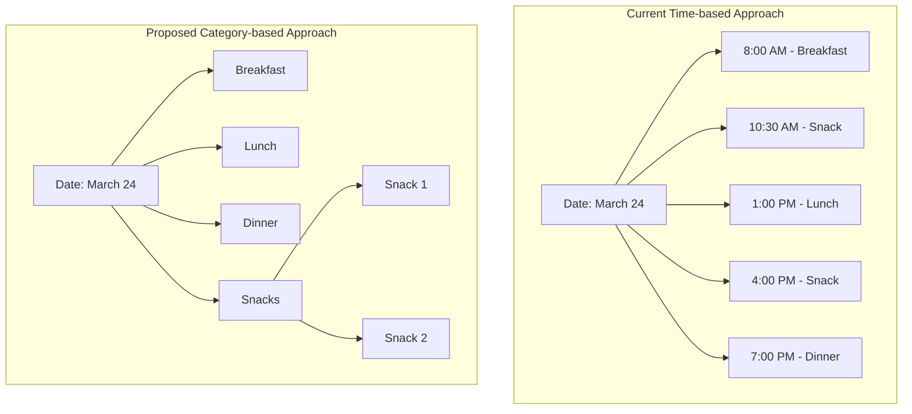

# Meal Organization Analysis

## Current Time-based Approach vs Proposed Category-based Approach



## Analysis

### Current Time-based Approach

#### Advantages

- Granular tracking of meal timing
- Support for intermittent fasting tracking
- Flexible for non-standard eating schedules

#### Disadvantages

- Complex UI with time input requirements
- Less structured meal categorization
- Harder to analyze patterns by meal type
- Time input often unnecessary

### Proposed Category-based Approach

#### Advantages

1. Data Organization

   - Natural meal type hierarchy
   - Intuitive grouping
   - Clear daily structure
   - Better pattern analysis

2. User Experience

   - Simpler input process
   - More structured daily view
   - Matches natural meal planning
   - Easier to understand at a glance

3. Implementation Benefits

   - Simplified state management
   - Predictable sorting
   - Easier data visualization
   - Better performance (fewer fields)

4. Feature Potential
   - Natural fit for meal templates
   - Easier meal planning integration
   - Simple macro goals per meal type
   - Better for recommendations

#### Disadvantages

- Less temporal detail
- Need solution for multiple entries per category
- May not suit all eating schedules

## Recommendation

I strongly recommend switching to the category-based approach for the following reasons:

1. Better Data Structure

   - Clearer organization
   - More meaningful grouping
   - Easier analysis
   - Better data consistency

2. Enhanced User Experience

   - Reduced input complexity
   - More intuitive interface
   - Better matches user mental model
   - Faster data entry

3. Implementation Advantages
   - Simplified state management
   - More maintainable code
   - Better performance
   - Easier to extend

## Implementation Strategy

### Data Model Updates

```typescript
interface MealEntry {
  id: number;
  date: string;
  meal_type: MealType;
  sequence?: number; // For multiple entries in same category
  name?: string;
  protein: number;
  carbs: number;
  fats: number;
}

interface GroupedMeals {
  date: string;
  categories: {
    breakfast: MealEntry[];
    lunch: MealEntry[];
    dinner: MealEntry[];
    snacks: MealEntry[];
  };
}
```

### UI Components

1. Main Entry Form

   - Date picker (defaults to today)
   - Meal type selector
   - Macro inputs
   - Food name input

2. History Display
   - Group by date
   - Subgroup by meal type
   - Auto-number multiple entries
   - Show totals per category

### Sorting Logic

```typescript
const sortedMeals = meals.sort((a, b) => {
  // First by date
  const dateCompare = new Date(b.date) - new Date(a.date);
  if (dateCompare !== 0) return dateCompare;

  // Then by meal type priority
  const typePriority = {
    breakfast: 1,
    lunch: 2,
    dinner: 3,
    snack: 4,
  };
  return typePriority[a.meal_type] - typePriority[b.meal_type];
});
```

## Additional Enhancements

1. Auto-numbering for multiple entries
2. Optional notes/labels per entry
3. Macro totals per meal type
4. Category-based templates
5. Quick entry from templates
6. Daily meal planning interface

This approach provides a solid foundation for future features while maintaining simplicity and usability.
