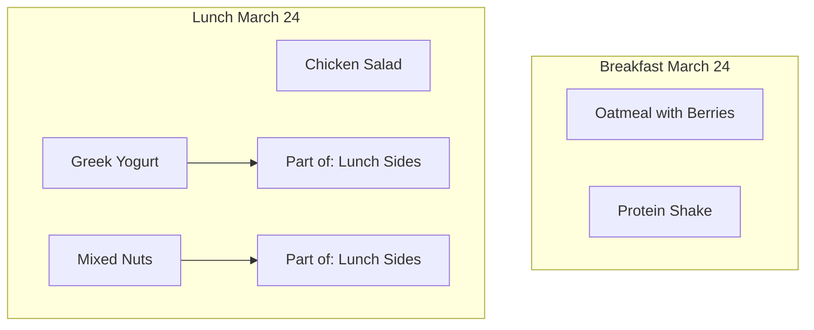
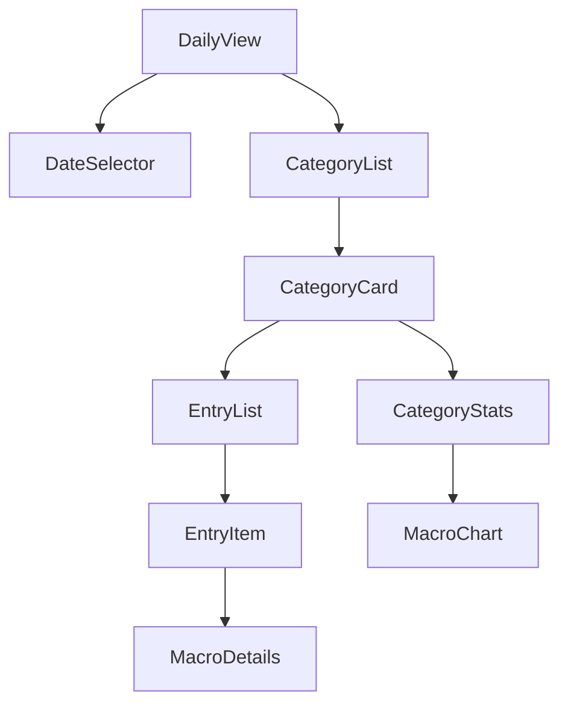

# Meal Tracking Organization Refinement

## 1. Multiple Entries Within Categories

### Previous Approach

- Simple sequence numbers (1, 2, 3...)
- Basic chronological ordering

### Refined Approach

```typescript
interface MealEntry {
  id: number;
  date: string;
  meal_type: MealType;
  name: string;
  entry_group?: {
    group_name?: string; // Optional group name for multiple related items
    sequence: number; // Position within group
    total_items: number; // Total items in group
  };
  protein: number;
  carbs: number;
  fats: number;
}
```

### UI Handling



- Group related items (e.g., meal components)
- Allow custom naming of entries
- Collapsible groups in the UI
- Show totals per group

## 2. Date Handling

### Previous Approach

- Simple date picker
- Default to current date

### Refined Approach

```typescript
interface DateHandling {
  selectedDate: Date;
  dateContext: {
    weekStart: Date;
    weekEnd: Date;
    selectedWeek: Date[];
  };
  quickSelect: {
    today: Date;
    yesterday: Date;
    thisWeek: Date[];
    lastWeek: Date[];
  };
}
```

### Features

1. Smart Defaults

   - Default to current date
   - Remember last used date
   - Quick jump to common dates

2. Date Navigation

   - Week view with day selection
   - Quick today/yesterday toggles
   - Week forward/backward

3. Meal Planning
   - Future date selection
   - Batch date selection
   - Recurring meal templates

## 3. Category Organization

### Meal Category Hierarchy

```typescript
const MEAL_CATEGORIES = {
  BREAKFAST: {
    id: "breakfast",
    displayName: "Breakfast",
    order: 1,
    defaultTime: "08:00",
    icon: "🍳",
    color: "yellow",
  },
  LUNCH: {
    id: "lunch",
    displayName: "Lunch",
    order: 2,
    defaultTime: "13:00",
    icon: "🍽️",
    color: "green",
  },
  DINNER: {
    id: "dinner",
    displayName: "Dinner",
    order: 3,
    defaultTime: "19:00",
    icon: "🌙",
    color: "blue",
  },
  SNACKS: {
    id: "snack",
    displayName: "Snacks",
    order: 4,
    icon: "🍎",
    color: "purple",
  },
} as const;
```

### UI Organization

1. Card-based Layout

   ```
   +----------------+
   | 🍳 Breakfast   |
   | Total: 450cal  |
   +----------------+
   | Items (2)      |
   |  - Oatmeal     |
   |  - Protein...  |
   +----------------+
   ```

2. Visual Hierarchy

   - Color coding by meal type
   - Icons for quick recognition
   - Expandable/collapsible sections

3. Quick Actions
   - Add to category
   - Copy from templates
   - Move between categories

## 4. Macro Visualization

### Per Category

```typescript
interface CategoryMacros {
  category: MealType;
  totals: {
    calories: number;
    protein: number;
    carbs: number;
    fats: number;
  };
  percentage: {
    ofDailyCalories: number;
    ofDailyProtein: number;
    ofDailyCarbs: number;
    ofDailyFats: number;
  };
}
```

### Visual Components

1. Category Summary

   ```
   Breakfast
   ├── 450 cal (25% of daily)
   ├── Protein: 25g (30%)
   ├── Carbs: 45g (20%)
   └── Fats: 15g (25%)
   ```

2. Progress Visualization

   ```mermaid
   pie
       title "Breakfast Macros"
       "Protein" : 25
       "Carbs" : 45
       "Fats" : 15
   ```

3. Daily Overview
   - Stacked bars per category
   - Category contribution to daily totals
   - Goal progress indicators

## Implementation Updates

### Data Structure

```typescript
interface DailyMeals {
  date: string;
  meals: {
    [K in MealType]: {
      entries: MealEntry[];
      totals: MacroTotals;
      metadata: {
        lastUpdated: string;
        template?: string;
      };
    };
  };
  dailyTotals: MacroTotals;
}
```

### State Management

```typescript
interface MealState {
  selectedDate: string;
  meals: Record<string, DailyMeals>;
  templates: Record<MealType, MealTemplate[]>;
  preferences: {
    defaultCategory: MealType;
    expandedCategories: MealType[];
    viewMode: "compact" | "detailed";
  };
}
```

### UI Components Hierarchy



This refined approach provides:

- Better organization of multiple entries
- More intuitive date handling
- Clear visual hierarchy
- Comprehensive macro tracking
- Flexible grouping options
- Enhanced user experience

Would you like me to further detail any of these aspects or move forward with implementation?
