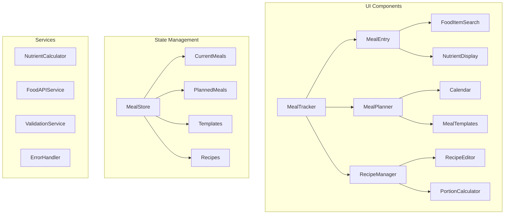

# Nutrition Tracker Core Implementation Plan

## Data Models

```typescript
// Core data structures for nutrition tracking

interface Meal {
  id: string;
  category: "breakfast" | "lunch" | "dinner" | "snack";
  date: string;
  foodItems: FoodItem[];
  notes?: string;
  isFavorite: boolean;
  template?: MealTemplate;
}

interface FoodItem {
  id: string;
  name: string;
  portionSize: number;
  portionUnit: string;
  nutrients: NutrientProfile;
  sourceId?: string; // Reference to external API
}

interface NutrientProfile {
  calories: number;
  macros: {
    protein: number;
    carbs: number;
    fats: number;
    fiber: number;
  };
  vitamins: {
    [key: string]: number; // e.g., vitaminC, vitaminD
  };
  minerals: {
    [key: string]: number; // e.g., iron, calcium
  };
}

interface MealTemplate {
  id: string;
  name: string;
  category: "breakfast" | "lunch" | "dinner" | "snack";
  foodItems: FoodItem[];
  defaultPortionMultiplier: number;
}

interface MealPlan {
  id: string;
  startDate: string;
  endDate: string;
  meals: PlannedMeal[];
}

interface PlannedMeal {
  mealId: string;
  date: string;
  timeSlot: string;
  template?: string;
  portions: number;
}

interface Recipe {
  id: string;
  name: string;
  ingredients: RecipeIngredient[];
  instructions: string[];
  servings: number;
  totalNutrients: NutrientProfile;
}

interface RecipeIngredient {
  foodItemId: string;
  amount: number;
  unit: string;
}
```

## Component Architecture



## Implementation Phases

### Phase 1: Core Meal Tracking (Weeks 1-2)

1. Basic Data Structures

```typescript
// frontend/src/types/meal-types.ts
export * from "./interfaces/meal";
export * from "./interfaces/food-item";
export * from "./interfaces/nutrient-profile";

// frontend/src/store/slices/meal-slice.ts
export interface MealSlice {
  meals: Record<string, Meal>;
  addMeal: (meal: Meal) => void;
  updateMeal: (id: string, updates: Partial<Meal>) => void;
  deleteMeal: (id: string) => void;
  getMealsByDate: (date: string) => Meal[];
}
```

2. API Endpoints

```typescript
// backend/src/routes/meal-routes.ts
router.get("/meals", getMeals);
router.post("/meals", createMeal);
router.put("/meals/:id", updateMeal);
router.delete("/meals/:id", deleteMeal);
```

3. Validation

```typescript
// frontend/src/utils/validators/meal-validator.ts
export const validateMeal = (meal: Meal): ValidationResult => {
  // Validate meal structure
  // Check for required fields
  // Validate nutrient ranges
};
```

### Phase 2: Recipe Management (Weeks 3-4)

1. Recipe Data Handling

```typescript
// frontend/src/store/slices/recipe-slice.ts
export interface RecipeSlice {
  recipes: Record<string, Recipe>;
  addRecipe: (recipe: Recipe) => void;
  calculateNutrients: (recipe: Recipe) => NutrientProfile;
  scaleRecipe: (recipe: Recipe, servings: number) => Recipe;
}
```

2. Portion Calculator

```typescript
// frontend/src/utils/portion-calculator.ts
export const calculatePortion = (
  baseAmount: number,
  fromUnit: string,
  toUnit: string
): number => {
  // Convert between units
  // Handle scaling
};
```

### Phase 3: Meal Planning (Weeks 5-6)

1. Planning Interface

```typescript
// frontend/src/store/slices/plan-slice.ts
export interface PlanSlice {
  mealPlans: Record<string, MealPlan>;
  addPlannedMeal: (meal: PlannedMeal) => void;
  checkScheduleConflicts: (meal: PlannedMeal) => boolean;
}
```

2. Template Management

```typescript
// frontend/src/store/slices/template-slice.ts
export interface TemplateSlice {
  templates: Record<string, MealTemplate>;
  createTemplate: (meal: Meal) => MealTemplate;
  applyTemplate: (template: MealTemplate) => Meal;
}
```

### Phase 4: Batch Operations & Testing (Weeks 7-8)

1. Batch Entry System

```typescript
// frontend/src/components/BatchEntryForm.tsx
interface BatchEntryProps {
  onSubmit: (items: FoodItem[]) => void;
  onValidationError: (errors: ValidationError[]) => void;
}
```

2. Test Suites

```typescript
// frontend/src/tests/nutrient-calculations.test.ts
describe("Nutrient Calculations", () => {
  test("accurately scales recipe nutrients", () => {
    const recipe = mockRecipe();
    const scaled = scaleRecipe(recipe, 2);
    expect(scaled.totalNutrients.calories).toBe(
      recipe.totalNutrients.calories * 2
    );
  });
});
```

## Error Handling Strategy

1. Input Validation

```typescript
// frontend/src/utils/validators/index.ts
export const validateNutrients = (
  nutrients: NutrientProfile
): ValidationResult => {
  // Check for negative values
  // Validate against recommended ranges
  // Ensure required nutrients are present
};
```

2. API Error Handling

```typescript
// frontend/src/utils/api-error-handler.ts
export const handleAPIError = (error: APIError): UserFacingError => {
  // Transform API errors into user-friendly messages
  // Handle specific error cases (invalid portions, missing data)
  // Log errors for monitoring
};
```

## Data Persistence

1. State Management

```typescript
// frontend/src/store/middleware/persistence-middleware.ts
export const persistenceMiddleware = (store) => (next) => (action) => {
  // Handle state persistence
  // Manage optimistic updates
  // Handle offline synchronization
};
```

2. Cache Strategy

```typescript
// frontend/src/utils/cache-manager.ts
export class CacheManager {
  // Cache frequently used data
  // Handle template storage
  // Manage recipe cache
}
```

## Success Metrics

1. Performance Targets

- Meal entry completion < 30 seconds
- Recipe calculation < 100ms
- Plan generation < 1 second

2. Error Rates

- Invalid nutrition data < 1%
- Failed API calls < 0.1%
- Data sync conflicts < 0.01%

## Next Steps

After completing the core implementation:

1. User Experience Enhancements

- Drag-and-drop meal planning
- Smart recipe suggestions
- Nutrition goal tracking

2. Data Analysis

- Trend visualization
- Nutrient intake reports
- Goal progress tracking

3. Integration Expansions

- Additional nutrition databases
- Health app synchronization
- Meal photo support
