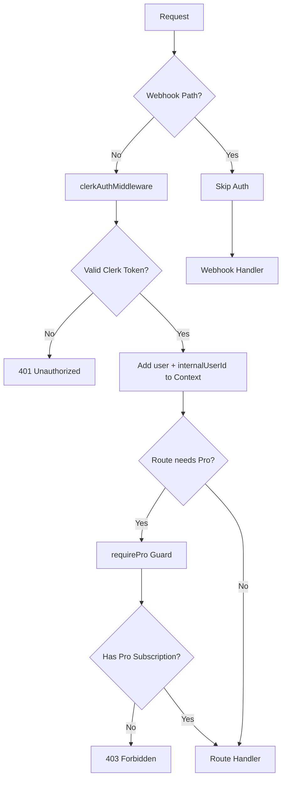

# Roadmap A: Authentication & Authorization Consolidation

> **Goal**: Single, predictable auth model (Clerk-first) across all routes and guards.

---

## Current State Analysis

### Auth Middleware Inventory

| File                                                                                        | Middleware Used               | Issue               |
| ------------------------------------------------------------------------------------------- | ----------------------------- | ------------------- |
| [`backend/src/index.ts:86`](backend/src/index.ts:86)                                        | `clerkAuthMiddleware`         | ✅ Global - Correct |
| [`backend/src/modules/reporting/routes.ts:5,22`](backend/src/modules/reporting/routes.ts:5) | `authMiddleware` (legacy JWT) | ❌ Overrides Clerk  |
| [`backend/src/middleware/pro-guard.ts:4,13`](backend/src/middleware/pro-guard.ts:4)         | `authMiddleware` (legacy JWT) | ❌ Uses legacy auth |
| [`backend/src/middleware/pro-guard.ts:143`](backend/src/middleware/pro-guard.ts:143)        | `authMiddleware` (legacy JWT) | ❌ Uses legacy auth |

### User Object Shape Mismatch

**Legacy `AuthenticatedContext.user`**:

```typescript
{
  userId: number;      // Internal DB ID
  email: string;
  firstName?: string;
  lastName?: string;
}
```

**Clerk `ClerkAuthContext.user`**:

```typescript
{
  userId?: number | null;  // Internal DB ID (nullable)
  id: string;              // Clerk user ID
  clerkUserId: string;     // Clerk user ID
  email?: string;
  firstName?: string;
  lastName?: string;
  imageUrl?: string;
}
```

### Risk Assessment

1. **Route behavior differs by endpoint** - Reporting routes use JWT validation while others use Clerk
2. **Clerk tokens fail in legacy middleware** - JWT middleware expects legacy token format
3. **Pro guard checks wrong user ID** - `user.userId` may be undefined with Clerk context
4. **Double authentication** - Routes may run both auth middlewares unnecessarily

---

## Migration Plan

### Phase 1: Create Clerk-Compatible Guard Helpers

Create new guard utilities that work with Clerk context:

```typescript
// backend/src/middleware/clerk-guards.ts

import { Elysia } from "elysia";
import { SubscriptionService } from "../modules/billing/subscription-service";
import { AuthorizationError, AuthenticationError } from "../lib/errors";
import { logger } from "../lib/logger";
import type { ClerkAuthContext } from "./clerkAuth";

/**
 * Guard that ensures user is authenticated via Clerk
 */
export const requireAuth = new Elysia({ name: "requireAuth" }).derive(
  { as: "scoped" },
  async ({ user, internalUserId }: ClerkAuthContext) => {
    if (!user || !internalUserId) {
      throw new AuthenticationError("Authentication required");
    }
    return {
      authenticatedUser: {
        userId: internalUserId,
        clerkUserId: user.clerkUserId,
        email: user.email,
        firstName: user.firstName,
        lastName: user.lastName,
      },
    };
  },
);

/**
 * Guard that ensures user has active Pro subscription
 */
export const requirePro = new Elysia({ name: "requirePro" })
  .use(requireAuth)
  .derive({ as: "scoped" }, async ({ authenticatedUser }) => {
    const hasPro = await SubscriptionService.hasActiveProSubscription(
      authenticatedUser.userId,
    );
    if (!hasPro) {
      throw new AuthorizationError("Pro subscription required");
    }
    return { isProUser: true };
  });

/**
 * Feature limit checker for free tier
 */
export const checkFeatureLimit = async (
  userId: number,
  feature: keyof typeof FREE_TIER_LIMITS,
  currentCount: number,
): Promise<{ allowed: boolean; limit?: number; message?: string }> => {
  // ... existing logic
};
```

### Phase 2: Update Reporting Routes

**File**: [`backend/src/modules/reporting/routes.ts`](backend/src/modules/reporting/routes.ts)

**Changes**:

1. Remove `authMiddleware` import and usage
2. Use global Clerk context instead
3. Update type annotations

```diff
- import { authMiddleware } from "../../middleware/auth";
- import type { AuthenticatedContext } from "../../middleware/auth";
+ import type { ClerkAuthContext } from "../../middleware/clerkAuth";

  export const reportingRoutes = new Elysia({ prefix: "/api/reporting" })
    .decorate("db", db)
-   .use(authMiddleware)
    .get(
      "/nutrient-density-summary",
-     async (context: any) => {
-       const { user, query } = context as AuthenticatedContext & { query?: Record<string, string | undefined> };
+     async ({ user, internalUserId, query }: ClerkAuthContext & { query?: Record<string, string | undefined> }) => {
        // ... use internalUserId instead of user.userId
      }
    );
```

### Phase 3: Update Pro Guard

**File**: [`backend/src/middleware/pro-guard.ts`](backend/src/middleware/pro-guard.ts)

**Changes**:

1. Remove `authMiddleware` import and usage
2. Depend on global Clerk context
3. Use `internalUserId` for database operations

```diff
- import { authMiddleware } from "./auth";
+ import type { ClerkAuthContext } from "./clerkAuth";

  export const proGuard = new Elysia({ name: "proGuard" })
-   .use(authMiddleware)
-   .derive({ as: "scoped" }, async ({ user }) => {
+   .derive({ as: "scoped" }, async ({ user, internalUserId }: ClerkAuthContext) => {
-     if (!user) {
+     if (!user || !internalUserId) {
        throw new AuthenticationError("Authentication required for Pro features");
      }
      // ... use internalUserId for subscription check
    });
```

### Phase 4: Update Feature Limit Guard

**File**: [`backend/src/middleware/pro-guard.ts`](backend/src/middleware/pro-guard.ts) (featureLimitGuard function)

**Changes**:

```diff
  export const featureLimitGuard = (feature: keyof typeof FREE_TIER_LIMITS) =>
    new Elysia({ name: `featureLimitGuard_${feature}` })
-     .use(authMiddleware)
-     .derive({ as: "scoped" }, async ({ user }) => {
+     .derive({ as: "scoped" }, async ({ user, internalUserId }: ClerkAuthContext) => {
-       if (!user) {
+       if (!user || !internalUserId) {
          throw new AuthenticationError("Authentication required");
        }
        // ... use internalUserId
      });
```

### Phase 5: Add Route-Level Integration Tests

Create tests for auth-required endpoints:

```typescript
// backend/tests/auth.integration.test.ts

describe("Authentication", () => {
  it("should reject requests without Clerk token", async () => {
    const res = await app.handle(new Request("http://localhost/api/macros"));
    expect(res.status).toBe(401);
  });

  it("should accept valid Clerk tokens", async () => {
    const res = await app.handle(
      new Request("http://localhost/api/macros", {
        headers: { Authorization: "Bearer valid-clerk-token" },
      }),
    );
    expect(res.status).not.toBe(401);
  });
});

describe("Pro Guard", () => {
  it("should reject free users from pro endpoints", async () => {
    // ... test pro guard
  });
});
```

### Phase 6: Remove Legacy Middleware

After all tests pass:

1. Remove [`backend/src/middleware/auth.ts`](backend/src/middleware/auth.ts) (or mark as deprecated)
2. Remove `AuthenticatedContext` type exports
3. Update any remaining imports

---

## Execution Checklist

- [x] Create `backend/src/middleware/clerk-guards.ts` with `requireAuth`, `requirePro`
- [x] Update [`backend/src/modules/reporting/routes.ts`](backend/src/modules/reporting/routes.ts) to use Clerk context
- [x] Update [`backend/src/middleware/pro-guard.ts`](backend/src/middleware/pro-guard.ts) `proGuard` to use Clerk context
- [x] Update [`backend/src/middleware/pro-guard.ts`](backend/src/middleware/pro-guard.ts) `featureLimitGuard` to use Clerk context
- [x] Add deprecation notice to [`backend/src/middleware/auth.ts`](backend/src/middleware/auth.ts)
- [x] Verify TypeScript compilation passes
- [ ] Add integration tests for auth flows
- [ ] Migrate remaining route files to use Clerk types (follow-up)

## Remaining Type Migration (P1/P2)

The following files still import `AuthenticatedContext` from the legacy auth module for type assertions. These work at runtime because the global `clerkAuthMiddleware` provides the correct context, but should be updated for type safety:

- [`backend/src/modules/macros/routes.ts`](backend/src/modules/macros/routes.ts) - Uses `AuthenticatedContext` type assertion
- [`backend/src/modules/habits/routes.ts`](backend/src/modules/habits/routes.ts) - Uses `AuthenticatedContext` type assertion
- [`backend/src/modules/auth/routes.ts`](backend/src/modules/auth/routes.ts) - Uses `AuthenticatedContext` type assertion
- [`backend/src/modules/goals/routes.ts`](backend/src/modules/goals/routes.ts) - Uses `AuthenticatedContext` type assertion

These are type-safety improvements, not runtime auth issues. The global Clerk middleware handles authentication correctly.

---

## Success Criteria

1. ✅ No route imports `middleware/auth.ts` in runtime auth flow
2. ✅ All protected endpoints authenticate Clerk tokens consistently
3. ✅ `proGuard` and `featureLimitGuard` work with Clerk user context
4. ✅ Integration tests cover auth-required endpoints

---

## Diagram: Auth Flow After Consolidation



---

## Files to Modify

| File                                      | Action                           |
| ----------------------------------------- | -------------------------------- |
| `backend/src/middleware/clerk-guards.ts`  | **CREATE** - New guard helpers   |
| `backend/src/modules/reporting/routes.ts` | **MODIFY** - Remove legacy auth  |
| `backend/src/middleware/pro-guard.ts`     | **MODIFY** - Use Clerk context   |
| `backend/src/middleware/auth.ts`          | **DEPRECATE** - Mark for removal |
| `backend/tests/auth.integration.test.ts`  | **CREATE** - Auth tests          |

---

## Rollback Plan

If issues arise after deployment:

1. Revert changes to `reporting/routes.ts` and `pro-guard.ts`
2. Legacy `authMiddleware` remains available as fallback
3. No database changes required - fully reversible
