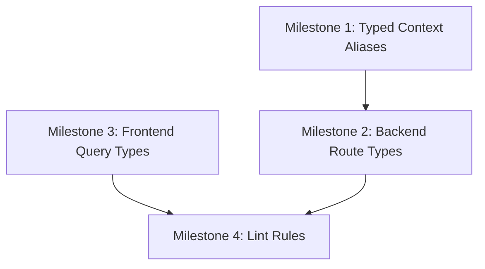

# Roadmap C — Type-safety Recovery Implementation Plan

> **Priority**: P0 (High)  
> **Status**: Not Started  
> **Dependencies**: Roadmap A ✅, Roadmap B ✅ (both complete)

---

## Executive Summary

Roadmap C focuses on reducing runtime uncertainty by strategically removing `any` usage throughout the codebase. The analysis reveals:

- **Backend**: 47 instances of `context: any` across 10 files
- **Frontend**: 31 instances of `as any` across 14 files
- **Primary areas affected**: Route handlers, query cache transforms, billing webhooks, error handling

---

## 1. Roadmap Overview

### Goal

Reduce runtime uncertainty by removing strategic `any` usage.

### Scope

- Backend route contexts
- Frontend query/mutation cache transforms
- Billing webhook/service typing

### Estimated Effort

Medium complexity - requires careful type design but changes are localized.

---

## 2. Detailed Milestones

### Milestone 1: Create Typed Handler Context Aliases Per Module

**Description**: Define strongly-typed context interfaces for each backend module.

**Affected Files**:

- [`backend/src/middleware/clerkAuth.ts`](backend/src/middleware/clerkAuth.ts) - Base `ClerkAuthContext` type
- [`backend/src/lib/route-adapter.ts`](backend/src/lib/route-adapter.ts) - Context adaptation utilities
- New file: `backend/src/types/route-contexts.ts` - Module-specific context types

**Current State**:

```typescript
// Current pattern - untyped context
async (context: any) => {
  const { query, openFoodFactsApiClient, cacheService } = context as MacrosRouteContext;
```

**Target State**:

```typescript
// Typed context pattern
import { MacrosContext } from '@/types/route-contexts';
async (context: MacrosContext) => {
  const { query, openFoodFactsApiClient, cacheService } = context;
```

**Implementation Strategy**:

1. Create `backend/src/types/route-contexts.ts` with typed interfaces
2. Define base context extending `ClerkAuthContext`
3. Add module-specific extensions (db, services, body, query, params)
4. Export type aliases for each route group

**Type Definitions to Create**:

```typescript
// backend/src/types/route-contexts.ts

import type { Database } from "bun:sqlite";
import type { ClerkAuthContext } from "../middleware/clerkAuth";
import type { OpenFoodFactsApiClient } from "../lib/openfoodfacts-api-client";
import type { CacheService } from "../lib/cache-service";

// Base authenticated context with database
export interface AuthenticatedContext extends ClerkAuthContext {
  db: Database;
}

// Macro routes context
export interface MacrosRouteContext extends AuthenticatedContext {
  openFoodFactsApiClient: OpenFoodFactsApiClient;
  cacheService: CacheService;
}

// Goals routes context
export interface GoalsRouteContext extends AuthenticatedContext {
  // Add specific properties
}

// Billing routes context
export interface BillingRouteContext extends AuthenticatedContext {
  // Add specific properties
}

// Auth routes context (partial auth)
export interface AuthRouteContext {
  db: Database;
  body?: Record<string, unknown>;
  jwt?: any; // Replace with proper JWT type
  set: { status: number };
}
```

**Dependencies**: None

---

### Milestone 2: Replace `context: any` in Top-Traffic Backend Routes

**Description**: Systematically replace `any` typed contexts with proper typed interfaces.

**Affected Files** (by priority):

| File                                                                               | `any` Count | Priority |
| ---------------------------------------------------------------------------------- | ----------- | -------- |
| [`backend/src/modules/macros/routes.ts`](backend/src/modules/macros/routes.ts)     | 8           | High     |
| [`backend/src/modules/goals/routes.ts`](backend/src/modules/goals/routes.ts)       | 8           | High     |
| [`backend/src/modules/user/routes.ts`](backend/src/modules/user/routes.ts)         | 4           | Medium   |
| [`backend/src/modules/habits/routes.ts`](backend/src/modules/habits/routes.ts)     | 5           | Medium   |
| [`backend/src/modules/billing/routes.ts`](backend/src/modules/billing/routes.ts)   | 5           | Medium   |
| [`backend/src/modules/auth/routes.ts`](backend/src/modules/auth/routes.ts)         | 6           | Medium   |
| [`backend/src/middleware/clerkAuth.ts`](backend/src/middleware/clerkAuth.ts)       | 2           | High     |
| [`backend/src/middleware/clerk-guards.ts`](backend/src/middleware/clerk-guards.ts) | 3           | High     |
| [`backend/src/middleware/correlation.ts`](backend/src/middleware/correlation.ts)   | 5           | Medium   |

**Implementation Strategy**:

1. **Phase 2a - Middleware Layer** (High Priority)
   - Fix [`clerkAuth.ts`](backend/src/middleware/clerkAuth.ts:60) - resolve function
   - Fix [`clerkAuth.ts`](backend/src/middleware/clerkAuth.ts:235) - onBeforeHandle
   - Fix [`clerk-guards.ts`](backend/src/middleware/clerk-guards.ts:47) - requireAuth derive
   - Fix [`clerk-guards.ts`](backend/src/middleware/clerk-guards.ts:91) - requirePro derive
   - Fix [`clerk-guards.ts`](backend/src/middleware/clerk-guards.ts:255) - checkFeatureLimit derive

2. **Phase 2b - Macro Routes** (High Traffic)
   - Replace all 8 `context: any` in [`routes.ts`](backend/src/modules/macros/routes.ts)
   - Use `MacrosRouteContext` type from Milestone 1

3. **Phase 2c - Goals Routes** (High Traffic)
   - Replace all 8 `context: any` in [`routes.ts`](backend/src/modules/goals/routes.ts)
   - Use `GoalsRouteContext` type

4. **Phase 2d - Remaining Routes**
   - User, Habits, Billing, Auth routes
   - Correlation middleware

**Dependencies**: Milestone 1

---

### Milestone 3: Replace `as any` in Frontend Query Hooks and Auth Pages

**Description**: Eliminate type assertions in frontend data transformation layers.

**Affected Files**:

| File                                                                                               | `as any` Count | Category       |
| -------------------------------------------------------------------------------------------------- | -------------- | -------------- |
| [`frontend/src/hooks/queries/useMacroQueries.ts`](frontend/src/hooks/queries/useMacroQueries.ts)   | 15+            | Query Cache    |
| [`frontend/src/lib/queryClient.ts`](frontend/src/lib/queryClient.ts)                               | 4              | Error Handling |
| [`frontend/src/lib/optimisticUpdates.ts`](frontend/src/lib/optimisticUpdates.ts)                   | 3              | Error Handling |
| [`frontend/src/hooks/auth/useAuthQueries.ts`](frontend/src/hooks/auth/useAuthQueries.ts)           | 4              | Auth Queries   |
| [`frontend/src/hooks/queries/useSettings.ts`](frontend/src/hooks/queries/useSettings.ts)           | 1              | Settings       |
| [`frontend/src/components/chart/ChartTooltip.tsx`](frontend/src/components/chart/ChartTooltip.tsx) | 6              | Charts         |
| [`frontend/src/features/auth/components/*.tsx`](frontend/src/features/auth/components/)            | 3              | Auth Forms     |

**Key Issues in [`useMacroQueries.ts`](frontend/src/hooks/queries/useMacroQueries.ts)**:

1. **Line 157-159**: `getQueryData<any>()` - untyped cache access
2. **Line 176-200**: `setQueryData` callback uses `oldData: any`
3. **Line 262-270**: Success handler uses `oldData: any`
4. **Line 334-346**: Update mutation uses `historyData: any`
5. **Line 357-373**: Page mapping uses `page: any`
6. **Line 464-482**: Delete mutation uses `entryToDelete: any`

**Implementation Strategy**:

1. **Phase 3a - Define Cache Types**

   ```typescript
   // frontend/src/types/query-cache.ts

   export interface MacroHistoryCacheData {
     pages: MacroHistoryPage[];
     pageParams: number[];
   }

   export interface MacroHistoryPage {
     entries: MacroEntry[];
     hasMore: boolean;
     total: number;
     limit: number;
     offset: number;
   }

   export interface OptimisticMacroEntry extends MacroEntry {
     optimistic?: boolean;
   }
   ```

2. **Phase 3b - Type Error Objects**

   ```typescript
   // frontend/src/types/api-error.ts

   export interface ApiError extends Error {
     status: number;
     code?: string;
     details?: unknown;
   }

   export function isApiError(error: unknown): error is ApiError {
     return error instanceof Error && "status" in error;
   }
   ```

3. **Phase 3c - Update Query Hooks**
   - Replace `any` with proper cache types
   - Use type guards for error handling
   - Type optimistic update callbacks

**Dependencies**: None (can run parallel with Milestone 1)

---

### Milestone 4: Add Lint Rule and PR Check to Prevent New `any` Proliferation

**Description**: Implement automated guards against new `any` usage in critical paths.

**Affected Files**:

- [`eslint.config.js`](eslint.config.js) (root)
- [`frontend/eslint.config.js`](frontend/eslint.config.js)
- [`.github/workflows/quality-gate.yml`](.github/workflows/quality-gate.yml)

**Implementation Strategy**:

1. **Add TypeScript ESLint Rules**:

   ```javascript
   // eslint.config.js
   {
     rules: {
       '@typescript-eslint/no-explicit-any': 'error',
       '@typescript-eslint/no-unsafe-assignment': 'warn',
       '@typescript-eslint/no-unsafe-member-access': 'warn',
       '@typescript-eslint/no-unsafe-call': 'warn',
     }
   }
   ```

2. **Create Override Patterns for Critical Paths**:

   ```javascript
   // Allow temporary any in specific files during migration
   {
     files: ['backend/src/modules/**/*.ts'],
     rules: {
       '@typescript-eslint/no-explicit-any': 'error',
     }
   }
   ```

3. **Add PR Check Comment**:
   - Count `any` usage in changed files
   - Post comment if new `any` introduced in protected paths

4. **Update Quality Gate Workflow**:
   - Add ESLint check with new rules
   - Fail PR if violations in critical modules

**Dependencies**: Milestones 1-3 (implement after type fixes)

---

## 3. Implementation Sequence



**Recommended Execution Order**:

1. Milestone 1 (Backend types foundation)
2. Milestone 3 (Frontend types - can run parallel)
3. Milestone 2 (Apply backend types)
4. Milestone 4 (Enforce with lint rules)

---

## 4. Success Criteria

### Milestone 1 Verification

- [ ] `backend/src/types/route-contexts.ts` exists with all module contexts
- [ ] All contexts extend `ClerkAuthContext` properly
- [ ] TypeScript compilation passes with new types

### Milestone 2 Verification

- [ ] Zero `context: any` in middleware files
- [ ] Zero `context: any` in macro routes
- [ ] Zero `context: any` in goals routes
- [ ] `bun run typecheck` passes
- [ ] All existing tests pass

### Milestone 3 Verification

- [ ] Zero `as any` in `useMacroQueries.ts`
- [ ] Zero `as any` in error handling utilities
- [ ] Proper `ApiError` type with type guard
- [ ] Cache types defined and used
- [ ] `bun run typecheck` passes in frontend

### Milestone 4 Verification

- [ ] ESLint config includes `no-explicit-any: error`
- [ ] Quality gate workflow enforces lint rules
- [ ] Test by intentionally adding `any` - should fail CI

### Overall Success Metrics

- `any` usage reduced by >80% in runtime paths
- Zero type assertions in auth/query/billing layers
- All TypeScript strict mode checks pass
- No runtime regressions in existing tests

---

## 5. Risk Assessment

| Risk                                 | Likelihood | Impact | Mitigation                                 |
| ------------------------------------ | ---------- | ------ | ------------------------------------------ |
| Type mismatches cause runtime errors | Medium     | High   | Comprehensive testing after each milestone |
| Elysia context typing complexity     | Medium     | Medium | Use type inference where possible          |
| Breaking changes to API contracts    | Low        | High   | Use type guards for runtime validation     |
| Merge conflicts with ongoing work    | Low        | Medium | Create feature branch, merge frequently    |

---

## 6. Files Summary

### Backend Files to Modify

- `backend/src/types/route-contexts.ts` (NEW)
- `backend/src/middleware/clerkAuth.ts`
- `backend/src/middleware/clerk-guards.ts`
- `backend/src/middleware/correlation.ts`
- `backend/src/modules/macros/routes.ts`
- `backend/src/modules/goals/routes.ts`
- `backend/src/modules/user/routes.ts`
- `backend/src/modules/habits/routes.ts`
- `backend/src/modules/billing/routes.ts`
- `backend/src/modules/auth/routes.ts`
- `backend/src/modules/billing/webhook-handler.ts`
- `backend/src/modules/billing/stripe-service.ts`

### Frontend Files to Modify

- `frontend/src/types/query-cache.ts` (NEW)
- `frontend/src/types/api-error.ts` (NEW)
- `frontend/src/hooks/queries/useMacroQueries.ts`
- `frontend/src/lib/queryClient.ts`
- `frontend/src/lib/optimisticUpdates.ts`
- `frontend/src/hooks/auth/useAuthQueries.ts`
- `frontend/src/hooks/queries/useSettings.ts`
- `frontend/src/utils/errorHandling.ts`
- `frontend/src/components/chart/ChartTooltip.tsx`
- `frontend/src/features/auth/components/ClerkSignInForm.tsx`
- `frontend/src/features/auth/components/ResetPasswordForm.tsx`
- `frontend/src/features/auth/components/ProfileCreationForm.tsx`

### Configuration Files to Modify

- `eslint.config.js`
- `frontend/eslint.config.js`
- `.github/workflows/quality-gate.yml`

---

## 7. Delegation Notes for Code Mode

When delegating to Code mode, implement milestones in order:

1. **Start with Milestone 1**: Create the type definitions file first
2. **Then Milestone 3**: Frontend types can be done independently
3. **Then Milestone 2**: Apply backend types module by module
4. **Finally Milestone 4**: Add lint enforcement

Each milestone should be a separate commit for easier review and rollback if needed.

**Test Command**: `bun run typecheck && bun run test`
