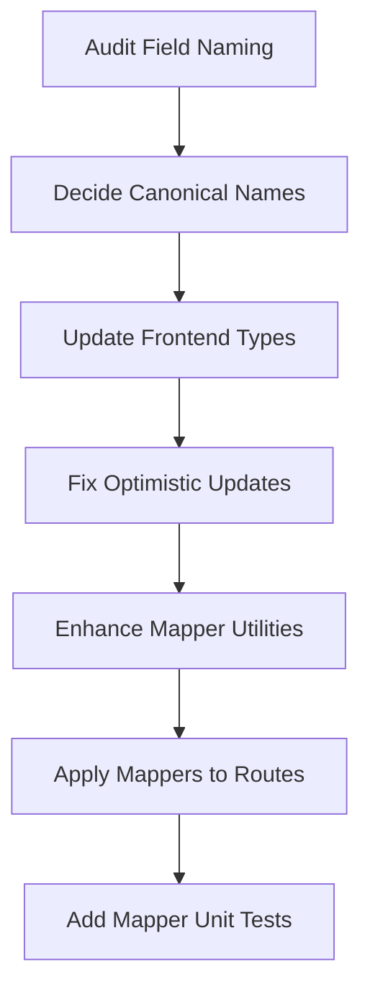
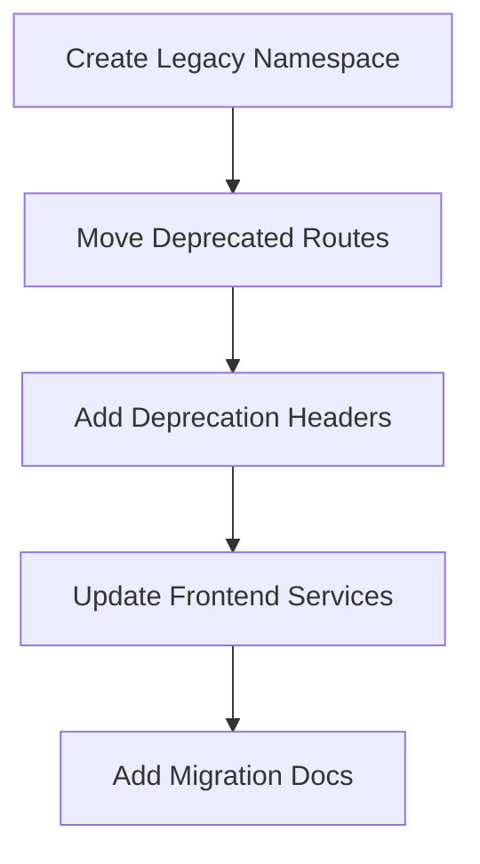
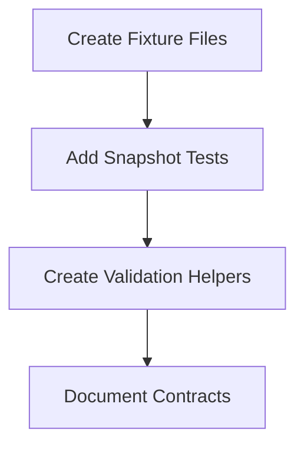
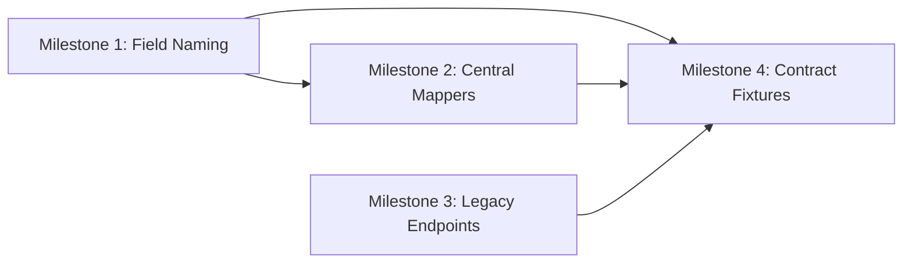

# Roadmap D - Data Correctness and API Contract Integrity

> **Status**: Planning Complete - Ready for Implementation  
> **Priority**: P1 (High Impact)  
> **Estimated Effort**: Medium  
> **Created**: 2026-02-18

---

## Executive Summary

Roadmap D focuses on establishing canonical, consistent domain models across backend and frontend. The primary issues identified are:

1. **Macro totals field naming inconsistencies** between API responses and frontend optimistic update logic
2. **Deprecated endpoints** still present in the codebase with no clear separation
3. **Snake_case to camelCase mapping** handled inconsistently across routes
4. **Missing contract fixtures** for regression testing

---

## 1. Roadmap D Overview

### Priority Level

**P1 - High Impact Next** (from roadmap document)

### Estimated Effort

**Medium** - Requires coordinated changes across backend and frontend, but scope is well-defined

### High-Level Description

Establish canonical, consistent domain models across backend and frontend by:

- Normalizing macro totals naming and response shapes
- Adding central mappers between DB snake_case and API camelCase
- Splitting legacy endpoints into compatibility namespace
- Adding contract fixtures and schema snapshots

---

## 2. Detailed Milestones

### Milestone 1: Normalize Macro Totals Naming

**Description**: Fix inconsistent field names in macro totals handling between backend API responses and frontend optimistic update logic.

**Problem Identified**:

- Backend [`/api/macros/totals`](backend/src/modules/macros/routes.ts:263) returns `{ protein, carbs, fats, calories }`
- Frontend type [`MacroDailyTotals`](frontend/src/types/macro.ts:52) defines `{ protein, carbs, fats, calories }`
- BUT [`useMacroQueries.ts`](frontend/src/hooks/queries/useMacroQueries.ts:410) optimistic updates use `totalCalories`, `totalProtein`, `totalCarbs`, `totalFat`

**Files Affected**:

- [`frontend/src/hooks/queries/useMacroQueries.ts`](frontend/src/hooks/queries/useMacroQueries.ts) - Lines 409-414, 518-529
- [`frontend/src/types/macro.ts`](frontend/src/types/macro.ts) - May need extended type for daily totals with metadata

**Implementation Steps**:

1. Audit all usages of `totalCalories`, `totalProtein`, `totalCarbs`, `totalFat` in frontend
2. Decide on canonical naming: either simple (`calories`) or prefixed (`totalCalories`)
3. Update optimistic update logic to match API response shape
4. Add type safety to catch future mismatches

**Dependencies**: None

---

### Milestone 2: Central Snake_case ↔ CamelCase Mappers

**Description**: Create and enforce consistent use of central mapping utilities for database-to-API transformations.

**Current State**:

- [`toCamelCase`](backend/src/lib/responses.ts:121) function exists but is underutilized
- Some routes manually map fields, others use the utility
- No reverse mapper (camelCase → snake_case) is consistently used for incoming payloads

**Files Affected**:

- [`backend/src/lib/responses.ts`](backend/src/lib/responses.ts) - Enhance mapper utilities
- [`backend/src/modules/macros/routes.ts`](backend/src/modules/macros/routes.ts) - Apply consistent mapping
- [`backend/src/modules/goals/routes.ts`](backend/src/modules/goals/routes.ts) - Apply consistent mapping
- [`backend/src/modules/user/routes.ts`](backend/src/modules/user/routes.ts) - Apply consistent mapping

**Implementation Steps**:

1. Enhance [`toCamelCase`](backend/src/lib/responses.ts:121) to handle nested objects and arrays
2. Create typed mapper functions for each domain entity (MacroEntry, WeightGoal, etc.)
3. Replace manual field mapping with centralized mappers
4. Add unit tests for mapper functions

**Dependencies**: None

---

### Milestone 3: Split Legacy Endpoints into Compatibility Namespace

**Description**: Move deprecated authentication endpoints to a versioned compatibility namespace with clear deprecation warnings.

**Deprecated Endpoints Identified**:
| Endpoint | Location | Status |
|----------|----------|--------|
| `POST /api/auth/login` | [`auth/routes.ts:166`](backend/src/modules/auth/routes.ts:166) | Deprecated |
| `POST /api/auth/register` | [`auth/routes.ts:68`](backend/src/modules/auth/routes.ts:68) | Deprecated |
| `POST /api/auth/validate-email` | [`auth/routes.ts:41`](backend/src/modules/auth/routes.ts:41) | Deprecated |
| `POST /api/auth/forgot-password` | [`auth/routes.ts:218`](backend/src/modules/auth/routes.ts:218) | Deprecated |
| `POST /api/auth/reset-password` | [`auth/routes.ts:265`](backend/src/modules/auth/routes.ts:265) | Deprecated |
| `PUT /api/user/password` | [`user/routes.ts:418`](backend/src/modules/user/routes.ts:418) | Deprecated |

**Files Affected**:

- [`backend/src/modules/auth/routes.ts`](backend/src/modules/auth/routes.ts)
- [`backend/src/modules/user/routes.ts`](backend/src/modules/user/routes.ts)
- [`frontend/src/utils/apiServices.ts`](frontend/src/utils/apiServices.ts) - Contains deprecated method references

**Implementation Steps**:

1. Create `/api/v1/legacy/` route group for deprecated endpoints
2. Move deprecated endpoints to legacy namespace
3. Add `Deprecation` header to all legacy responses
4. Update frontend to remove or mark deprecated API service methods
5. Add documentation for migration path

**Dependencies**: None

---

### Milestone 4: Add Contract Fixtures and Schema Snapshots

**Description**: Create comprehensive contract fixtures that can be used for regression testing and API documentation.

**Current State**:

- Contract tests exist in [`backend/tests/contracts/`](backend/tests/contracts/)
- Schema fixtures in [`backend/tests/contracts/schemas.ts`](backend/tests/contracts/schemas.ts)
- No snapshot testing for API responses

**Files Affected**:

- [`backend/tests/contracts/schemas.ts`](backend/tests/contracts/schemas.ts) - Enhance fixtures
- [`backend/tests/contracts/api-responses.test.ts`](backend/tests/contracts/api-responses.test.ts) - Add snapshot tests
- New file: `backend/tests/contracts/fixtures/` - JSON fixtures for each endpoint

**Implementation Steps**:

1. Create fixture files for each API response type
2. Add snapshot tests using Vitest's snapshot feature
3. Create a schema validation helper that can be used in E2E tests
4. Document expected response shapes in fixtures

**Dependencies**: Milestone 1, Milestone 2 (normalized naming first)

---

## 3. Implementation Strategy

### Phase 1: Foundation (Milestones 1 & 2)



**Approach**:

1. Start with frontend fixes (Milestone 1) as they are self-contained
2. Enhance backend mappers (Milestone 2) with proper typing
3. Run full test suite after each change

### Phase 2: Cleanup (Milestone 3)



**Approach**:

1. Create new route group without breaking existing clients
2. Add deprecation headers to signal sunset timeline
3. Update frontend to use Clerk-only paths

### Phase 3: Hardening (Milestone 4)



**Approach**:

1. Build on existing contract tests
2. Add snapshots for regression detection
3. Create reusable validation utilities

---

## 4. Files/Modules Affected

### Backend Files

| File                                                                           | Changes Required                                            |
| ------------------------------------------------------------------------------ | ----------------------------------------------------------- |
| [`backend/src/lib/responses.ts`](backend/src/lib/responses.ts)                 | Enhance `toCamelCase` for nested objects, add typed mappers |
| [`backend/src/modules/macros/routes.ts`](backend/src/modules/macros/routes.ts) | Apply consistent mapping, verify response shapes            |
| [`backend/src/modules/auth/routes.ts`](backend/src/modules/auth/routes.ts)     | Move deprecated endpoints to legacy namespace               |
| [`backend/src/modules/user/routes.ts`](backend/src/modules/user/routes.ts)     | Move deprecated password endpoint                           |
| [`backend/tests/contracts/schemas.ts`](backend/tests/contracts/schemas.ts)     | Add missing type definitions                                |

### Frontend Files

| File                                                                                             | Changes Required                         |
| ------------------------------------------------------------------------------------------------ | ---------------------------------------- |
| [`frontend/src/hooks/queries/useMacroQueries.ts`](frontend/src/hooks/queries/useMacroQueries.ts) | Fix field naming in optimistic updates   |
| [`frontend/src/types/macro.ts`](frontend/src/types/macro.ts)                                     | Ensure types match API responses         |
| [`frontend/src/utils/apiServices.ts`](frontend/src/utils/apiServices.ts)                         | Mark/remove deprecated method references |

### New Files to Create

| File                                    | Purpose                                |
| --------------------------------------- | -------------------------------------- |
| `backend/src/lib/mappers/index.ts`      | Centralized entity mappers             |
| `backend/src/lib/mappers/macroEntry.ts` | MacroEntry snake_case ↔ camelCase     |
| `backend/src/lib/mappers/weightGoal.ts` | WeightGoal snake_case ↔ camelCase     |
| `backend/tests/contracts/fixtures/`     | JSON fixtures for API responses        |
| `docs/api/deprecation-notice.md`        | Documentation for deprecated endpoints |

---

## 5. Data Correctness Issues to Address

### Issue 1: Macro Totals Field Mismatch

**Location**: [`useMacroQueries.ts:409-414`](frontend/src/hooks/queries/useMacroQueries.ts:409)

```typescript
// Current (incorrect):
return {
  ...oldData,
  totalCalories: oldData.totalCalories + caloriesDiff,
  totalProtein: oldData.totalProtein + proteinDiff,
  totalCarbs: oldData.totalCarbs + carbsDiff,
  totalFat: oldData.totalFat + fatsDiff,
};

// Should match API response shape:
return {
  ...oldData,
  calories: oldData.calories + caloriesDiff,
  protein: oldData.protein + proteinDiff,
  carbs: oldData.carbs + carbsDiff,
  fats: oldData.fats + fatsDiff,
};
```

### Issue 2: Inconsistent Fat Field Naming

**Location**: [`useMacroQueries.ts:528`](frontend/src/hooks/queries/useMacroQueries.ts:528)

```typescript
// Current (inconsistent):
totalFat: Math.max(0, oldData.totalFat - entryToDelete.fat),

// Note: Uses "fat" for entry but "totalFat" for totals
// Should be consistent: "fats" everywhere
```

### Issue 3: Missing Type Safety for Daily Totals

The `MacroDailyTotals` type doesn't include optional metadata fields that the optimistic update logic expects:

```typescript
// Current type:
export interface MacroDailyTotals {
  protein: number;
  carbs: number;
  fats: number;
  calories: number;
}

// Optimistic update expects:
// - entryCount (used in delete mutation)
// - totalCalories, totalProtein, etc. (incorrect naming)
```

---

## 6. Success Criteria

### Milestone 1 Success Criteria

- [ ] All macro totals fields use consistent naming (`calories`, `protein`, `carbs`, `fats`)
- [ ] No references to `totalCalories`, `totalProtein`, `totalCarbs`, `totalFat` in optimistic updates
- [ ] TypeScript compilation passes with strict types
- [ ] All existing tests pass

### Milestone 2 Success Criteria

- [ ] Central mapper utilities handle nested objects and arrays
- [ ] All routes use centralized mappers (no manual field mapping)
- [ ] Mapper unit tests achieve 100% coverage
- [ ] API responses validated against schemas in tests

### Milestone 3 Success Criteria

- [ ] All deprecated endpoints moved to `/api/v1/legacy/`
- [ ] `Deprecation` header included in all legacy responses
- [ ] Frontend no longer calls deprecated endpoints
- [ ] Migration documentation published

### Milestone 4 Success Criteria

- [ ] JSON fixtures exist for all API response types
- [ ] Snapshot tests detect response shape changes
- [ ] Contract tests run in CI pipeline
- [ ] API documentation generated from fixtures

---

## 7. Verification Checklist

### Pre-Implementation

- [ ] Create feature branch: `feat/roadmap-d-data-correctness`
- [ ] Ensure all existing tests pass
- [ ] Document current API response shapes

### During Implementation

- [ ] Run tests after each milestone
- [ ] Update TypeScript types as needed
- [ ] Add new tests for fixed functionality

### Post-Implementation

- [ ] Full test suite passes (165+ tests)
- [ ] TypeScript strict mode passes
- [ ] ESLint passes with no warnings
- [ ] Manual testing of affected endpoints
- [ ] Update API documentation

---

## 8. Risk Assessment

| Risk                        | Likelihood | Impact | Mitigation                                            |
| --------------------------- | ---------- | ------ | ----------------------------------------------------- |
| Breaking existing clients   | Low        | High   | Version deprecated endpoints, add deprecation headers |
| Optimistic update bugs      | Medium     | Medium | Comprehensive testing of mutation flows               |
| Type mismatches             | Medium     | Low    | Strict TypeScript, runtime validation                 |
| Regression in API responses | Low        | High   | Snapshot tests, contract tests                        |

---

## 9. Dependencies Between Milestones



**Critical Path**: Milestone 1 → Milestone 2 → Milestone 4

Milestone 3 can be done in parallel with Milestones 1 and 2.

---

## 10. Recommended Execution Order

1. **Milestone 1** - Fix field naming (self-contained, high impact)
2. **Milestone 2** - Centralize mappers (builds on M1, enables M4)
3. **Milestone 3** - Legacy endpoints (can be done in parallel)
4. **Milestone 4** - Contract fixtures (validates all previous work)

---

## Appendix A: Current API Response Shapes

### GET /api/macros/totals

```json
{
  "protein": 150,
  "carbs": 200,
  "fats": 65,
  "calories": 1985
}
```

### GET /api/macros/history

```json
{
  "entries": [
    {
      "id": 1,
      "protein": 30,
      "carbs": 40,
      "fats": 15,
      "mealType": "lunch",
      "mealName": "Chicken Salad",
      "entryDate": "2026-02-18",
      "entryTime": "12:30",
      "createdAt": "2026-02-18T12:30:00Z"
    }
  ],
  "total": 50,
  "limit": 20,
  "offset": 0,
  "hasMore": true
}
```

### GET /api/macros/target

```json
{
  "macroTarget": {
    "proteinPercentage": 30,
    "carbsPercentage": 40,
    "fatsPercentage": 30,
    "lockedMacros": ["protein"]
  }
}
```

---

## Appendix B: Deprecated Endpoint Reference

| Endpoint                         | Replacement               | Sunset Date |
| -------------------------------- | ------------------------- | ----------- |
| `POST /api/auth/login`           | Clerk SignIn              | v2.0.0      |
| `POST /api/auth/register`        | Clerk SignUp              | v2.0.0      |
| `POST /api/auth/validate-email`  | Clerk validation          | v2.0.0      |
| `POST /api/auth/forgot-password` | Clerk password reset      | v2.0.0      |
| `POST /api/auth/reset-password`  | Clerk password reset      | v2.0.0      |
| `PUT /api/user/password`         | Clerk password management | v2.0.0      |

---

_Document generated from codebase analysis on 2026-02-18_
