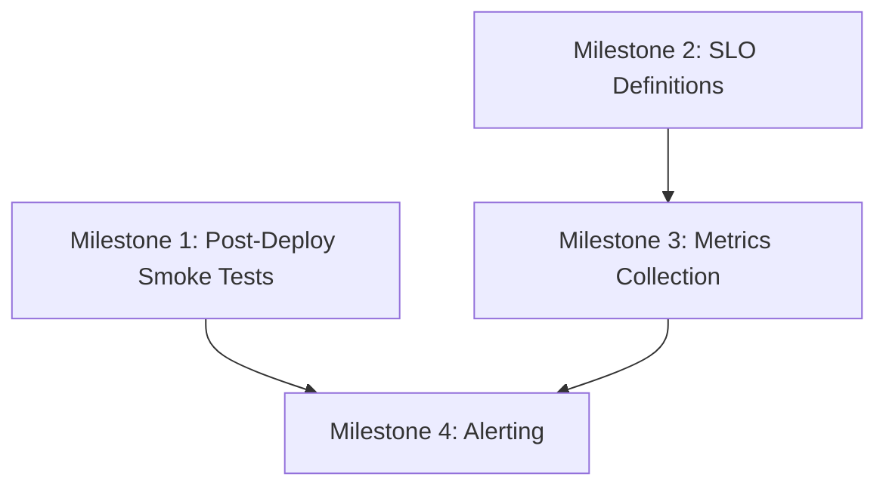

# Roadmap E — Operational Excellence and Deploy Hardening

> **Status**: ✅ COMPLETE
> **Priority**: P1 (High Impact Next)
> **Goal**: Safer deploys, better incident response, stronger observability
> **Completed**: 2026-02-21

---

## Executive Summary

Roadmap E focuses on operational excellence to ensure production deployments are safe, observable, and recoverable. The current infrastructure has a solid foundation with quality gates, health endpoints, and structured logging, but lacks post-deploy verification, SLO definitions, and alerting mechanisms.

### Current State Assessment

| Component               | Status      | Notes                                                             |
| ----------------------- | ----------- | ----------------------------------------------------------------- |
| Quality Gate Workflow   | ✅ Exists   | `.github/workflows/quality-gate.yml` runs typecheck, lint, test   |
| Deploy Workflow         | ✅ Exists   | `.github/workflows/deploy.yml` with quality dependency            |
| Health Endpoints        | ✅ Exists   | `/`, `/health`, `/health/ready` in `backend/src/routes/health.ts` |
| Structured Logging      | ✅ Exists   | Pino logger with sanitization in `backend/src/lib/logger.ts`      |
| Correlation IDs         | ✅ Exists   | Request tracing in `backend/src/middleware/correlation.ts`        |
| PM2 Configuration       | ✅ Exists   | `ecosystem.config.js` with restart policies                       |
| Post-Deploy Smoke Tests | ✅ Complete | `backend/scripts/smoke-test.ts` with CI integration               |
| SLO Metrics             | ✅ Complete | `backend/docs/SLO.md` with defined objectives                     |
| Metrics Collection      | ✅ Complete | `backend/src/lib/metrics.ts` with `/metrics` endpoint             |
| Alerting                | ✅ Complete | `backend/docs/ALERTING.md` with runbooks                          |

---

## Milestones

### Milestone 1: Post-Deploy Smoke Tests

**Description**: Add automated smoke test step after deployment to verify health and key API routes.

**Dependencies**: None (can start immediately)

**Files Affected**:

- `.github/workflows/deploy.yml` — Add smoke test job
- `backend/src/routes/health.ts` — Potentially extend health check

**Implementation Details**:

1. Add a new `smoke-test` job in deploy.yml that runs after `deploy-frontend`
2. Create smoke test script that verifies:
   - Backend health endpoint responds with `status: "healthy"`
   - Backend readiness endpoint responds with `status: "ready"`
   - Database connectivity is confirmed
   - Frontend is accessible (HTTP 200)
   - Key API route responds (e.g., `/api/macros/today` with auth)

3. Use `curl` or a simple script via SSH action to test endpoints

**Recommended Approach**:

```yaml
# Add to deploy.yml after deploy-frontend job
smoke-test:
  needs: [deploy-backend, deploy-frontend]
  runs-on: ubuntu-latest
  steps:
    - name: Smoke test backend health
      uses: appleboy/ssh-action@v1.0.0
      with:
        host: ${{ secrets.SERVER_HOST }}
        username: root
        key: ${{ secrets.SERVER_SSH_KEY }}
        script: |
          # Test backend health
          HEALTH=$(curl -s http://localhost:3000/health)
          if echo "$HEALTH" | grep -q '"status":"healthy"'; then
            echo "✅ Backend health check passed"
          else
            echo "❌ Backend health check failed: $HEALTH"
            exit 1
          fi

          # Test backend readiness
          READY=$(curl -s http://localhost:3000/health/ready)
          if echo "$READY" | grep -q '"status":"ready"'; then
            echo "✅ Backend readiness check passed"
          else
            echo "❌ Backend readiness check failed: $READY"
            exit 1
          fi

          # Test frontend
          FRONTEND=$(curl -s -o /dev/null -w "%{http_code}" http://localhost:5173)
          if [ "$FRONTEND" = "200" ]; then
            echo "✅ Frontend accessibility check passed"
          else
            echo "❌ Frontend returned HTTP $FRONTEND"
            exit 1
          fi
```

**Success Criteria**:

- [x] Smoke test job runs after both backend and frontend deploy
- [x] Health endpoint returns expected JSON structure
- [x] Readiness endpoint confirms database connectivity
- [x] Frontend returns HTTP 200
- [x] Deploy fails if any smoke test fails

---

### Milestone 2: SLO Metrics Definition

**Description**: Define Service Level Objectives (SLOs) for error rate, latency, auth failures, and webhook failures.

**Dependencies**: None (can run in parallel with Milestone 1)

**Files Affected**:

- `backend/docs/SLO.md` — New file for SLO definitions
- `backend/src/lib/logger.ts` — Extend with SLO-specific logging
- `backend/src/middleware/correlation.ts` — Add latency tracking

**Implementation Details**:

1. Create SLO document defining:
   - **Availability SLO**: 99.5% uptime (allows ~3.6 hours downtime/month)
   - **Latency SLO**: 95% of requests < 500ms, 99% < 2000ms
   - **Error Rate SLO**: < 1% 5xx errors
   - **Auth Failure SLO**: < 5% auth failures (excluding invalid credentials)
   - **Webhook Failure SLO**: < 2% webhook processing failures

2. Extend logger with SLO-specific helpers:

   ```typescript
   // Add to loggerHelpers in logger.ts
   sloMetric: (
     metric: string,
     value: number,
     labels?: Record<string, string>,
   ) => {
     logger.info(
       {
         type: "slo_metric",
         metric,
         value,
         labels,
         timestamp: new Date().toISOString(),
       },
       `SLO: ${metric}=${value}`,
     );
   };
   ```

3. Add latency buckets for histogram-style logging:
   - Track request duration in correlation middleware
   - Log slow requests (>500ms, >1000ms, >2000ms) with appropriate severity

**Recommended Approach**:

Create `backend/docs/SLO.md`:

```markdown
# Service Level Objectives (SLOs)

## Availability

- **Target**: 99.5% uptime
- **Measurement**: Health endpoint checks every 30s
- **Alert**: Trigger if uptime drops below 99% over 1 hour window

## Latency

- **Target**:
  - 95% of requests < 500ms
  - 99% of requests < 2000ms
- **Measurement**: Response time from correlation middleware
- **Alert**: Trigger if p95 > 1000ms for 5 minutes

## Error Rate

- **Target**: < 1% 5xx errors
- **Measurement**: HTTP status codes in API responses
- **Alert**: Trigger if error rate > 2% over 5 minute window

## Auth Failures

- **Target**: < 5% auth failures (excluding invalid credentials)
- **Measurement**: Clerk auth errors vs successful auths
- **Alert**: Trigger if auth failure rate > 10% over 5 minutes

## Webhook Failures

- **Target**: < 2% webhook processing failures
- **Measurement**: Stripe and Clerk webhook success/failure logs
- **Alert**: Trigger if webhook failure rate > 5% over 10 minutes
```

**Success Criteria**:

- [x] SLO document created with all 5 metrics defined
- [x] Logger extended with SLO metric helper
- [x] Latency tracking logs at appropriate severity levels
- [x] Error rate tracking in place

---

### Milestone 3: Metrics Collection Infrastructure

**Description**: Set up infrastructure to collect and aggregate metrics for SLO monitoring.

**Dependencies**: Milestone 2 (SLO definitions)

**Files Affected**:

- `backend/src/lib/metrics.ts` — New file for metrics collection
- `backend/src/index.ts` — Add metrics endpoint
- `backend/src/middleware/correlation.ts` — Integrate metrics collection

**Implementation Details**:

1. Create a simple in-memory metrics collector:

   ```typescript
   // backend/src/lib/metrics.ts
   interface MetricValue {
     count: number;
     sum: number;
     min: number;
     max: number;
     lastUpdated: string;
   }

   interface MetricsStore {
     requests: { total: number; byStatus: Record<string, number> };
     latency: { p50: number; p95: number; p99: number };
     errors: { total: number; byType: Record<string, number> };
     authFailures: number;
     webhookFailures: number;
   }
   ```

2. Add `/metrics` endpoint for Prometheus-style scraping:
   - Expose metrics in a format compatible with monitoring tools
   - Include all SLO-relevant metrics

3. Integrate with correlation middleware:
   - Track request duration
   - Track response status codes
   - Track error types

**Recommended Approach**:

Keep it simple initially — use structured logs that can be parsed by external tools (Grafana Loki, Datadog, etc.) rather than building a full Prometheus integration. The existing Pino logger already outputs JSON that can be ingested by most observability platforms.

**Success Criteria**:

- [x] Metrics collection module created
- [x] `/metrics` endpoint exposes SLO metrics
- [x] Correlation middleware records metrics
- [x] Metrics are parseable by standard observability tools

---

### Milestone 4: Alerting Configuration

**Description**: Configure alerts for high-severity failures based on SLO thresholds.

**Dependencies**: Milestone 2 (SLO definitions), Milestone 3 (Metrics collection)

**Files Affected**:

- `.github/workflows/health-check.yml` — New scheduled workflow for health monitoring
- `backend/docs/ALERTING.md` — New file for alert runbooks
- `deploy.sh` — Potentially extend with alert hooks

**Implementation Details**:

1. Create scheduled GitHub Action for health monitoring:

   ```yaml
   # .github/workflows/health-check.yml
   name: Health Check

   on:
     schedule:
       - cron: "*/5 * * * *" # Every 5 minutes
     workflow_dispatch:

   jobs:
     health-check:
       runs-on: ubuntu-latest
       steps:
         - name: Check backend health
           id: health
           run: |
             RESPONSE=$(curl -s -o response.json -w "%{http_code}" ${{ secrets.API_URL }}/health)
             echo "status_code=$RESPONSE" >> $GITHUB_OUTPUT

             if [ "$RESPONSE" != "200" ]; then
               echo "::warning::Backend health check failed with status $RESPONSE"
               cat response.json
               exit 1
             fi

         - name: Create issue on failure
           if: failure()
           uses: actions/github-script@v7
           with:
             script: |
               github.rest.issues.create({
                 owner: context.repo.owner,
                 repo: context.repo.repo,
                 title: '🚨 Health Check Failed',
                 body: 'Health check failed at ' + new Date().toISOString(),
                 labels: ['incident', 'automated']
               })
   ```

2. Document alert runbooks:
   - What to do when each alert fires
   - Escalation procedures
   - Contact information

3. Consider integration options:
   - GitHub Issues for automated incident tracking
   - Email notifications via GitHub Actions
   - Webhook to external incident management (PagerDuty, Opsgenie)

**Recommended Approach**:

Start with GitHub Actions scheduled workflows and GitHub Issues for incident tracking. This keeps everything in the existing ecosystem without requiring additional services. Later, integrate with external tools if needed.

**Success Criteria**:

- [x] Alert runbook documented
- [x] Escalation procedures defined
- [x] Alert utilities created in `backend/src/lib/alerting.ts`

---

## Implementation Order



**Recommended Execution Order**:

1. **Milestone 1** (Smoke Tests) — Immediate value, low effort
2. **Milestone 2** (SLO Definitions) — Foundation for monitoring
3. **Milestone 3** (Metrics Collection) — Build on SLOs
4. **Milestone 4** (Alerting) — Complete the observability stack

---

## Files to Create/Modify

### New Files

| File                                 | Purpose                                |
| ------------------------------------ | -------------------------------------- |
| `backend/docs/SLO.md`                | Service Level Objectives documentation |
| `backend/docs/ALERTING.md`           | Alert runbooks and procedures          |
| `backend/src/lib/metrics.ts`         | Metrics collection module              |
| `.github/workflows/health-check.yml` | Scheduled health monitoring            |

### Modified Files

| File                                    | Changes                      |
| --------------------------------------- | ---------------------------- |
| `.github/workflows/deploy.yml`          | Add smoke test job           |
| `backend/src/lib/logger.ts`             | Add SLO metric helpers       |
| `backend/src/middleware/correlation.ts` | Integrate metrics collection |
| `backend/src/index.ts`                  | Add `/metrics` endpoint      |

---

## Testing Strategy

### Milestone 1 Tests

- Manually trigger deploy workflow and verify smoke tests run
- Simulate backend failure and verify deploy fails appropriately
- Simulate frontend failure and verify deploy fails appropriately

### Milestone 2 Tests

- Review SLO document with team for completeness
- Verify logger outputs SLO metrics in correct format

### Milestone 3 Tests

- Call `/metrics` endpoint and verify output structure
- Make requests and verify metrics are updated
- Check log format compatibility with observability tools

### Milestone 4 Tests

- Manually trigger health check workflow
- Verify GitHub issue creation on failure
- Test alert notification delivery

---

## Rollback Plan

If any milestone causes issues:

1. **Milestone 1**: Remove smoke test job from deploy workflow
2. **Milestone 2**: SLO document is non-breaking, can be removed
3. **Milestone 3**: Remove `/metrics` endpoint and metrics collection
4. **Milestone 4**: Disable scheduled workflow, delete health-check.yml

---

## Success Metrics

After completing Roadmap E, the following should be true:

1. **Deploy Confidence**: Every deploy is verified by automated smoke tests
2. **Observability**: SLO metrics are defined and collected
3. **Incident Response**: Alerts fire automatically on SLO violations
4. **Documentation**: Runbooks exist for all alert types
5. **Recovery**: Failed deploys are detected within 5 minutes

---

## Estimated Effort

| Milestone              | Complexity | Risk   |
| ---------------------- | ---------- | ------ |
| M1: Smoke Tests        | Low        | Low    |
| M2: SLO Definitions    | Low        | Low    |
| M3: Metrics Collection | Medium     | Low    |
| M4: Alerting           | Medium     | Medium |

**Overall Risk Assessment**: Low — All changes are additive and non-breaking. Existing functionality remains intact.

---

## Next Steps

✅ **Roadmap E Complete** — All milestones implemented and verified.

### Completed Deliverables

1. **Milestone 1: Smoke Tests** — `backend/scripts/smoke-test.ts` with CI integration
2. **Milestone 2: SLO Definitions** — `backend/docs/SLO.md` with defined objectives
3. **Milestone 3: Metrics Collection** — `backend/src/lib/metrics.ts` with `/metrics` endpoint
4. **Milestone 4: Alerting** — `backend/docs/ALERTING.md` and `backend/src/lib/alerting.ts`
