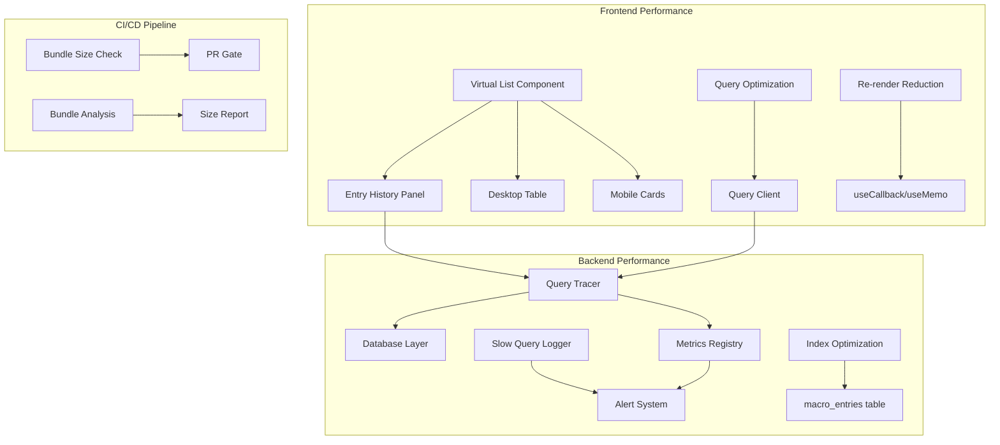

# Roadmap F — Performance and Scalability Implementation Plan

> **Status**: Planning Complete
> **Created**: 2026-02-21
> **Goal**: Sustain responsiveness as data and usage scale

---

## Executive Summary

Roadmap F focuses on ensuring the Macro Tracker application remains performant as user data grows. This plan addresses four key areas: list virtualization for large datasets, backend query performance tracing, frontend re-render optimization, and bundle size guardrails.

---

## Current State Analysis

### Frontend History Views

| Component           | File                                                                                            | Current Implementation                | Performance Risk              |
| ------------------- | ----------------------------------------------------------------------------------------------- | ------------------------------------- | ----------------------------- |
| Entry History Panel | [`EntryHistoryPanel.tsx`](frontend/src/features/macroTracking/components/EntryHistoryPanel.tsx) | Manual pagination with 5-date batches | Medium - DOM grows with data  |
| Desktop Entry Table | [`DesktopEntryTable.tsx`](frontend/src/features/macroTracking/components/DesktopEntryTable.tsx) | TanStack Table with AnimatePresence   | Medium - Animation overhead   |
| Mobile Entry Cards  | [`MobileEntryCards.tsx`](frontend/src/features/macroTracking/components/MobileEntryCards.tsx)   | Card-based with staggered animations  | High - Many animated elements |

**Key Findings:**

- No virtualization - all visible entries rendered in DOM
- Heavy use of motion/react animations on each entry
- Memoization present but could be improved
- "Load More" pagination helps but doesn't prevent DOM bloat

### Backend Query Performance

| Endpoint                | File                                                            | Current Implementation       | Performance Risk          |
| ----------------------- | --------------------------------------------------------------- | ---------------------------- | ------------------------- |
| GET /api/macros/history | [`routes.ts:319-373`](backend/src/modules/macros/routes.ts:319) | Paginated with limit/offset  | Low - Has pagination      |
| GET /api/macros/totals  | [`routes.ts:262-317`](backend/src/modules/macros/routes.ts:262) | Date range aggregation       | Medium - No query tracing |
| GET /api/macros/search  | [`routes.ts:50-90`](backend/src/modules/macros/routes.ts:50)    | OpenFoodFacts API with cache | Low - Has caching         |

**Key Findings:**

- Pagination implemented for history endpoint
- Basic caching for external API calls
- No query-level performance tracing
- No slow query logging or alerts

### Bundle Configuration

| Setting       | Current Value         | File                                                    |
| ------------- | --------------------- | ------------------------------------------------------- |
| Minification  | esbuild               | [`vite.config.ts:122`](frontend/vite.config.ts:122)     |
| Source Maps   | Disabled              | [`vite.config.ts:124`](frontend/vite.config.ts:124)     |
| Manual Chunks | React + ReactDOM only | [`vite.config.ts:131-133`](frontend/vite.config.ts:131) |
| Compression   | Enabled via plugin    | [`vite.config.ts:47`](frontend/vite.config.ts:47)       |

**Key Findings:**

- Basic vendor splitting exists
- No bundle size limits or monitoring
- No CI bundle size checks
- Large dependencies could be better chunked

### Performance Monitoring

| Metric Type       | Implementation    | File                                                |
| ----------------- | ----------------- | --------------------------------------------------- |
| HTTP Duration     | Histogram metric  | [`metrics.ts:97`](backend/src/lib/metrics.ts:97)    |
| Request Counter   | Counter metric    | [`metrics.ts:91`](backend/src/lib/metrics.ts:91)    |
| Error Counter     | Counter metric    | [`metrics.ts:92`](backend/src/lib/metrics.ts:92)    |
| Prometheus Export | /metrics endpoint | [`metrics.ts:71-84`](backend/src/lib/metrics.ts:71) |

**Key Findings:**

- Basic HTTP metrics exist
- No query-level performance traces
- No frontend performance monitoring
- No alerting thresholds configured

---

## Milestones

### Milestone 1: List Virtualization for History Views

**Objective**: Implement virtual scrolling to handle large datasets without DOM bloat.

**Files to Create/Modify:**

| Action | File                                                                   | Description                            |
| ------ | ---------------------------------------------------------------------- | -------------------------------------- |
| Create | `frontend/src/components/ui/VirtualList.tsx`                           | Reusable virtual list component        |
| Modify | `frontend/src/features/macroTracking/components/EntryHistoryPanel.tsx` | Integrate virtual list                 |
| Modify | `frontend/src/features/macroTracking/components/DesktopEntryTable.tsx` | Add virtualization to table            |
| Modify | `frontend/src/features/macroTracking/components/MobileEntryCards.tsx`  | Add virtualization to cards            |
| Modify | `frontend/package.json`                                                | Add @tanstack/react-virtual dependency |

**Implementation Details:**

1. **Install @tanstack/react-virtual**

   ```bash
   cd frontend && bun add @tanstack/react-virtual
   ```

2. **Create VirtualList Component**
   - Wrapper around @tanstack/react-virtual
   - Support for variable item heights
   - Overscan configuration for smooth scrolling
   - Threshold prop to enable/disable virtualization

3. **Virtualization Threshold**
   - Enable virtualization when entries exceed 50 items
   - Keep standard rendering for small lists
   - Preserve animation behavior for visible items only

4. **Table Virtualization**
   - Use TanStack Virtual for table body
   - Keep header fixed
   - Maintain group collapse/expand functionality

**Success Criteria:**

- [ ] History view handles 1000+ entries without scroll lag
- [ ] Memory usage remains stable with large datasets
- [ ] First Contentful Paint under 1.5s with 500 entries
- [ ] No visual regressions in entry display

---

### Milestone 2: Backend Query Performance Tracing

**Objective**: Add query-level performance monitoring to identify and address slow queries.

**Files to Create/Modify:**

| Action | File                                   | Description                               |
| ------ | -------------------------------------- | ----------------------------------------- |
| Create | `backend/src/lib/query-tracer.ts`      | Query performance tracing utility         |
| Modify | `backend/src/lib/database.ts`          | Integrate tracer into safeQuery functions |
| Modify | `backend/src/lib/metrics.ts`           | Add query duration histogram              |
| Modify | `backend/src/modules/macros/routes.ts` | Add tracing to slow endpoints             |
| Modify | `backend/src/lib/logger.ts`            | Add slow query logging                    |

**Implementation Details:**

1. **Query Tracer Interface**

   ```typescript
   interface QueryTrace {
     query: string;
     tableName: string;
     durationMs: number;
     timestamp: Date;
     params?: number;
   }
   ```

2. **Slow Query Thresholds**
   - Warning: > 100ms
   - Critical: > 500ms
   - Log all queries exceeding thresholds

3. **Metrics Integration**
   - New histogram: `db_query_duration_ms`
   - Labels: table, operation (SELECT/INSERT/UPDATE/DELETE)
   - Export via existing /metrics endpoint

4. **Database Index Audit**
   - Review existing indexes on macro_entries
   - Add composite index on (user_id, entry_date) if missing
   - Add index on entry_date for date range queries

**Success Criteria:**

- [ ] All database queries logged with duration
- [ ] Slow queries trigger warning logs
- [ ] Query duration metrics exported to Prometheus
- [ ] Index recommendations documented

---

### Milestone 3: Frontend Re-render Optimization

**Objective**: Reduce unnecessary re-renders in macro tracking and history flows.

**Files to Create/Modify:**

| Action | File                                                                   | Description                      |
| ------ | ---------------------------------------------------------------------- | -------------------------------- |
| Create | `frontend/src/lib/performance-utils.ts`                                | Performance monitoring utilities |
| Modify | `frontend/src/features/macroTracking/hooks/useHomePage.tsx`            | Optimize state updates           |
| Modify | `frontend/src/features/macroTracking/components/DailySummaryPanel.tsx` | Memoize calculations             |
| Modify | `frontend/src/features/macroTracking/components/EntryHistoryPanel.tsx` | Improve memoization              |
| Modify | `frontend/src/lib/queryClient.ts`                                      | Optimize query configuration     |

**Implementation Details:**

1. **React DevTools Profiler Integration**
   - Add development-only profiling
   - Identify top re-render sources
   - Document findings in performance audit

2. **Memoization Improvements**
   - Convert inline functions to useCallback
   - Move expensive calculations to useMemo
   - Stabilize object references in props

3. **Query Configuration Optimization**
   - Review staleTime settings
   - Adjust refetchOnWindowFocus behavior
   - Implement structural sharing for large datasets

4. **Animation Optimization**
   - Use layoutId for smoother transitions
   - Reduce animation complexity for large lists
   - Consider will-change CSS property

**Success Criteria:**

- [ ] Re-render count reduced by 50% in history view
- [ ] Interaction latency under 100ms for common actions
- [ ] No unnecessary re-renders on unrelated state changes
- [ ] Animation frame rate maintains 60fps

---

### Milestone 4: Bundle Size Guardrails

**Objective**: Implement CI checks and monitoring for bundle size to prevent regressions.

**Files to Create/Modify:**

| Action | File                                  | Description                   |
| ------ | ------------------------------------- | ----------------------------- |
| Create | `frontend/scripts/bundle-analysis.js` | Bundle size analysis script   |
| Create | `.github/workflows/bundle-size.yml`   | CI workflow for bundle checks |
| Modify | `frontend/vite.config.ts`             | Improve code splitting        |
| Modify | `frontend/package.json`               | Add bundle analysis scripts   |
| Create | `frontend/bundle-size.json`           | Bundle size baseline file     |

**Implementation Details:**

1. **Bundle Analysis Setup**

   ```bash
   bun add -d rollup-plugin-visualizer
   ```

2. **Code Splitting Improvements**
   - Split chart libraries (chart.js, recharts) into separate chunk
   - Split motion/react into separate chunk
   - Split TanStack libraries into separate chunk
   - Route-based code splitting (already enabled via TanStack Router)

3. **CI Bundle Size Check**
   - Run on every PR
   - Compare against baseline
   - Fail if bundle size increases by > 5%
   - Comment on PR with size diff

4. **Bundle Size Baseline**

   ```json
   {
     "main.js": { "maxSize": 150000, "unit": "bytes" },
     "vendor.js": { "maxSize": 200000, "unit": "bytes" },
     "charts.js": { "maxSize": 100000, "unit": "bytes" },
     "motion.js": { "maxSize": 50000, "unit": "bytes" }
   }
   ```

5. **Reporting**
   - Generate bundle stats on each build
   - Store historical data for trend analysis
   - Alert on significant increases

**Success Criteria:**

- [ ] CI fails on bundle size regression > 5%
- [ ] Bundle analysis report generated on build
- [ ] Initial JS bundle under 200KB gzipped
- [ ] Total assets under 500KB gzipped

---

## Dependencies and Prerequisites

### Required Dependencies

| Package                  | Purpose             | Install Command                       |
| ------------------------ | ------------------- | ------------------------------------- |
| @tanstack/react-virtual  | List virtualization | `bun add @tanstack/react-virtual`     |
| rollup-plugin-visualizer | Bundle analysis     | `bun add -d rollup-plugin-visualizer` |

### Prerequisites from Previous Roadmaps

| Roadmap   | Requirement              | Status         |
| --------- | ------------------------ | -------------- |
| Roadmap A | Clerk auth consolidation | ✅ Complete    |
| Roadmap B | Test infrastructure      | ✅ Complete    |
| Roadmap C | Type safety improvements | ✅ Complete    |
| Roadmap D | API contract integrity   | ✅ Complete    |
| Roadmap E | Operational excellence   | ⏳ In Progress |

---

## Architecture Diagram



---

## Risk Assessment

| Risk                                   | Likelihood | Impact | Mitigation                                             |
| -------------------------------------- | ---------- | ------ | ------------------------------------------------------ |
| Virtualization breaks animations       | Medium     | High   | Test thoroughly, preserve animations for visible items |
| Bundle splitting causes loading issues | Low        | Medium | Test lazy loading, add error boundaries                |
| Query tracing adds overhead            | Low        | Low    | Use sampling for high-traffic endpoints                |
| Index changes affect write performance | Low        | Medium | Test in staging, monitor write metrics                 |

---

## Testing Strategy

### Performance Testing

1. **Frontend Benchmarks**
   - Use React DevTools Profiler
   - Measure render times with 100, 500, 1000 entries
   - Test scroll performance on mobile devices

2. **Backend Load Testing**
   - Simulate 100 concurrent users
   - Measure query response times
   - Verify metrics collection

3. **Bundle Size Testing**
   - Run on every PR
   - Compare against baseline
   - Track trends over time

### Test Files to Create

| File                                                        | Purpose                        |
| ----------------------------------------------------------- | ------------------------------ |
| `frontend/src/components/ui/__tests__/VirtualList.test.tsx` | Virtual list unit tests        |
| `frontend/tests/performance/history-performance.test.ts`    | History view performance tests |
| `backend/tests/performance/query-tracer.test.ts`            | Query tracer unit tests        |

---

## Rollout Plan

### Phase 1: Foundation (Week 1)

1. Install dependencies
2. Create query tracer infrastructure
3. Set up bundle analysis scripts

### Phase 2: Implementation (Week 2-3)

1. Implement virtual list component
2. Integrate virtualization into history views
3. Add query tracing to database layer
4. Implement bundle size CI checks

### Phase 3: Optimization (Week 4)

1. Profile and optimize re-renders
2. Add database indexes
3. Fine-tune bundle splitting
4. Performance testing and validation

### Phase 4: Monitoring (Week 5)

1. Enable production metrics
2. Set up alerting thresholds
3. Document performance baselines
4. Create runbook for performance issues

---

## Success Metrics

| Metric                                 | Current | Target          | Measurement        |
| -------------------------------------- | ------- | --------------- | ------------------ |
| History view render time (500 entries) | Unknown | < 1.5s          | React Profiler     |
| Scroll frame rate (large lists)        | Unknown | 60fps           | Chrome DevTools    |
| P95 query duration                     | Unknown | < 100ms         | Prometheus metrics |
| Initial JS bundle size                 | Unknown | < 200KB gzipped | Build output       |
| Lighthouse Performance score           | Unknown | > 90            | Lighthouse CI      |

---

## Appendix: File Reference

### Frontend Files

- [`frontend/src/features/macroTracking/components/EntryHistoryPanel.tsx`](frontend/src/features/macroTracking/components/EntryHistoryPanel.tsx) - Main history panel
- [`frontend/src/features/macroTracking/components/DesktopEntryTable.tsx`](frontend/src/features/macroTracking/components/DesktopEntryTable.tsx) - Desktop table view
- [`frontend/src/features/macroTracking/components/MobileEntryCards.tsx`](frontend/src/features/macroTracking/components/MobileEntryCards.tsx) - Mobile card view
- [`frontend/vite.config.ts`](frontend/vite.config.ts) - Build configuration
- [`frontend/src/lib/queryClient.ts`](frontend/src/lib/queryClient.ts) - React Query configuration

### Backend Files

- [`backend/src/modules/macros/routes.ts`](backend/src/modules/macros/routes.ts) - Macro API routes
- [`backend/src/lib/database.ts`](backend/src/lib/database.ts) - Database utilities
- [`backend/src/lib/metrics.ts`](backend/src/lib/metrics.ts) - Metrics registry
- [`backend/src/lib/logger.ts`](backend/src/lib/logger.ts) - Logging utilities

---

## Conclusion

This implementation plan provides a comprehensive approach to improving performance across the Macro Tracker application. By addressing virtualization, query performance, re-render optimization, and bundle size monitoring, the application will be well-positioned to handle growing user data while maintaining a responsive user experience.

The plan is designed to be executed incrementally, with each milestone building on the previous one. Success criteria are measurable and specific, allowing for clear validation of improvements.
