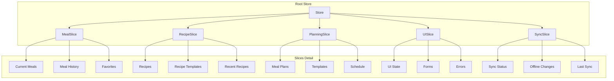

# State Management and Data Persistence Architecture

## Store Structure



## Store Implementation

### 1. Store Configuration

```typescript
// frontend/src/store/store.ts
import { create } from "zustand";
import { persist } from "zustand/middleware";
import { createMealSlice } from "./slices/meal-slice";
import { createRecipeSlice } from "./slices/recipe-slice";
import { createPlanningSlice } from "./slices/planning-slice";

export const useStore = create(
  persist(
    (set, get) => ({
      ...createMealSlice(set, get),
      ...createRecipeSlice(set, get),
      ...createPlanningSlice(set, get),
    }),
    {
      name: "nutrition-tracker-storage",
      partialize: (state) => ({
        // Specify which parts of state to persist
        meals: state.meals,
        recipes: state.recipes,
        mealPlans: state.mealPlans,
        templates: state.templates,
      }),
      storage: {
        getItem: (name) => {
          // Custom storage implementation
          // Handle encryption if needed
          return localStorage.getItem(name);
        },
        setItem: (name, value) => {
          // Implement rate limiting for storage
          // Handle storage quota exceeded
          localStorage.setItem(name, value);
        },
        removeItem: (name) => localStorage.removeItem(name),
      },
    }
  )
);
```

### 2. Meal State Management

```typescript
// frontend/src/store/slices/meal-slice.ts
interface MealState {
  meals: Record<string, Meal>;
  mealHistory: Record<string, Meal[]>;
  favorites: Set<string>;
  // Derived data
  dailyTotals: Record<string, NutrientProfile>;
  weeklyAverages: NutrientProfile;
}

export const createMealSlice = (set, get) => ({
  ...initialMealState,

  // Actions with optimistic updates
  addMeal: async (meal: Meal) => {
    // Optimistic update
    set((state) => ({
      meals: { ...state.meals, [meal.id]: meal },
      dailyTotals: recalculateDailyTotals(state.meals, meal),
    }));

    try {
      await apiService.meals.create(meal);
    } catch (error) {
      // Revert optimistic update
      set((state) => ({
        meals: omit(state.meals, meal.id),
        dailyTotals: recalculateDailyTotals(state.meals),
      }));
      throw error;
    }
  },

  // Batch operations
  addMealBatch: async (meals: Meal[]) => {
    const batchOperation = new BatchOperation(get().meals);

    try {
      // Optimistic update
      batchOperation.apply(meals);
      set(batchOperation.getState());

      // API call
      await apiService.meals.createBatch(meals);
    } catch (error) {
      // Rollback
      set(batchOperation.rollback());
      throw error;
    }
  },
});
```

### 3. Offline Support and Sync

```typescript
// frontend/src/store/slices/sync-slice.ts
interface SyncState {
  lastSyncTime: number;
  pendingChanges: ChangeSet[];
  syncStatus: "idle" | "syncing" | "error";
  offlineMode: boolean;
}

interface ChangeSet {
  id: string;
  type: "create" | "update" | "delete";
  entity: "meal" | "recipe" | "plan";
  data: any;
  timestamp: number;
}

export const createSyncSlice = (set, get) => ({
  ...initialSyncState,

  initializeSync: () => {
    // Set up event listeners
    window.addEventListener("online", get().syncPendingChanges);
    window.addEventListener("offline", () => set({ offlineMode: true }));
  },

  trackChange: (change: ChangeSet) => {
    set((state) => ({
      pendingChanges: [...state.pendingChanges, change],
    }));
  },

  syncPendingChanges: async () => {
    if (!navigator.onLine) return;

    set({ syncStatus: "syncing" });
    const { pendingChanges } = get();

    try {
      // Group changes by entity type
      const groupedChanges = groupBy(pendingChanges, "entity");

      // Process each group in parallel
      await Promise.all(
        Object.entries(groupedChanges).map(([entity, changes]) =>
          processSyncGroup(entity, changes)
        )
      );

      set({
        pendingChanges: [],
        lastSyncTime: Date.now(),
        syncStatus: "idle",
      });
    } catch (error) {
      set({ syncStatus: "error" });
      throw error;
    }
  },
});
```

### 4. Persistence Strategies

#### Local Storage Management

```typescript
// frontend/src/utils/storage/local-storage.ts
export class LocalStorageManager {
  private quota: number;
  private usedSpace: number;

  constructor() {
    this.initializeQuota();
  }

  async store(key: string, data: any): Promise<void> {
    const serialized = this.serialize(data);

    if (!this.hassufficient(serialized)) {
      await this.cleanup();
    }

    try {
      localStorage.setItem(key, serialized);
      this.updateUsedSpace();
    } catch (error) {
      if (error.name === "QuotaExceededError") {
        await this.handleQuotaExceeded();
      }
      throw error;
    }
  }

  private async cleanup(): Promise<void> {
    // LRU cache implementation
    const lru = new LRUCache(this.quota * 0.8);
    // Clean up old data
  }
}
```

#### IndexedDB for Offline Data

```typescript
// frontend/src/utils/storage/indexed-db.ts
export class OfflineStore {
  private db: IDBDatabase;

  async initialize(): Promise<void> {
    this.db = await this.openDatabase();
    await this.createStores();
  }

  async saveOfflineChanges(changes: ChangeSet[]): Promise<void> {
    const transaction = this.db.transaction(["changes"], "readwrite");
    const store = transaction.objectStore("changes");

    for (const change of changes) {
      await store.add(change);
    }
  }

  async getOfflineChanges(): Promise<ChangeSet[]> {
    const transaction = this.db.transaction(["changes"], "readonly");
    const store = transaction.objectStore("changes");
    return store.getAll();
  }
}
```

## Optimizations

### 1. State Derivation

```typescript
// frontend/src/store/selectors/meal-selectors.ts
export const selectDailyNutrients = (state: RootState, date: string) => {
  const meals = selectMealsByDate(state, date);
  return memoize(calculateDailyNutrients)(meals);
};

export const selectWeeklyAverages = (state: RootState) => {
  const weekMeals = selectLastWeekMeals(state);
  return memoize(calculateWeeklyAverages)(weekMeals);
};
```

### 2. Batch Processing

```typescript
// frontend/src/utils/batch-processor.ts
export class BatchProcessor {
  private queue: BatchOperation[] = [];
  private processing = false;

  async add(operation: BatchOperation): Promise<void> {
    this.queue.push(operation);
    if (!this.processing) {
      await this.processQueue();
    }
  }

  private async processQueue(): Promise<void> {
    this.processing = true;

    while (this.queue.length > 0) {
      const batch = this.queue.splice(0, 10); // Process 10 at a time
      await Promise.all(batch.map(this.process));
    }

    this.processing = false;
  }
}
```

### 3. Cache Management

```typescript
// frontend/src/utils/cache-manager.ts
export class CacheManager {
  private cache = new Map<string, CacheEntry>();
  private maxAge: number;

  constructor(maxAge = 5 * 60 * 1000) {
    // 5 minutes default
    this.maxAge = maxAge;
  }

  set(key: string, value: any): void {
    this.cache.set(key, {
      value,
      timestamp: Date.now(),
    });
  }

  get(key: string): any | null {
    const entry = this.cache.get(key);
    if (!entry) return null;

    if (Date.now() - entry.timestamp > this.maxAge) {
      this.cache.delete(key);
      return null;
    }

    return entry.value;
  }
}
```

## State Management Guidelines

1. **Optimistic Updates**

   - Always implement with rollback capability
   - Queue offline changes
   - Maintain consistency in derived data

2. **Performance Considerations**

   - Use selective persistence
   - Implement LRU caching
   - Batch similar operations

3. **Error Handling**

   - Handle storage quota exceeded
   - Implement retry mechanisms
   - Maintain data integrity during sync

4. **Data Flow**

   - Unidirectional data flow
   - Centralized state updates
   - Controlled side effects

5. **Monitoring**
   - Track sync status
   - Monitor storage usage
   - Log critical operations
